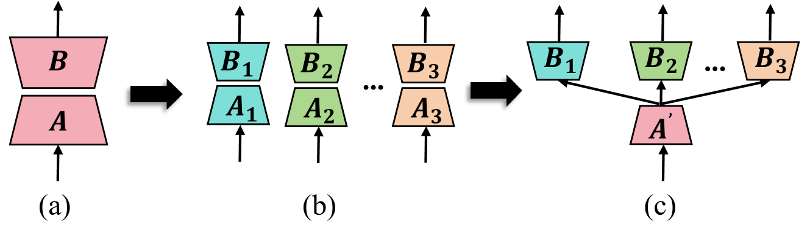
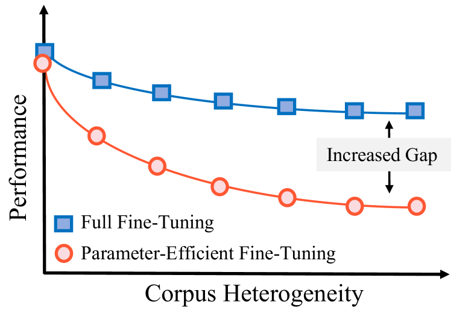
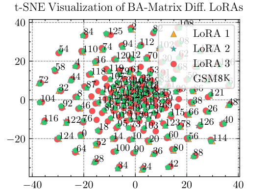
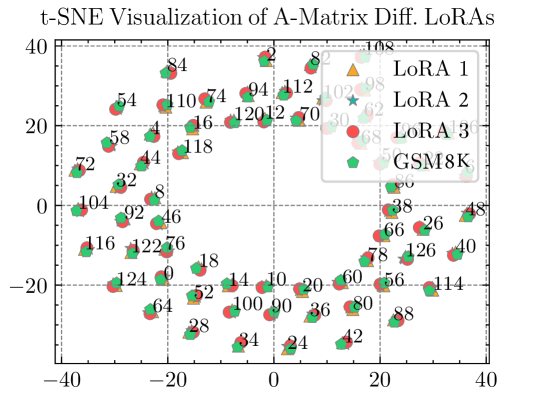
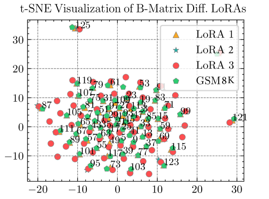
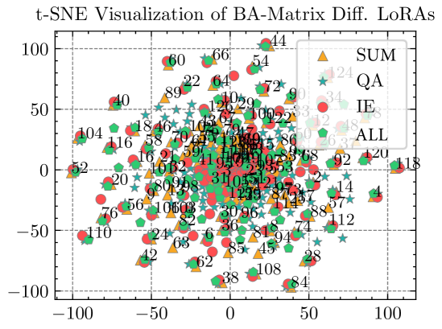
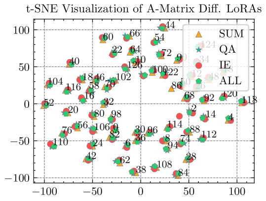
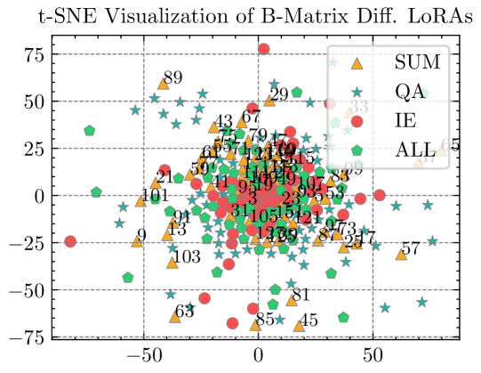
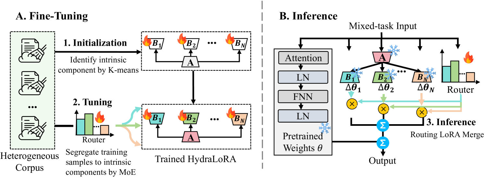

# HydraLoRA：一种高效微调的非对称LoRA架构。

发布时间：2024年04月30日

`分类：LLM理论` `计算机科学` `机器学习`

> HydraLoRA: An Asymmetric LoRA Architecture for Efficient Fine-Tuning

# 摘要

> 采用参数高效微调（PEFT）技术如LoRA，大型语言模型（LLMs）的微调过程变得更加高效。但这些方法在面对复杂数据集时往往表现不佳，尤其是在复杂领域中，这一问题尤为突出，迫切需要更优的PEFT方法来提升性能。经过一系列实验，我们发现了两个关键洞见，它们揭示了LoRA在训练效率和参数优化上的不足。基于这些洞见，我们构建了HydraLoRA，这是一个无需领域专家知识的非对称结构LoRA框架。实验结果证明，HydraLoRA在性能上超越了其他依赖于领域知识的PEFT方法。\href{https://github.com/Clin0212/HydraLoRA}{点击获取代码}。

> Adapting Large Language Models (LLMs) to new tasks through fine-tuning has been made more efficient by the introduction of Parameter-Efficient Fine-Tuning (PEFT) techniques, such as LoRA. However, these methods often underperform compared to full fine-tuning, particularly in scenarios involving complex datasets. This issue becomes even more pronounced in complex domains, highlighting the need for improved PEFT approaches that can achieve better performance. Through a series of experiments, we have uncovered two critical insights that shed light on the training and parameter inefficiency of LoRA. Building on these insights, we have developed HydraLoRA, a LoRA framework with an asymmetric structure that eliminates the need for domain expertise. Our experiments demonstrate that HydraLoRA outperforms other PEFT approaches, even those that rely on domain knowledge during the training and inference phases. \href{https://github.com/Clin0212/HydraLoRA}{Code}.

[Arxiv](https://arxiv.org/abs/2404.19245)