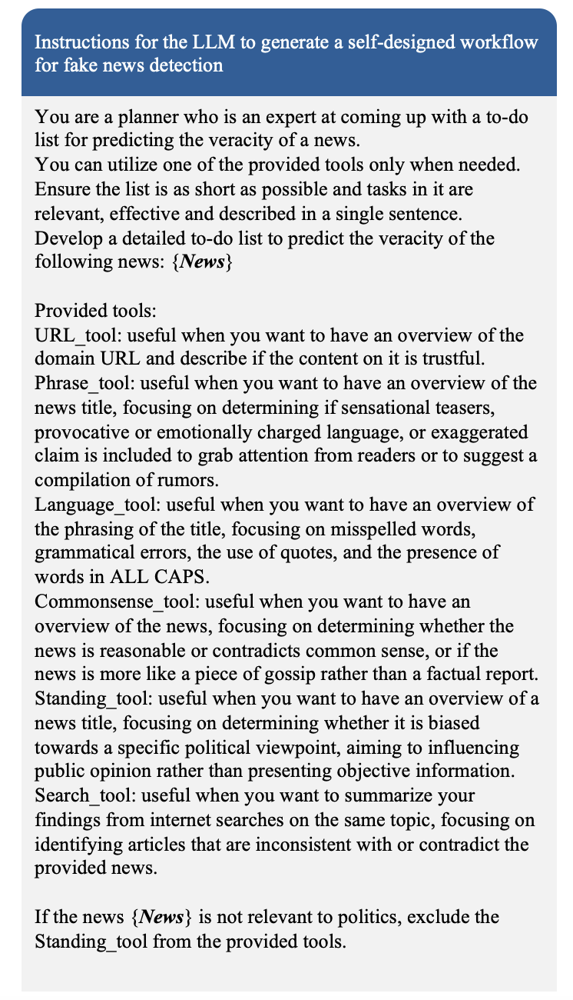
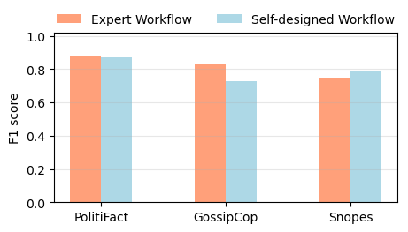
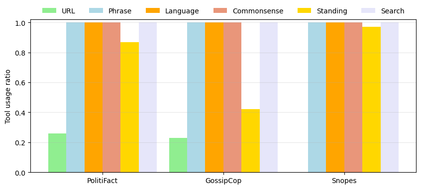
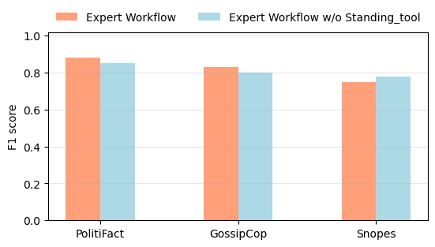
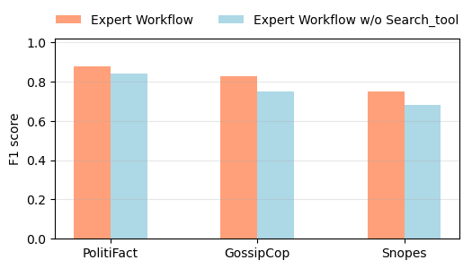
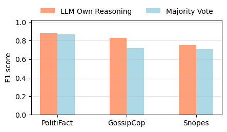
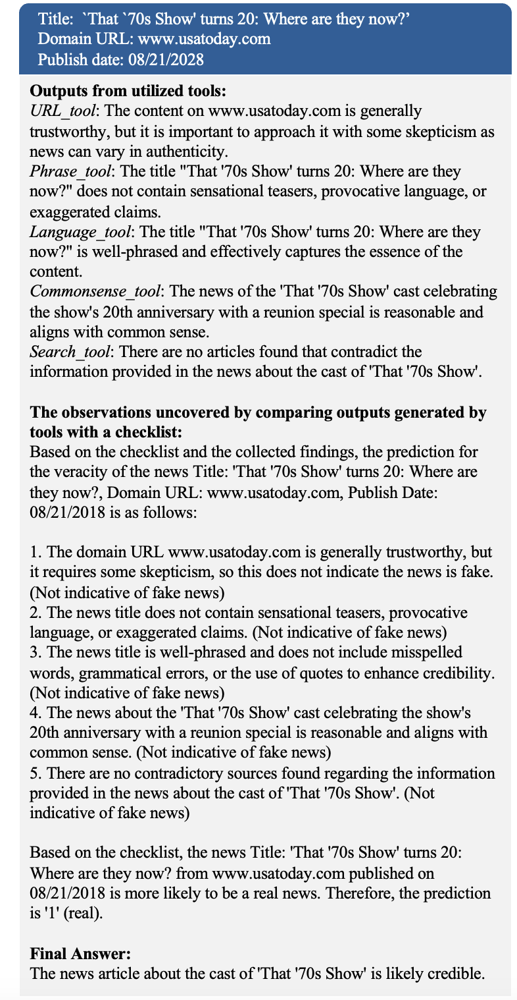

# 大型语言模型代理：假新闻侦测利器

发布时间：2024年04月30日

`Agent` `新闻媒体`

> Large Language Model Agent for Fake News Detection

# 摘要

> 在这个数字化飞速发展的时代，网络谣言的快速蔓延严重威胁着社会福祉、公众信任和民主进程，对关键决策和公众观点产生深远影响。为了应对这一挑战，自动假新闻检测技术的呼声愈发高涨。预训练的大型语言模型（LLMs）在自然语言处理（NLP）的多个领域展现出非凡的才能，这激发了人们探索其在新闻事实核查中的潜力。本文提出的FactAgent，是一种创新的代理式方法，它利用LLMs进行假新闻的识别。FactAgent模拟人类专家的核查行为，无需任何模型训练，通过一个有序的工作流程来验证新闻声明。该工作流程将复杂的新闻真实性检验分解为多个简单步骤，LLMs利用其内置知识或外部工具来完成这些任务。在工作流程的最终阶段，LLMs汇总整个过程中的所有信息，以判定新闻声明的真实性。相较于传统的人工核查，FactAgent在效率上有着显著提升。实验研究证明了FactAgent在无需训练的情况下进行声明验证的有效性。此外，FactAgent在工作流程的每一步以及最终决策阶段都提供了清晰的解释，为最终用户提供了假新闻检测推理过程的洞察。FactAgent的高适应性允许直接更新其工具，以及根据领域知识更新工作流程本身，使其能够灵活应用于不同领域的新闻核查。

> In the current digital era, the rapid spread of misinformation on online platforms presents significant challenges to societal well-being, public trust, and democratic processes, influencing critical decision making and public opinion. To address these challenges, there is a growing need for automated fake news detection mechanisms. Pre-trained large language models (LLMs) have demonstrated exceptional capabilities across various natural language processing (NLP) tasks, prompting exploration into their potential for verifying news claims. Instead of employing LLMs in a non-agentic way, where LLMs generate responses based on direct prompts in a single shot, our work introduces FactAgent, an agentic approach of utilizing LLMs for fake news detection. FactAgent enables LLMs to emulate human expert behavior in verifying news claims without any model training, following a structured workflow. This workflow breaks down the complex task of news veracity checking into multiple sub-steps, where LLMs complete simple tasks using their internal knowledge or external tools. At the final step of the workflow, LLMs integrate all findings throughout the workflow to determine the news claim's veracity. Compared to manual human verification, FactAgent offers enhanced efficiency. Experimental studies demonstrate the effectiveness of FactAgent in verifying claims without the need for any training process. Moreover, FactAgent provides transparent explanations at each step of the workflow and during final decision-making, offering insights into the reasoning process of fake news detection for end users. FactAgent is highly adaptable, allowing for straightforward updates to its tools that LLMs can leverage within the workflow, as well as updates to the workflow itself using domain knowledge. This adaptability enables FactAgent's application to news verification across various domains.

[Arxiv](https://arxiv.org/abs/2405.01593)