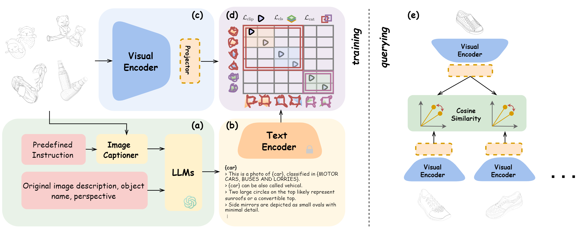

# 借助大型语言模型的专利图像检索技术

发布时间：2024年04月30日

`LLM应用` `专利审查` `图像检索`

> Large Language Model Informed Patent Image Retrieval

# 摘要

> 专利审查过程中，用于比对当前专利图像与已有技术图像相似性的图像检索系统，对于保障专利申请的创新性和独特性起着关键作用。尽管这类系统近年来越来越受欢迎，但它们在识别同一专利中的图像方面虽有成效，却因泛化能力有限而难以在检索相关已有技术图像上提供实用价值。此外，这项工作本身还面临着专利图像的抽象视觉特征、图像分类的不均衡分布以及图像描述的语义信息等挑战。为此，我们提出了一种融合语言信息、考虑数据分布的多模态专利图像特征学习方法，该方法通过整合大型语言模型来增强对专利图像的语义理解，并借助我们提出的分布感知对比损失来提升少数类别的性能。在DeepPatent2数据集上的广泛测试显示，我们的方法在图像检索任务上达到了或接近了最先进的性能，平均精度均值（mAP）提升了53.3%，10个召回率（Recall@10）提升了41.8%，10个平均召回率（MRR@10）提升了51.9%。进一步的深入用户分析表明，我们的模型在辅助专利专业人士进行图像检索方面具有实际应用价值和显著效果。

> In patent prosecution, image-based retrieval systems for identifying similarities between current patent images and prior art are pivotal to ensure the novelty and non-obviousness of patent applications. Despite their growing popularity in recent years, existing attempts, while effective at recognizing images within the same patent, fail to deliver practical value due to their limited generalizability in retrieving relevant prior art. Moreover, this task inherently involves the challenges posed by the abstract visual features of patent images, the skewed distribution of image classifications, and the semantic information of image descriptions. Therefore, we propose a language-informed, distribution-aware multimodal approach to patent image feature learning, which enriches the semantic understanding of patent image by integrating Large Language Models and improves the performance of underrepresented classes with our proposed distribution-aware contrastive losses. Extensive experiments on DeepPatent2 dataset show that our proposed method achieves state-of-the-art or comparable performance in image-based patent retrieval with mAP +53.3%, Recall@10 +41.8%, and MRR@10 +51.9%. Furthermore, through an in-depth user analysis, we explore our model in aiding patent professionals in their image retrieval efforts, highlighting the model's real-world applicability and effectiveness.

[Arxiv](https://arxiv.org/abs/2404.19360)