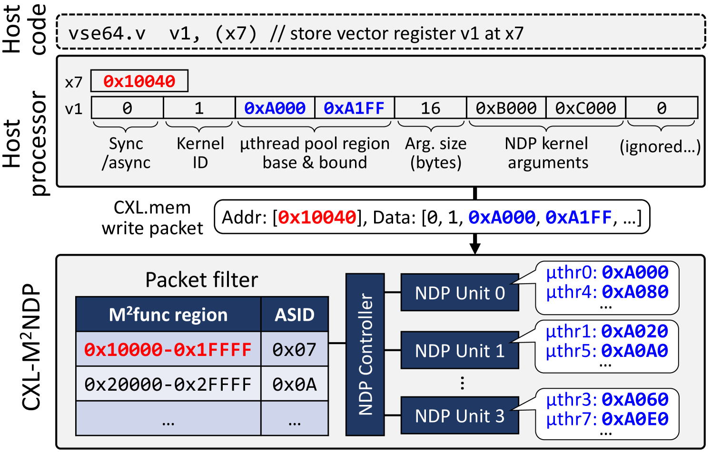

# 在 CXL 内存扩展器上实现高效能的通用近数据处理。

发布时间：2024年04月30日

`LLM应用` `大数据` `人工智能`

> Low-overhead General-purpose Near-Data Processing in CXL Memory Expanders

# 摘要

> 为突破大规模 AI 和大数据应用的内存瓶颈，Compute Express Link (CXL) 实现了处理器本地 DRAM 外的经济型内存扩展。尽管 CXL.mem 协议减少了连接延迟，CXL 内存访问仍可能使内存密集型应用大幅减速。CXL 内存中的近数据处理 (NDP) 虽然能解决这一问题，但现有方案多针对特定应用，不适合多样化应用需求的 CXL 内存系统。此外，现行 CPU 或 GPU 核心在 NDP 上的成本效益不高，因为它们未针对内存密集型应用进行优化。而且，主机处理器与 CXL 控制器之间的 NDP 卸载通信需要低延迟，但 CXL.io（或 PCIe）协议的延迟达到了微秒级，不适合精细的 NDP。为了实现高效的端到端 NDP，我们提出了一种低成本的通用 NDP 架构——Memory-Mapped NDP (M$^2$NDP)，适用于 CXL 内存。它包括内存映射函数 (M$^2$func) 和内存映射微线程 (M$^2μ$thr)。M$^2$func 作为一种与 CXL.mem 兼容的低开销通信机制，连接主机处理器与 CXL 内存中的 NDP 控制器。M$^2μ$thr 通过引入轻量级微线程，支持 NDP 内核的高并发执行，以低成本实现通用 NDP 单元设计，同时最大限度地减少资源浪费。结合这两者，我们的 M$^2$NDP 在多种应用中实现了显著加速，如内存内 OLAP、键值存储、大型语言模型、推荐系统和图分析等，最高加速比达 128 倍（平均加速 11.5 倍），与使用被动 CXL 内存的基线 CPU 或 GPU 主机相比，能耗降低了最高达 87.9%（平均降低 80.1%）。

> To overcome the memory capacity wall of large-scale AI and big data applications, Compute Express Link (CXL) enables cost-efficient memory expansion beyond the local DRAM of processors. While its CXL.mem protocol stack minimizes interconnect latency, CXL memory accesses can still result in significant slowdowns for memory-bound applications. While near-data processing (NDP) in CXL memory can overcome such limitations, prior works propose application-specific HW units that are not suitable for practical CXL memory-based systems that should support various applications. On the other hand, existing CPU or GPU cores are not cost-effective for NDP because they are not optimized for memory-bound applications. In addition, the communication between the host processor and CXL controller for NDP offloading should achieve low latency, but the CXL.io (or PCIe) protocol incurs $μ$s-scale latency and is not suitable for fine-grain NDP.
  To achieve high-performance NDP end-to-end, we propose a low-overhead general-purpose NDP architecture for CXL memory referred to as Memory-Mapped NDP (M$^2$NDP), which comprises memory-mapped functions (M$^2$func) and memory-mapped $μ$threading (M$^2μ$thr). The M$^2$func is a CXL.mem-compatible low-overhead communication mechanism between the host processor and NDP controller in the CXL memory. The M$^2μ$thr enables low-cost, general-purpose NDP unit design by introducing lightweight $μ$threads that support highly concurrent execution of NDP kernels with minimal resource wastage. By combining them, our M$^2$NDP achieves significant speedups for various applications, including in-memory OLAP, key-value store, large language model, recommendation model, and graph analytics by up to 128$\times$ (11.5$\times$ overall) and reduces energy by up to 87.9\% (80.1\% overall) compared to a baseline CPU or GPU host with passive CXL memory.

[Arxiv](https://arxiv.org/abs/2404.19381)