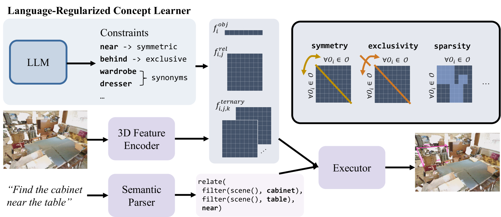
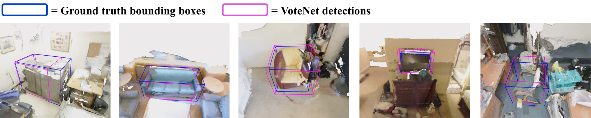

# 利用语言规范的概念学习器进行自然监督的三维视觉定位研究

发布时间：2024年04月30日

`分类：Agent` `3D视觉`

> Naturally Supervised 3D Visual Grounding with Language-Regularized Concept Learners

# 摘要

> 3D 视觉定位任务通常依赖于密集的直接指导，例如场景中每个物体的语义标签。本文另辟蹊径，探索了仅依赖于 3D 场景与问答对的自然监督学习环境，这一领域之前的研究表现并不理想。我们提出了一种名为语言规范化概念学习器（LARC）的新方法，它利用语言中的约束作为正则化手段，显著提升了神经符号概念学习器在自然监督环境下的准确度。该方法的核心思想有二：一是语言约束（如词与词之间的关系）能有效规范神经符号模型中的结构化表示；二是可以通过大型语言模型提炼出语言属性中的这些约束。实验结果表明，LARC 在自然监督的 3D 视觉定位任务上超越了现有技术，并展现出了从零样本组合到数据效率和可转移性的广泛 3D 视觉推理能力。这一方法为使用基于语言的先验知识来规范结构化视觉推理框架，以在缺乏密集监督的环境中学习，提供了一个充满希望的新方向。

> 3D visual grounding is a challenging task that often requires direct and dense supervision, notably the semantic label for each object in the scene. In this paper, we instead study the naturally supervised setting that learns from only 3D scene and QA pairs, where prior works underperform. We propose the Language-Regularized Concept Learner (LARC), which uses constraints from language as regularization to significantly improve the accuracy of neuro-symbolic concept learners in the naturally supervised setting. Our approach is based on two core insights: the first is that language constraints (e.g., a word's relation to another) can serve as effective regularization for structured representations in neuro-symbolic models; the second is that we can query large language models to distill such constraints from language properties. We show that LARC improves performance of prior works in naturally supervised 3D visual grounding, and demonstrates a wide range of 3D visual reasoning capabilities-from zero-shot composition, to data efficiency and transferability. Our method represents a promising step towards regularizing structured visual reasoning frameworks with language-based priors, for learning in settings without dense supervision.

[Arxiv](https://arxiv.org/abs/2404.19696)