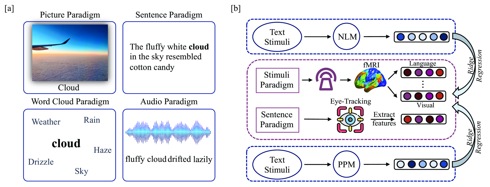
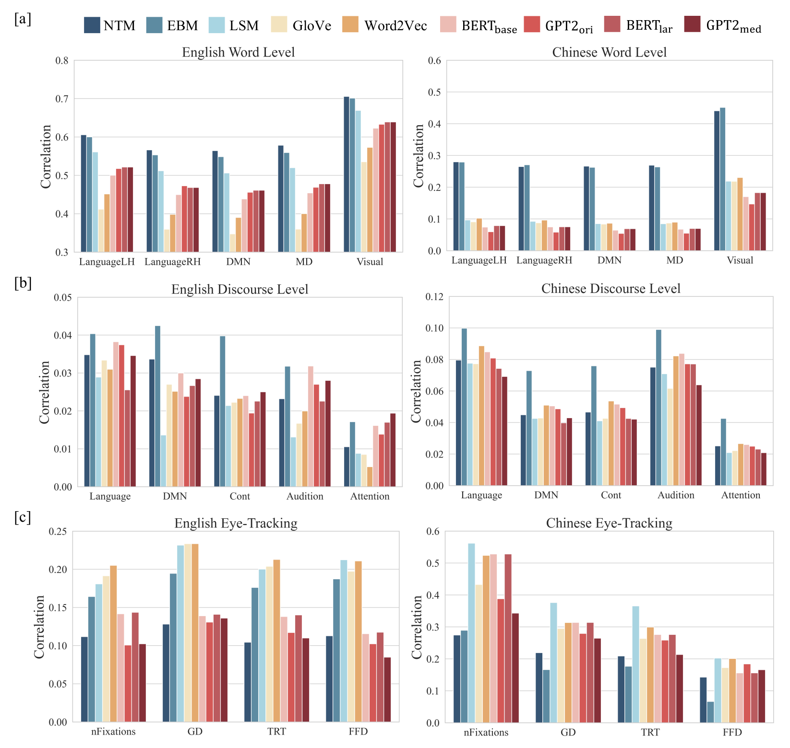
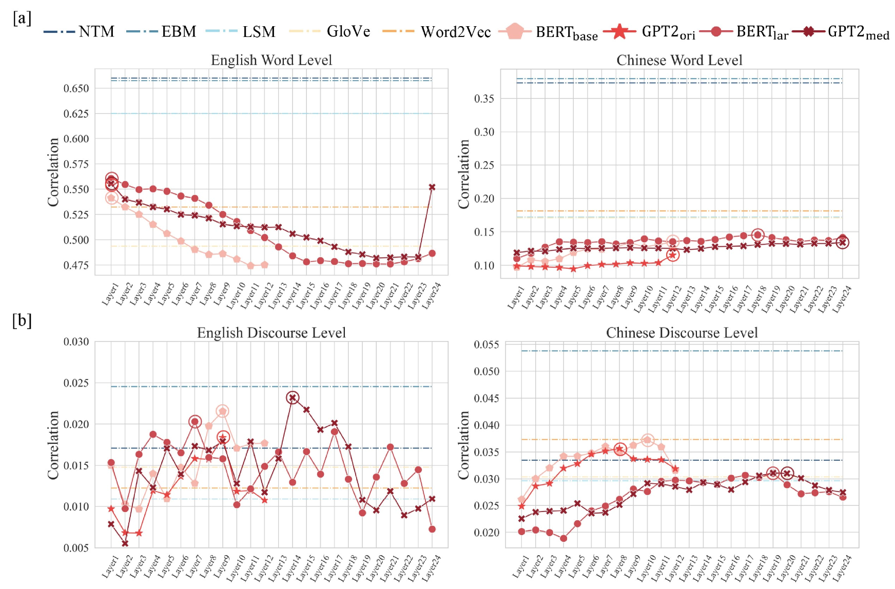
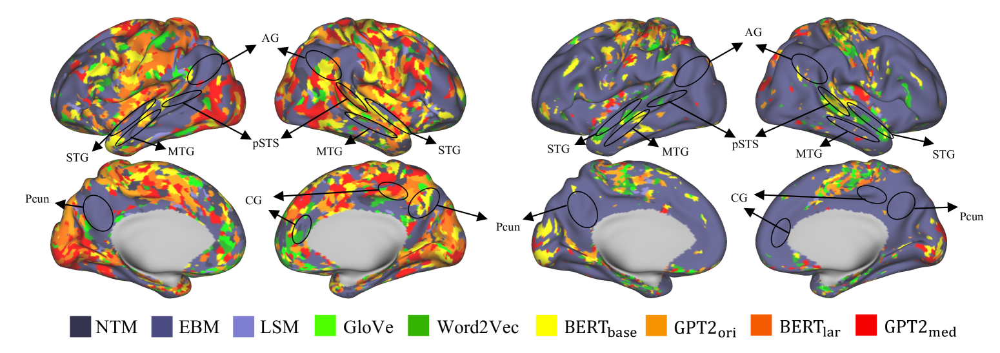

# 探索大脑中的语言表示：对神经语言模型与符合心理学原理模型的对比研究

发布时间：2024年04月30日

`LLM应用` `心理学` `神经科学`

> Navigating Brain Language Representations: A Comparative Analysis of Neural Language Models and Psychologically Plausible Models

# 摘要

> 大规模神经语言模型在预测大脑神经活动方面表现卓越，但以往研究较少将其与心理学认可的模型相比较，且评价多基于有限的、单一模态、英语为主的认知数据集。本研究通过广泛多模态认知数据集，对双语单词和话语层面进行了深入分析，比较了神经语言模型与心理学模型的编码表现。研究发现，在包括fMRI和眼动追踪在内的多种模态以及从英语到中文等多种语言环境中，心理学模型普遍超越了神经模型。特别是，融合了体现信息的心理学模型在单词和话语层面均展现出卓越的性能，无论是在英语还是中文中，都能精准预测大脑多个区域的激活情况。

> Neural language models, particularly large-scale ones, have been consistently proven to be most effective in predicting brain neural activity across a range of studies. However, previous research overlooked the comparison of these models with psychologically plausible ones. Moreover, evaluations were reliant on limited, single-modality, and English cognitive datasets. To address these questions, we conducted an analysis comparing encoding performance of various neural language models and psychologically plausible models. Our study utilized extensive multi-modal cognitive datasets, examining bilingual word and discourse levels. Surprisingly, our findings revealed that psychologically plausible models outperformed neural language models across diverse contexts, encompassing different modalities such as fMRI and eye-tracking, and spanning languages from English to Chinese. Among psychologically plausible models, the one incorporating embodied information emerged as particularly exceptional. This model demonstrated superior performance at both word and discourse levels, exhibiting robust prediction of brain activation across numerous regions in both English and Chinese.

[Arxiv](https://arxiv.org/abs/2404.19364)