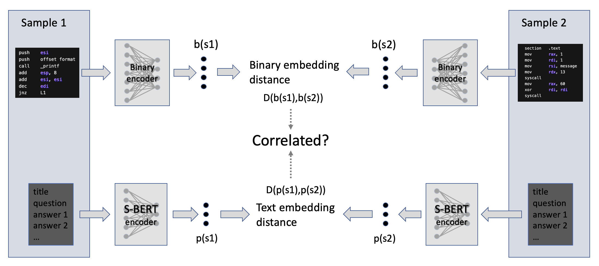
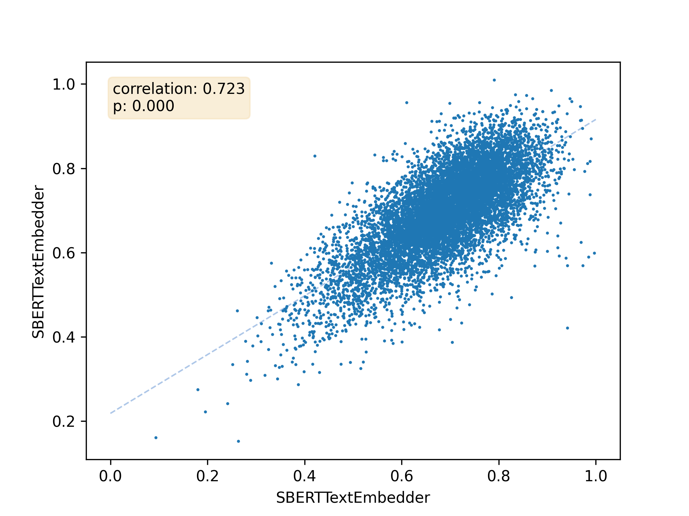
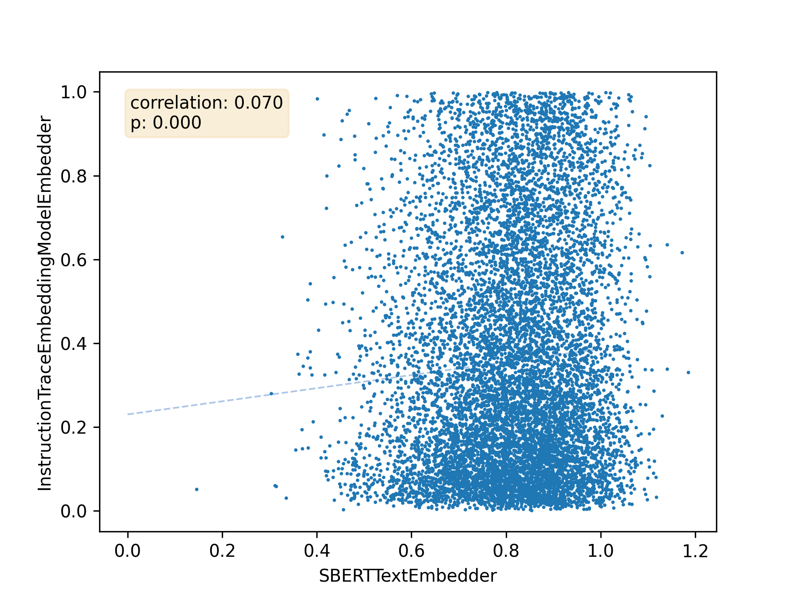

# 培养神经网络以阐释二进制代码

发布时间：2024年04月30日

`LLM应用` `软件工程` `数据科学`

> On Training a Neural Network to Explain Binaries

# 摘要

> 本研究致力于探索深度神经网络在二进制代码理解任务上的训练潜力。目标是让网络输入二进制文件的直接特征，并输出功能描述，以辅助逆向工程师分析闭源软件的功能，无论其性质是恶意还是良性。尽管在源代码摘要任务中应用大型语言模型已取得显著成果，但在寻找适合训练此类复杂模型的高质量和大规模数据集时，我们并未发现合适的资源。因此，我们自行构建了数据集，源自Stack Overflow的110万条数据。研究中一个创新的成果是提出了一种新的数据集评估方法，该方法基于样本对在输入和输出嵌入空间中的距离相关性。简而言之，若两个样本在输入嵌入空间中相近，则其在输出嵌入空间中也应相似。我们进行的嵌入距离相关性（EDC）测试显示出高度的诊断价值，揭示了我们的数据集及一些现有的开源数据集质量不佳，因为这些距离之间的相关性并不显著。此外，我们还探讨了EDC的普遍适用性，将其应用于多个已知优质的数据集和一些已知较差的合成数据集，证实了EDC作为衡量数据集价值的可靠标准。

> In this work, we begin to investigate the possibility of training a deep neural network on the task of binary code understanding. Specifically, the network would take, as input, features derived directly from binaries and output English descriptions of functionality to aid a reverse engineer in investigating the capabilities of a piece of closed-source software, be it malicious or benign. Given recent success in applying large language models (generative AI) to the task of source code summarization, this seems a promising direction. However, in our initial survey of the available datasets, we found nothing of sufficiently high quality and volume to train these complex models. Instead, we build our own dataset derived from a capture of Stack Overflow containing 1.1M entries. A major result of our work is a novel dataset evaluation method using the correlation between two distances on sample pairs: one distance in the embedding space of inputs and the other in the embedding space of outputs. Intuitively, if two samples have inputs close in the input embedding space, their outputs should also be close in the output embedding space. We found this Embedding Distance Correlation (EDC) test to be highly diagnostic, indicating that our collected dataset and several existing open-source datasets are of low quality as the distances are not well correlated. We proceed to explore the general applicability of EDC, applying it to a number of qualitatively known good datasets and a number of synthetically known bad ones and found it to be a reliable indicator of dataset value.

[Arxiv](https://arxiv.org/abs/2404.19631)