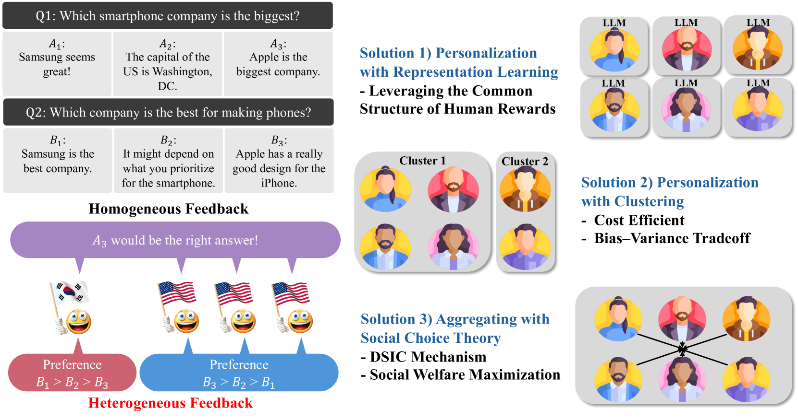

# 本文探讨了如何通过个性化定制和偏好聚合的方式，从多样化的反馈中提炼出原则性的人类引导强化学习（RLHF）策略。

发布时间：2024年04月30日

`LLM应用` `人工智能` `机器学习`

> Principled RLHF from Heterogeneous Feedback via Personalization and Preference Aggregation

# 摘要

> 利用人类反馈进行的强化学习（RLHF）在调整大型语言模型方面取得了显著成就，成为与人类价值观对齐的有效策略。然而，现有RLHF模式通常假设人类偏好是一致的，可以通过单一奖励模型来表达。本文针对人类偏好的多样性和反馈中可能的策略性行为提出挑战，提出了两种原则性框架：个性化和聚合。个性化框架通过表示学习和聚类方法，学习多个奖励模型以平衡偏好多样性带来的偏差和个性化导致的样本方差，同时为这些方法提供了样本复杂度的保证。聚合框架则旨在维持RLHF现行的单模型架构，通过精心整合人类的多元真实偏好。我们提出了基于奖励和偏好聚合的两种方法：前者结合功利主义和Leximin原则来整合个体奖励模型，并确保样本复杂度；后者则直接聚合以概率形式表达的人类反馈。此外，我们针对可能操纵反馈以影响聚合偏好的战略性标签器，开发了一种基于机制设计的方法，确保了偏好的真实报告，并最大化了社会福利。

> Reinforcement learning from human feedback (RLHF) has been an effective technique for aligning AI systems with human values, with remarkable successes in fine-tuning large-language models recently. Most existing RLHF paradigms make the underlying assumption that human preferences are relatively homogeneous, and can be encoded by a single reward model. In this paper, we focus on addressing the issues due to the inherent heterogeneity in human preferences, as well as their potential strategic behavior in providing feedback. Specifically, we propose two frameworks to address heterogeneous human feedback in principled ways: personalization-based one and aggregation-based one. For the former, we propose two approaches based on representation learning and clustering, respectively, for learning multiple reward models that trades off the bias (due to preference heterogeneity) and variance (due to the use of fewer data for learning each model by personalization). We then establish sample complexity guarantees for both approaches. For the latter, we aim to adhere to the single-model framework, as already deployed in the current RLHF paradigm, by carefully aggregating diverse and truthful preferences from humans. We propose two approaches based on reward and preference aggregation, respectively: the former utilizes both utilitarianism and Leximin approaches to aggregate individual reward models, with sample complexity guarantees; the latter directly aggregates the human feedback in the form of probabilistic opinions. Under the probabilistic-opinion-feedback model, we also develop an approach to handle strategic human labelers who may bias and manipulate the aggregated preferences with untruthful feedback. Based on the ideas in mechanism design, our approach ensures truthful preference reporting, with the induced aggregation rule maximizing social welfare functions.

[Arxiv](https://arxiv.org/abs/2405.00254)