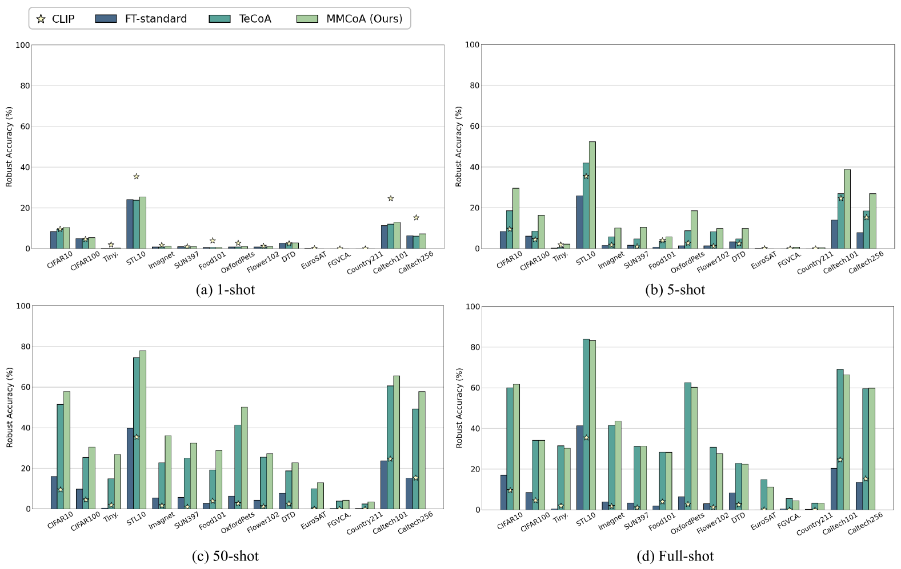

# 本文从多模态的角度出发，重新探讨视觉语言模型在对抗性攻击下的鲁棒性问题。

发布时间：2024年04月30日

`LLM应用` `计算机视觉`

> Revisiting the Adversarial Robustness of Vision Language Models: a Multimodal Perspective

# 摘要

> CLIP 等预训练视觉-语言模型在多样化任务上展现了卓越的泛化能力，但对对抗性攻击的抵抗力尚显不足。以往研究多聚焦于图像编码器的抗攻击性，而对文本和多模态攻击的探讨则相对欠缺。本研究首次全面探讨了在多模态攻击情境下提升视觉-语言模型的对抗性鲁棒性。我们首先提出了一种多模态攻击策略，分析了不同攻击方式的影响，随后引入了一种多模态对比对抗训练方法，通过同步干净与对抗性文本嵌入以及视觉特征，增强了 CLIP 模型中图像和文本编码器的鲁棒性。在15个数据集的两大任务上的广泛测试显示，该方法显著提升了 CLIP 的抗攻击能力。更引人注意的是，针对多模态对抗攻击进行的模型微调，在图像攻击环境下展现出比仅针对图像攻击微调的模型更强的鲁棒性，这为视觉-语言模型的安全性提升提供了新思路。

> Pretrained vision-language models (VLMs) like CLIP have shown impressive generalization performance across various downstream tasks, yet they remain vulnerable to adversarial attacks. While prior research has primarily concentrated on improving the adversarial robustness of image encoders to guard against attacks on images, the exploration of text-based and multimodal attacks has largely been overlooked. In this work, we initiate the first known and comprehensive effort to study adapting vision-language models for adversarial robustness under the multimodal attack. Firstly, we introduce a multimodal attack strategy and investigate the impact of different attacks. We then propose a multimodal contrastive adversarial training loss, aligning the clean and adversarial text embeddings with the adversarial and clean visual features, to enhance the adversarial robustness of both image and text encoders of CLIP. Extensive experiments on 15 datasets across two tasks demonstrate that our method significantly improves the adversarial robustness of CLIP. Interestingly, we find that the model fine-tuned against multimodal adversarial attacks exhibits greater robustness than its counterpart fine-tuned solely against image-based attacks, even in the context of image attacks, which may open up new possibilities for enhancing the security of VLMs.

[Arxiv](https://arxiv.org/abs/2404.19287)