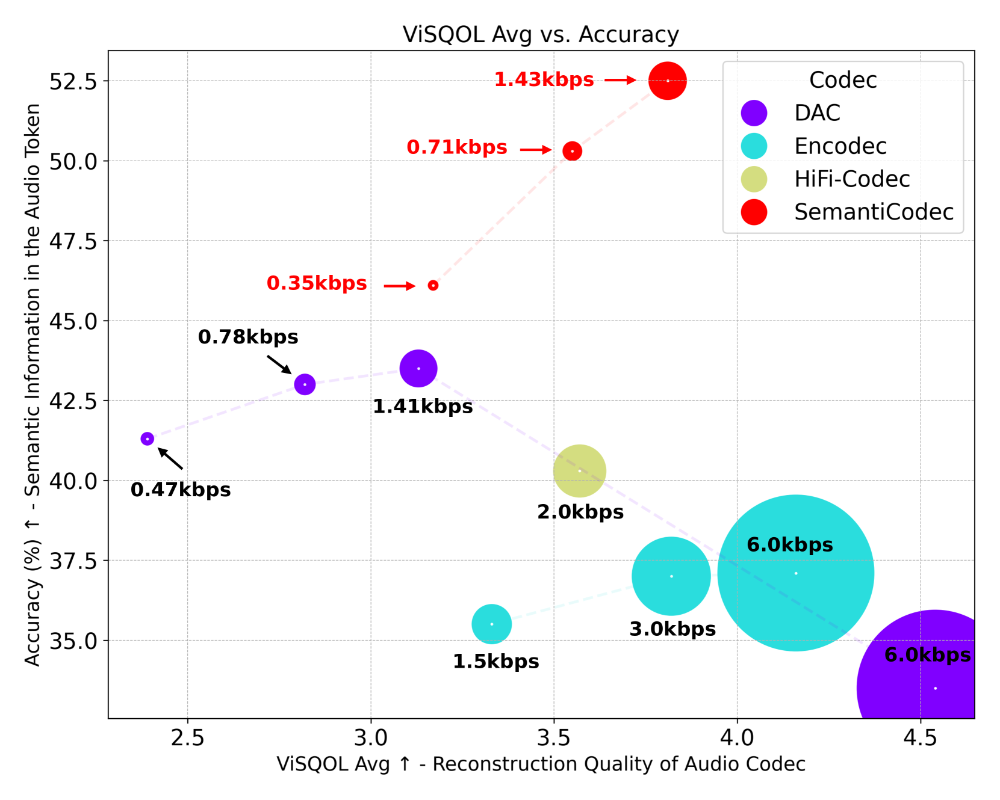
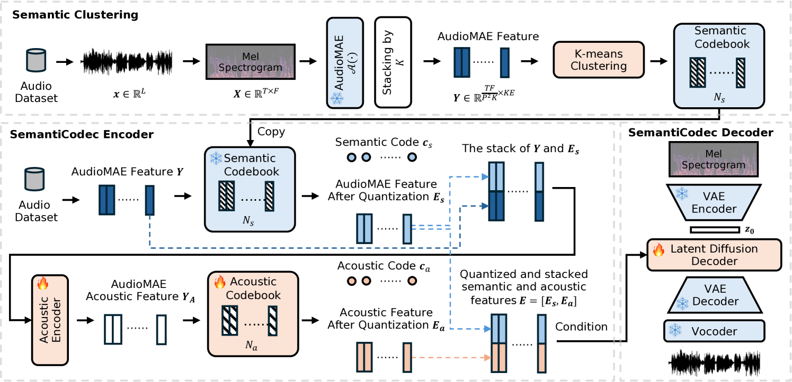
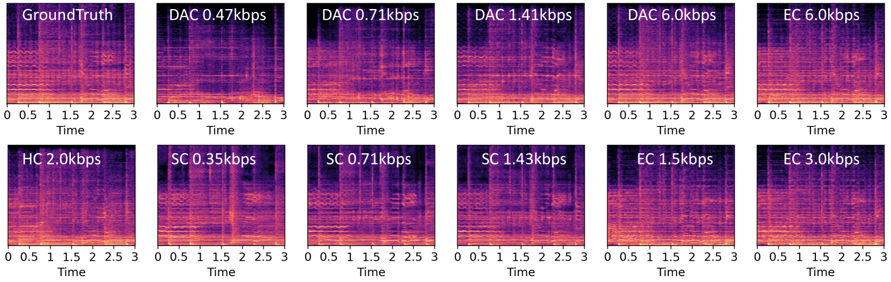
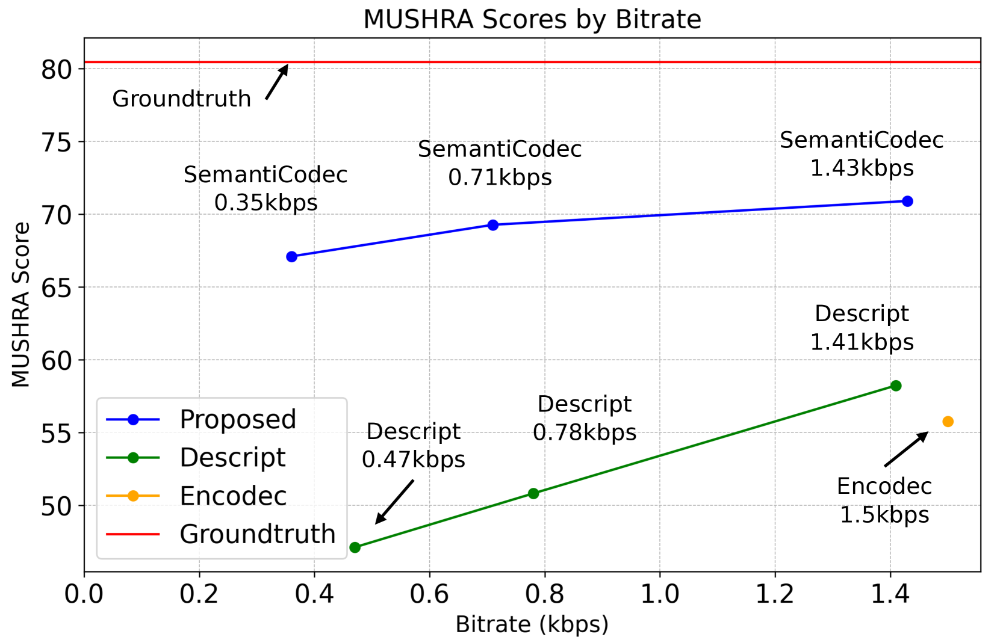
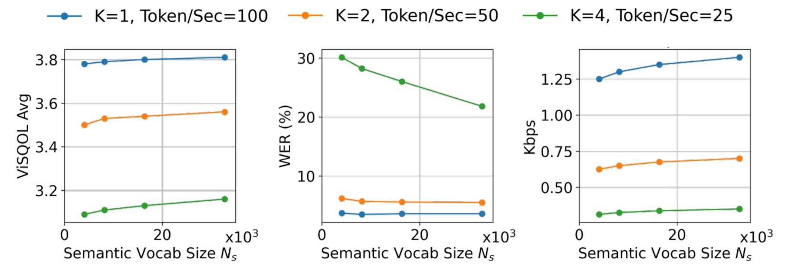
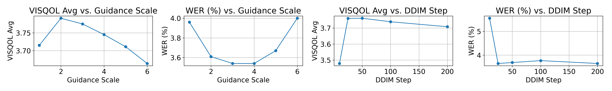

# SemantiCodec：一款为各类声音设计的超低码率语义音频编解码器。

发布时间：2024年04月30日

`分类：LLM应用` `音频处理` `语言建模`

> SemantiCodec: An Ultra Low Bitrate Semantic Audio Codec for General Sound

# 摘要

> 大型语言模型（LLMs）利用音频编解码器将音频转换为离散标记，极大提升了音频处理技术，使得语言建模技术得以应用于音频数据。但现有编解码器多在高比特率下工作，或仅限于如语音这样的特定领域，缺少进行高效语言建模的语义信息。为解决这些问题，我们设计了SemantiCodec，一种创新的编解码器，它能够将多种类型的音频——包括语音、普通音频和音乐——压缩成每秒不到一百个标记，同时保证音质。SemantiCodec具备双重编码器结构：一个是基于自监督AudioMAE的语义编码器，通过在海量音频数据上应用k均值聚类进行离散化；另一个是声学编码器，用于捕捉剩余的音频细节。语义编码器和声学编码器的输出联合使用，通过基于扩散模型的解码器来重建音频。SemantiCodec提供了三种不同标记速率的版本，分别是每秒25、50和100个标记，支持从0.31 kbps到1.43 kbps的超低比特率范围。实验结果显示，SemantiCodec在音频重建质量上明显超越了当前最先进的Descript编解码器。此外，即使在较低的比特率下，SemantiCodec所包含的语义信息量也远超其他所有评估的音频编解码器。我们的代码和演示可以在 https://haoheliu.github.io/SemantiCodec/ 上访问。

> Large language models (LLMs) have significantly advanced audio processing through audio codecs that convert audio into discrete tokens, enabling the application of language modelling techniques to audio data. However, traditional codecs often operate at high bitrates or within narrow domains such as speech and lack the semantic clues required for efficient language modelling. Addressing these challenges, we introduce SemantiCodec, a novel codec designed to compress audio into fewer than a hundred tokens per second across diverse audio types, including speech, general audio, and music, without compromising quality. SemantiCodec features a dual-encoder architecture: a semantic encoder using a self-supervised AudioMAE, discretized using k-means clustering on extensive audio data, and an acoustic encoder to capture the remaining details. The semantic and acoustic encoder outputs are used to reconstruct audio via a diffusion-model-based decoder. SemantiCodec is presented in three variants with token rates of 25, 50, and 100 per second, supporting a range of ultra-low bit rates between 0.31 kbps and 1.43 kbps. Experimental results demonstrate that SemantiCodec significantly outperforms the state-of-the-art Descript codec on reconstruction quality. Our results also suggest that SemantiCodec contains significantly richer semantic information than all evaluated audio codecs, even at significantly lower bitrates. Our code and demos are available at https://haoheliu.github.io/SemantiCodec/.

[Arxiv](https://arxiv.org/abs/2405.00233)