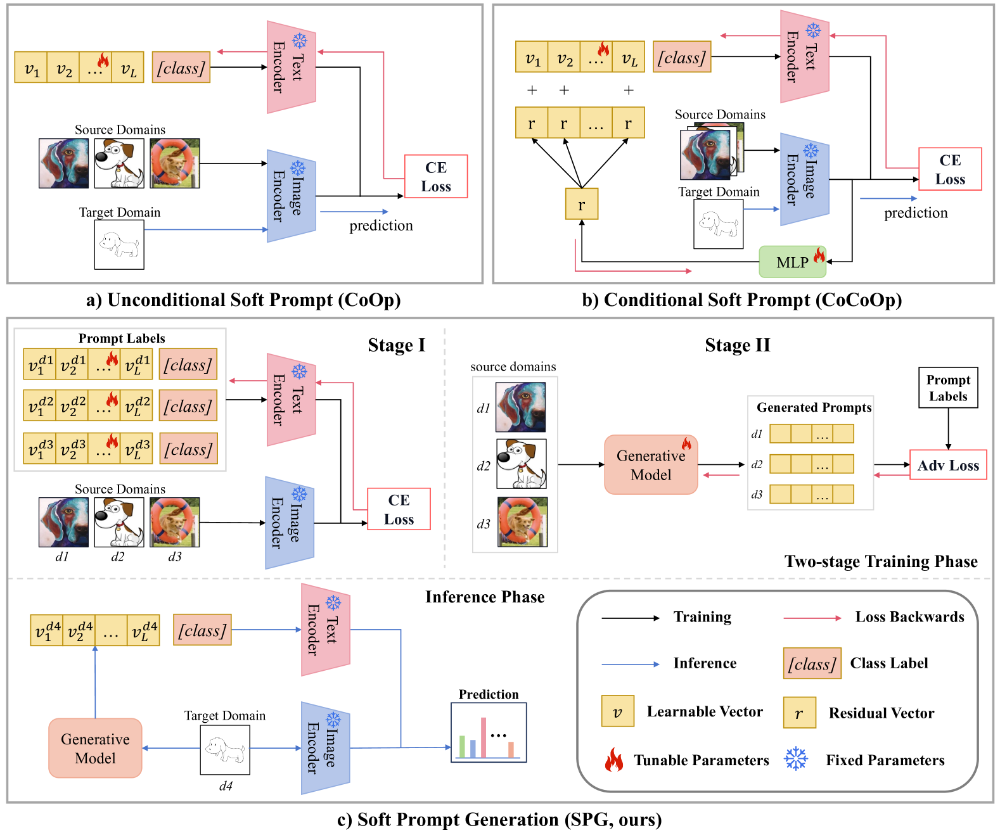
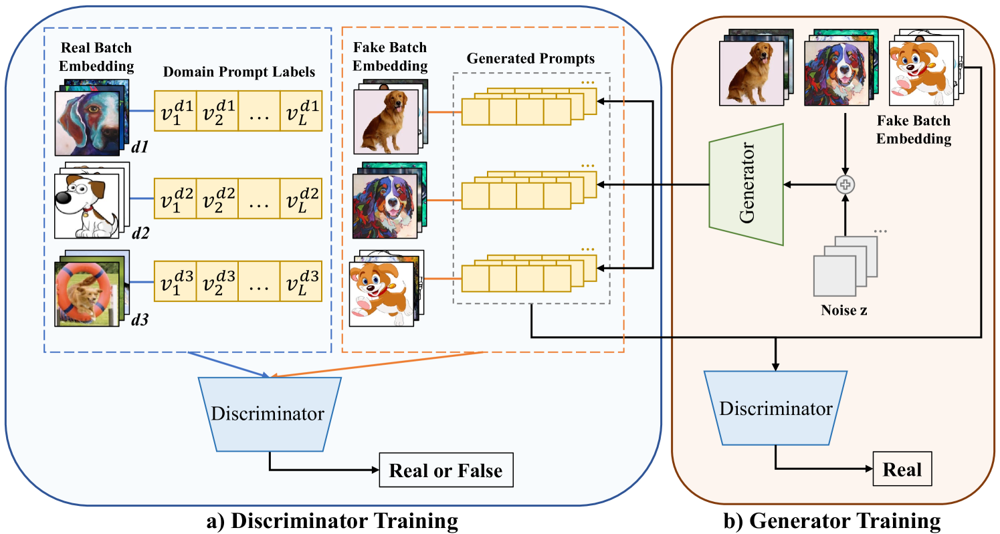
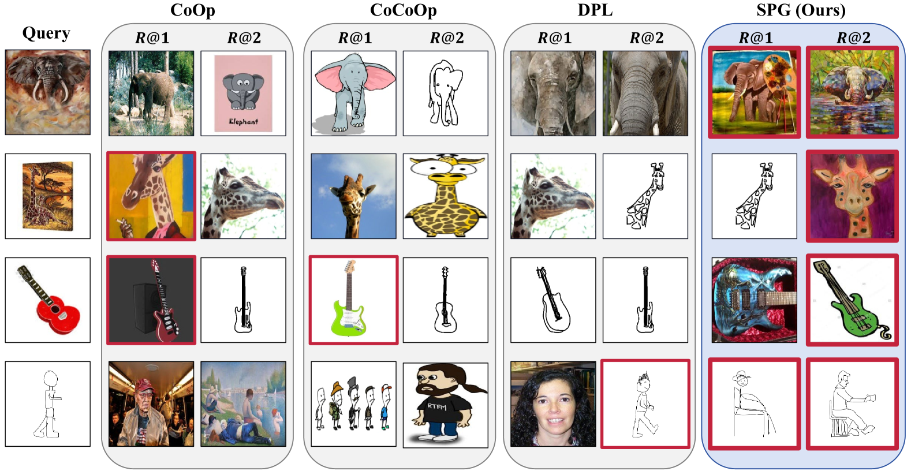

# 在领域泛化领域，软提示的生成技术正日益受到关注。

发布时间：2024年04月30日

`LLM应用` `计算机视觉`

> Soft Prompt Generation for Domain Generalization

# 摘要

> 大型预训练视觉语言模型（VLMs）在利用人工设计提示的下游任务中展现了卓越的零样本能力，但这些提示并不总是适合特定领域。为了提升VLMs对特定下游任务的适应性，本文提出了软提示的概念，以取代传统的人工设计提示，作为一个可基于特定领域数据进行微调的学习向量。传统提示学习方法通常只学习一个固定的提示，这限制了提示的多样性，并且忽视了未见领域的信息，从而影响了提示的泛化能力。本文从生成式学习的角度重新定义了提示学习框架，并提出了一种新颖的领域泛化（DG）任务方法——软提示生成（SPG）。据我们所知，这是首次将生成模型融入VLMs的提示学习中，以期通过生成模型独立产生多样化的软提示。SPG方法包括两个训练阶段和一个推理阶段：在训练阶段，我们为每个领域定义了软提示标签，以整合生成模型的领域知识；在推理阶段，利用生成模型的生成器为未见目标领域生成特定实例的软提示。通过在三个DG任务的五个领域泛化基准上的广泛实验，我们证明了SPG方法达到了最先进的性能。相关代码即将公开。

> Large pre-trained vision language models (VLMs) have shown impressive zero-shot ability on downstream tasks with manually designed prompt, which are not optimal for specific domains. To further adapt VLMs to downstream tasks, soft prompt is proposed to replace manually designed prompt, which acts as a learning vector that undergoes fine-tuning based on specific domain data. Prior prompt learning methods primarily learn a fixed prompt and residuled prompt from training samples. However, the learned prompts lack diversity and ignore information about unseen domains, potentially compromising the transferability of the prompts. In this paper, we reframe the prompt learning framework from a generative perspective and propose a simple yet efficient method for the Domain Generalization (DG) task, namely \textbf{S}oft \textbf{P}rompt \textbf{G}eneration (SPG). To the best of our knowledge, we are the first to introduce the generative model into prompt learning in VLMs and explore its potential for producing soft prompts by relying solely on the generative model, ensuring the diversity of prompts. Specifically, SPG consists of a two-stage training phase and an inference phase. During the training phase, we introduce soft prompt labels for each domain, aiming to incorporate the generative model domain knowledge. During the inference phase, the generator of the generative model is employed to obtain instance-specific soft prompts for the unseen target domain. Extensive experiments on five domain generalization benchmarks of three DG tasks demonstrate that our proposed SPG achieves state-of-the-art performance. The code will be available soon.

[Arxiv](https://arxiv.org/abs/2404.19286)