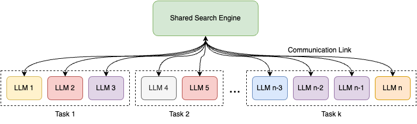
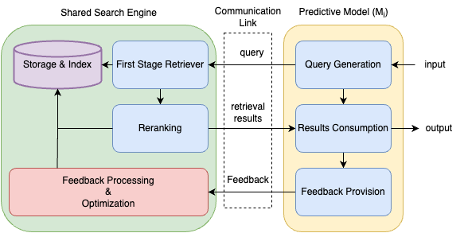
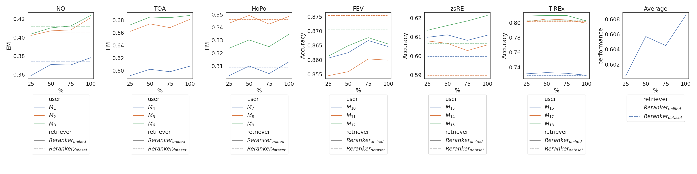

# 探索机器的搜索引擎：实现多种增强检索的大型语言模型的统一排名机制

发布时间：2024年04月30日

`RAG` `信息检索`

> Towards a Search Engine for Machines: Unified Ranking for Multiple Retrieval-Augmented Large Language Models

# 摘要

> 本文提出了 uRAG，这是一个集成了统一检索引擎的框架，能够支持多个下游的检索增强生成（RAG）系统。这些系统根据各自的需求，如开放域问答、事实核查、实体链接和关系抽取，来利用检索结果。我们引入了一套通用的训练指导原则，以规范搜索引擎与下游 RAG 系统之间的互动，这些系统都在致力于优化检索模型。这为构建一个包含 18 个参与训练的 RAG 系统和 18 个作为搜索引擎新用户的未知 RAG 系统的大规模实验生态系统奠定了基础。通过这个生态系统，我们探讨并回答了一系列基本的研究问题，从而深化了我们对机器搜索引擎开发中机遇与挑战的认识。

> This paper introduces uRAG--a framework with a unified retrieval engine that serves multiple downstream retrieval-augmented generation (RAG) systems. Each RAG system consumes the retrieval results for a unique purpose, such as open-domain question answering, fact verification, entity linking, and relation extraction. We introduce a generic training guideline that standardizes the communication between the search engine and the downstream RAG systems that engage in optimizing the retrieval model. This lays the groundwork for us to build a large-scale experimentation ecosystem consisting of 18 RAG systems that engage in training and 18 unknown RAG systems that use the uRAG as the new users of the search engine. Using this experimentation ecosystem, we answer a number of fundamental research questions that improve our understanding of promises and challenges in developing search engines for machines.

[Arxiv](https://arxiv.org/abs/2405.00175)