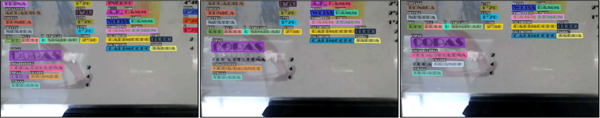

# VimTS：一款集视频与图像文本识别于一体的工具，旨在提升跨领域泛化能力。

发布时间：2024年04月30日

`分类：Agent

这篇论文主要研究了文本识别技术在跨域适应上的挑战，并提出了一种创新的方法——VimTS，通过促进不同任务间的协作，显著提升了模型的泛化性能。这种方法涉及到设计提示查询生成模块和任务感知适配器，将单任务模型转变为能够适应图像和视频场景的多任务模型。这属于智能代理（Agent）的范畴，因为它们能够处理多种任务，并在不同场景下进行自适应。` `计算机视觉`

> VimTS: A Unified Video and Image Text Spotter for Enhancing the Cross-domain Generalization

# 摘要

> 文本识别技术致力于从图像或视频序列中提取文本信息，却常常在跨域适应上遭遇难题，比如图像间的转换和图像到视频的泛化。本文提出了一种创新的方法——VimTS，它通过促进不同任务间的协作，显著提升了模型的泛化性能。我们设计了一个提示查询生成模块和任务感知适配器，以最小的参数增量，将单任务模型转变为能够适应图像和视频场景的多任务模型。提示查询生成模块促进了任务间的直接互动，而任务感知适配器则指导模型为每个任务学习适宜的特征。为了使模型更高效地掌握时间信息，我们还利用内容变形场（CoDeF）算法创建了一个合成视频文本数据集VTD-368k。我们的VimTS在多个跨域基准测试中平均领先现有最先进方法2.6%，在视频级别的跨域适应上，更是在ICDAR2015视频和DSText v2数据集上以平均5.5%的MOTA指标超越了先前的端到端视频识别方法，且仅依赖于图像级数据。此外，我们发现现有的大型多模态模型在跨域场景文本识别上存在局限，而VimTS模型则以更少的参数和数据需求，展现了其优势。相关代码和数据集将在https://VimTextSpotter.github.io公开。

> Text spotting, a task involving the extraction of textual information from image or video sequences, faces challenges in cross-domain adaption, such as image-to-image and image-to-video generalization. In this paper, we introduce a new method, termed VimTS, which enhances the generalization ability of the model by achieving better synergy among different tasks. Typically, we propose a Prompt Queries Generation Module and a Tasks-aware Adapter to effectively convert the original single-task model into a multi-task model suitable for both image and video scenarios with minimal additional parameters. The Prompt Queries Generation Module facilitates explicit interaction between different tasks, while the Tasks-aware Adapter helps the model dynamically learn suitable features for each task. Additionally, to further enable the model to learn temporal information at a lower cost, we propose a synthetic video text dataset (VTD-368k) by leveraging the Content Deformation Fields (CoDeF) algorithm. Notably, our method outperforms the state-of-the-art method by an average of 2.6% in six cross-domain benchmarks such as TT-to-IC15, CTW1500-to-TT, and TT-to-CTW1500. For video-level cross-domain adaption, our method even surpasses the previous end-to-end video spotting method in ICDAR2015 video and DSText v2 by an average of 5.5% on the MOTA metric, using only image-level data. We further demonstrate that existing Large Multimodal Models exhibit limitations in generating cross-domain scene text spotting, in contrast to our VimTS model which requires significantly fewer parameters and data. The code and datasets will be made available at the https://VimTextSpotter.github.io.

[Arxiv](https://arxiv.org/abs/2404.19652)