# 视觉事实核查器：助力生成高清晰度的详细字幕

发布时间：2024年04月30日

`LLM应用` `视觉内容生成` `自动字幕生成`

> Visual Fact Checker: Enabling High-Fidelity Detailed Caption Generation

# 摘要

> 现有自动生成视觉内容字幕的方法存在诸多挑战，如细节不足、内容失真和执行指令不力。本研究提出了一种名为 VisualFactChecker (VFC) 的新型工具，它无需额外训练即可为二维图像和三维物体生成高清晰度、详尽的字幕。VFC 的工作流程分为三步：首先，图像到文本的字幕模型提出多个初步字幕；其次，大型语言模型 (LLM) 借助对象检测和视觉问答 (VQA) 模型等工具对这些字幕进行事实核查；最后，LLM 综合初步字幕和事实核查结果，生成最终字幕。这一过程中，VFC 能够灵活地遵循复杂指令，生成多种风格的字幕。我们通过四个指标对字幕生成进行了全面评估：CLIP-Score 衡量图像与文本的相似度；CLIP-Image-Score 衡量原始图像与基于文本生成的图像之间的相似度；亚马逊机械土耳其的人机研究；以及 GPT-4V 的细粒度评估。评估结果显示，VFC 在 COCO 数据集的二维图像和 Objaverse 数据集的三维物体字幕生成上，均优于现有的顶尖开源方法。本研究证明，通过整合开源模型，即使模型规模小了十倍，也能实现与 GPT-4V 等专有模型相媲美的字幕生成能力。

> Existing automatic captioning methods for visual content face challenges such as lack of detail, content hallucination, and poor instruction following. In this work, we propose VisualFactChecker (VFC), a flexible training-free pipeline that generates high-fidelity and detailed captions for both 2D images and 3D objects. VFC consists of three steps: 1) proposal, where image-to-text captioning models propose multiple initial captions; 2) verification, where a large language model (LLM) utilizes tools such as object detection and VQA models to fact-check proposed captions; 3) captioning, where an LLM generates the final caption by summarizing caption proposals and the fact check verification results. In this step, VFC can flexibly generate captions in various styles following complex instructions. We conduct comprehensive captioning evaluations using four metrics: 1) CLIP-Score for image-text similarity; 2) CLIP-Image-Score for measuring the image-image similarity between the original and the reconstructed image generated by a text-to-image model using the caption. 3) human study on Amazon Mechanical Turk; 4) GPT-4V for fine-grained evaluation. Evaluation results show that VFC outperforms state-of-the-art open-sourced captioning methods for 2D images on the COCO dataset and 3D assets on the Objaverse dataset. Our study demonstrates that by combining open-source models into a pipeline, we can attain captioning capability comparable to proprietary models such as GPT-4V, despite being over 10x smaller in model size.

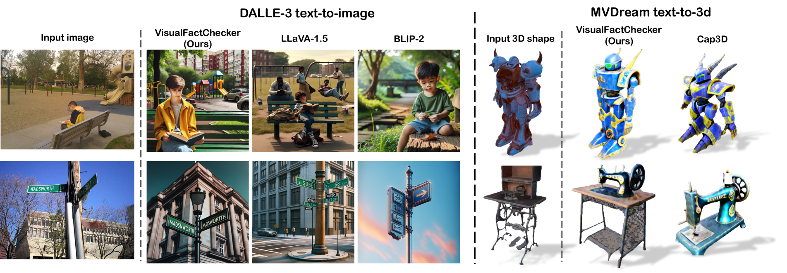

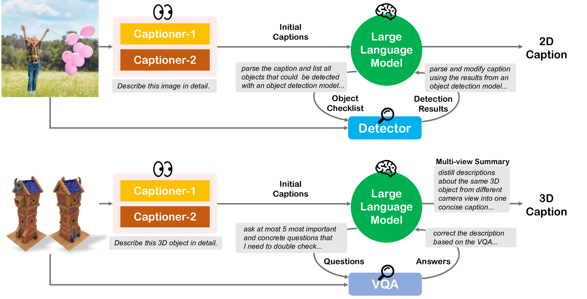

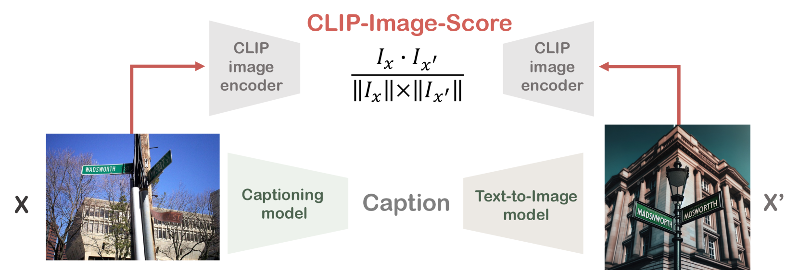

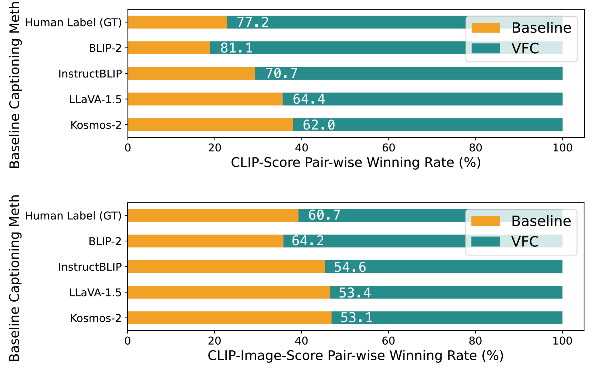

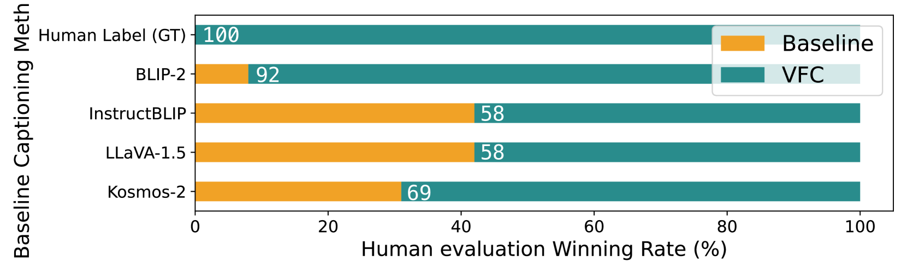

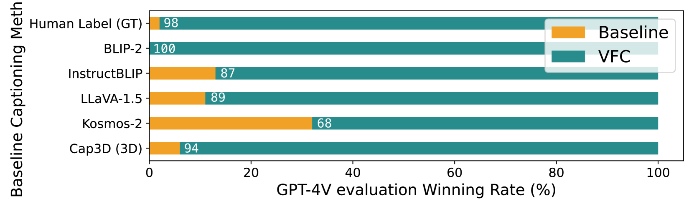

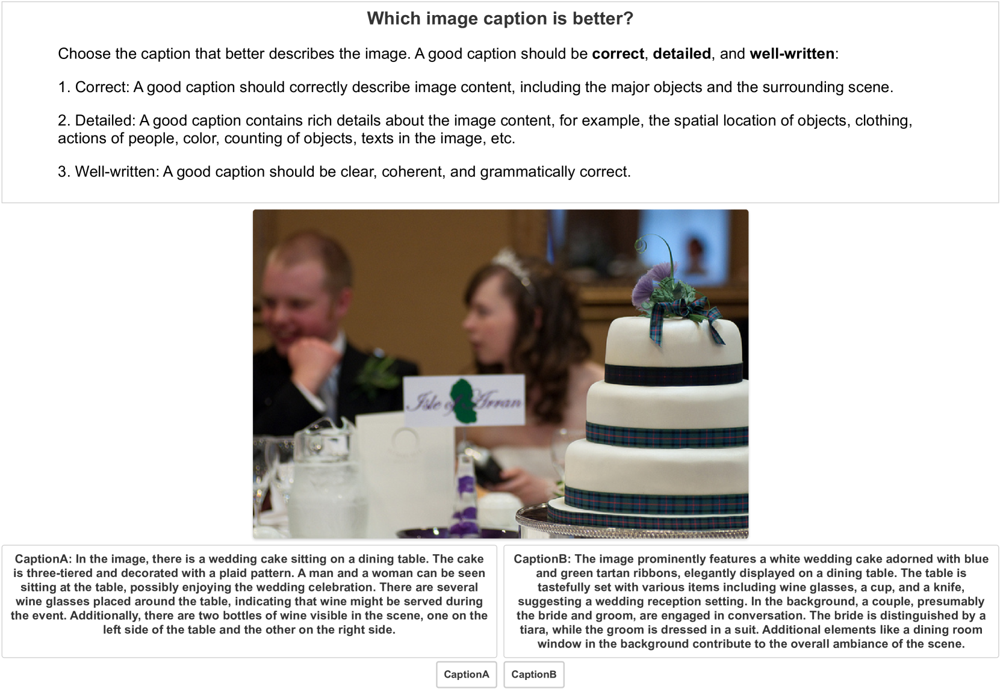

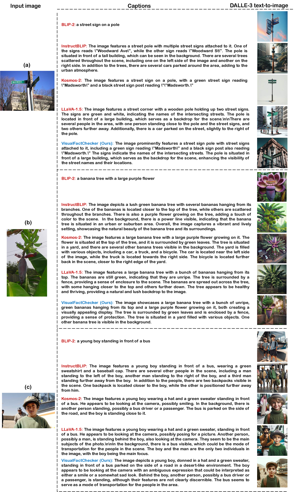

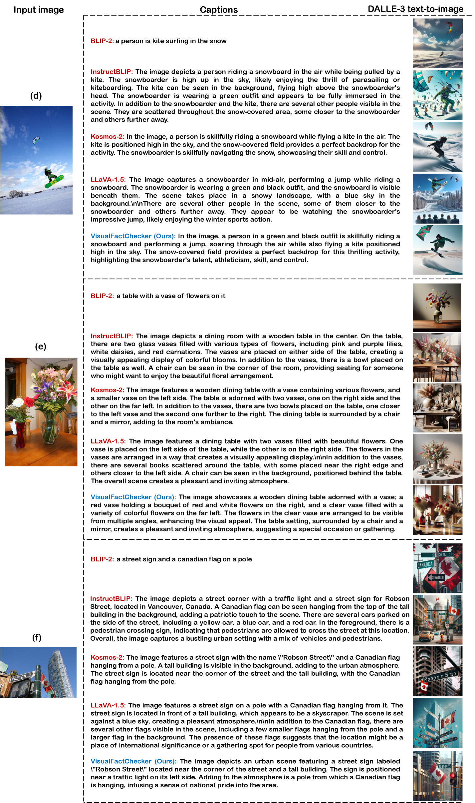

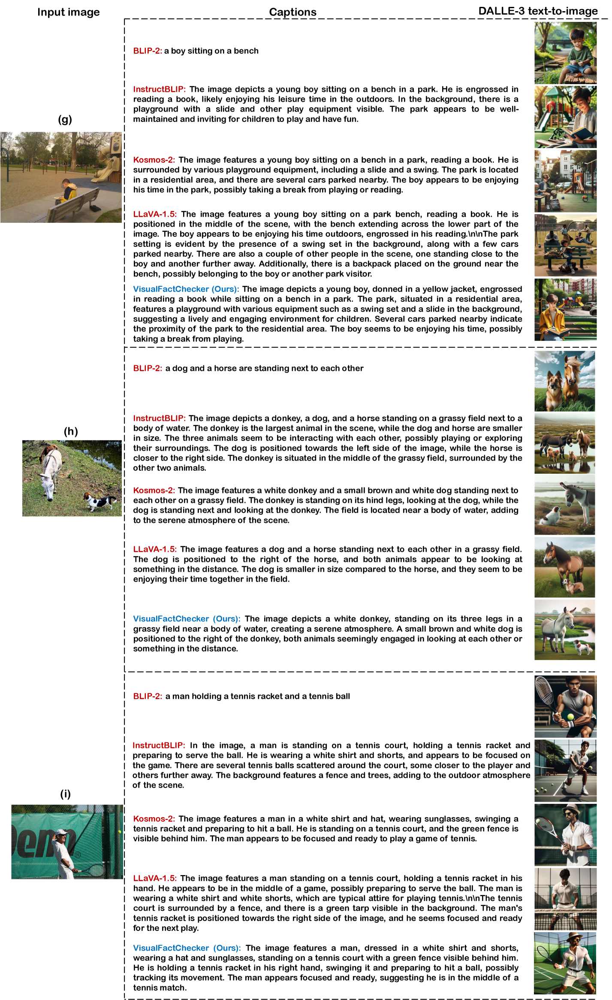

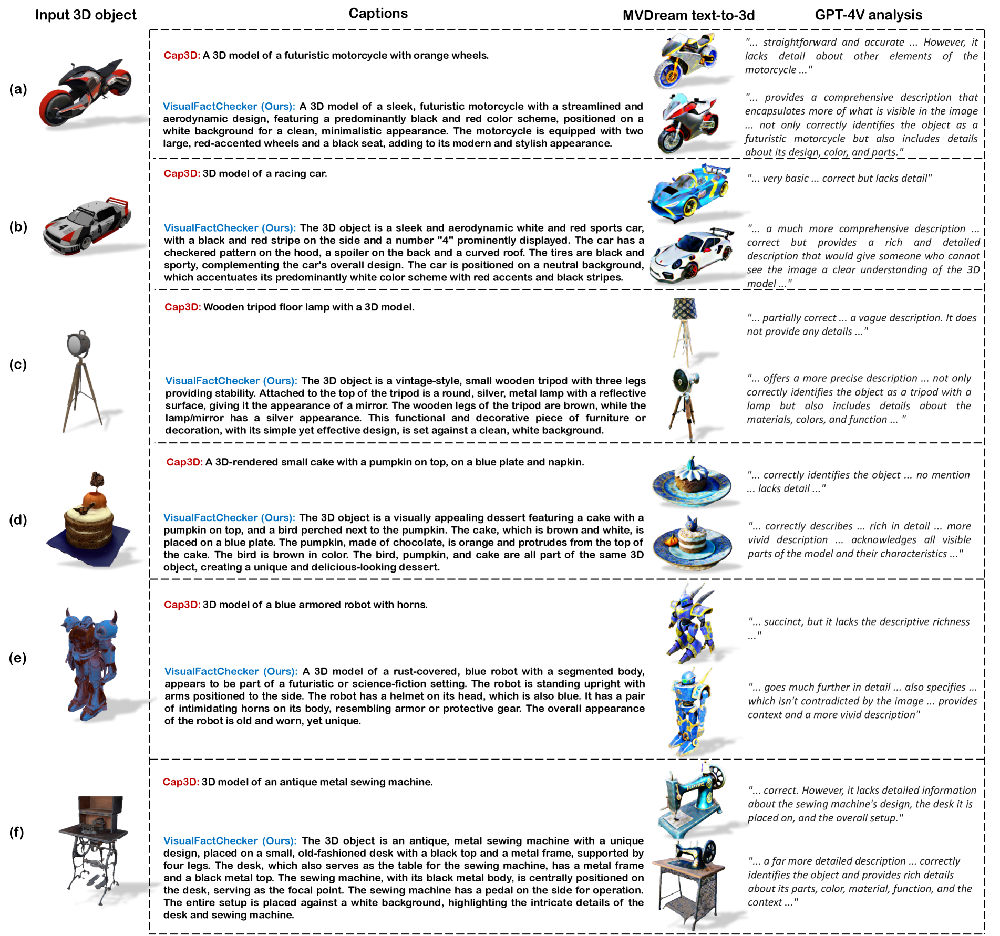

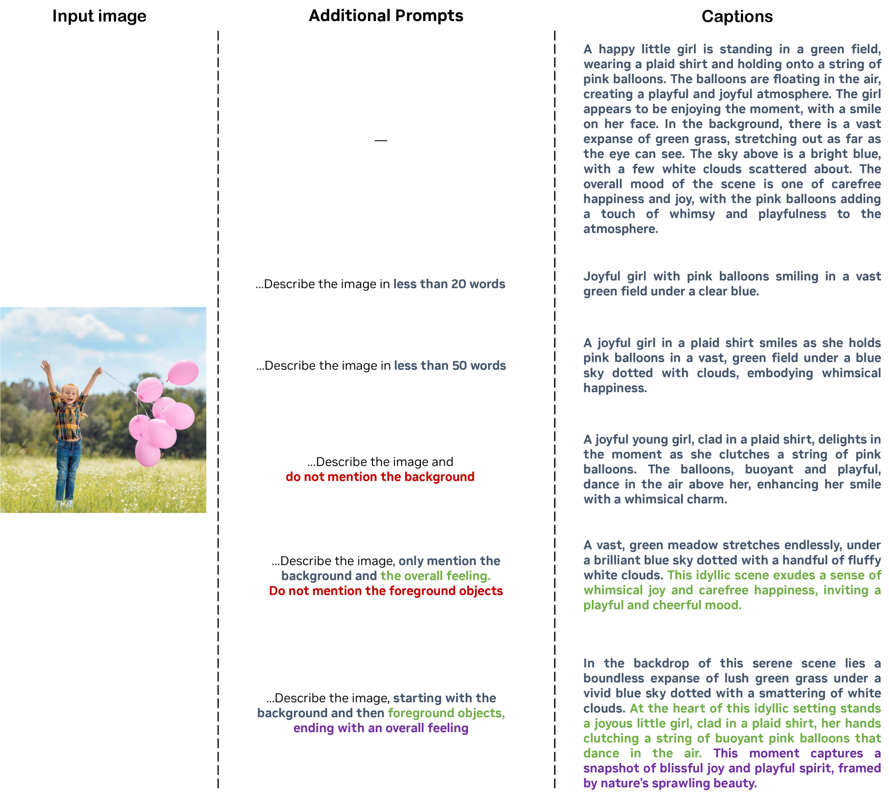

[Arxiv](https://arxiv.org/abs/2404.19752)