# 深入剖析大型语言模型在小学算术任务上的表现

发布时间：2024年05月01日

`分类：LLM理论` `数学教育` `人工智能`

> A Careful Examination of Large Language Model Performance on Grade School Arithmetic

# 摘要

> 大型语言模型（LLMs）在数学推理的多项基准测试中取得了显著成就。但人们担忧，这些成绩可能并非真实推理能力的体现，而是由于训练数据中混入了与测试题目极为相似的数据，导致成绩虚高。为了深入探究这一问题，我们推出了Grade School Math 1000（GSM1k）测试。GSM1k在设计上与公认的小学数学推理基准测试GSM8k保持一致，无论是在题型风格还是难度上。我们确保两个测试在解题步骤数量、解答难度等多个关键指标上具有可比性。在对当前主流的开源和闭源LLMs进行GSM1k测试时，我们发现准确率下降了高达13%，部分模型系列（如Phi和Mistral）几乎在所有模型尺寸上都表现出了系统性的过拟合。与此同时，许多前沿模型（如Gemini/GPT/Claude）则几乎没有过拟合的迹象。进一步分析还发现，模型生成GSM8k中题目的概率与其在GSM8k和GSM1k之间性能差异之间存在正相关（Spearman相关系数r^2=0.32），这表明许多模型可能已经部分记忆了GSM8k的题目。

> Large language models (LLMs) have achieved impressive success on many benchmarks for mathematical reasoning. However, there is growing concern that some of this performance actually reflects dataset contamination, where data closely resembling benchmark questions leaks into the training data, instead of true reasoning ability. To investigate this claim rigorously, we commission Grade School Math 1000 (GSM1k). GSM1k is designed to mirror the style and complexity of the established GSM8k benchmark, the gold standard for measuring elementary mathematical reasoning. We ensure that the two benchmarks are comparable across important metrics such as human solve rates, number of steps in solution, answer magnitude, and more. When evaluating leading open- and closed-source LLMs on GSM1k, we observe accuracy drops of up to 13%, with several families of models (e.g., Phi and Mistral) showing evidence of systematic overfitting across almost all model sizes. At the same time, many models, especially those on the frontier, (e.g., Gemini/GPT/Claude) show minimal signs of overfitting. Further analysis suggests a positive relationship (Spearman's r^2=0.32) between a model's probability of generating an example from GSM8k and its performance gap between GSM8k and GSM1k, suggesting that many models may have partially memorized GSM8k.

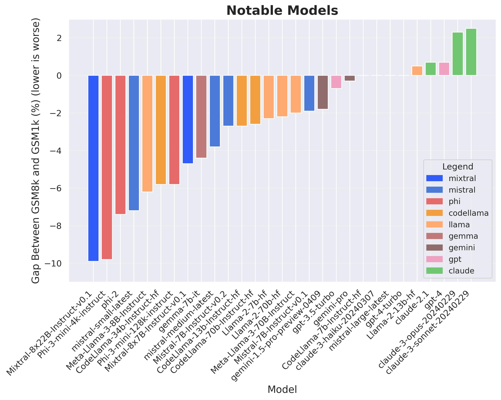

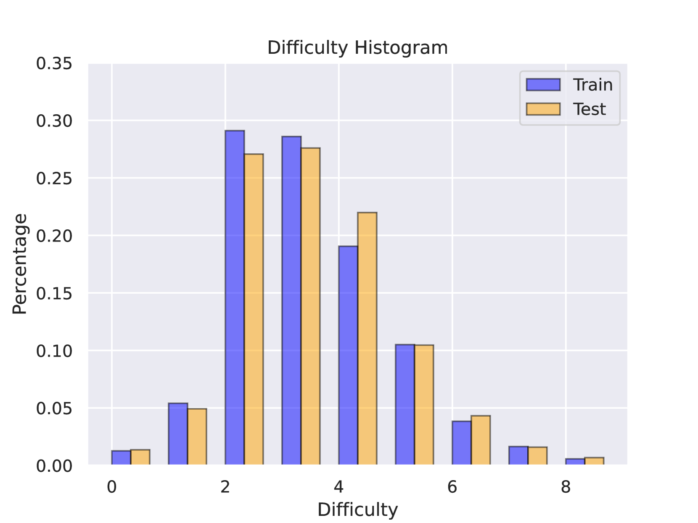

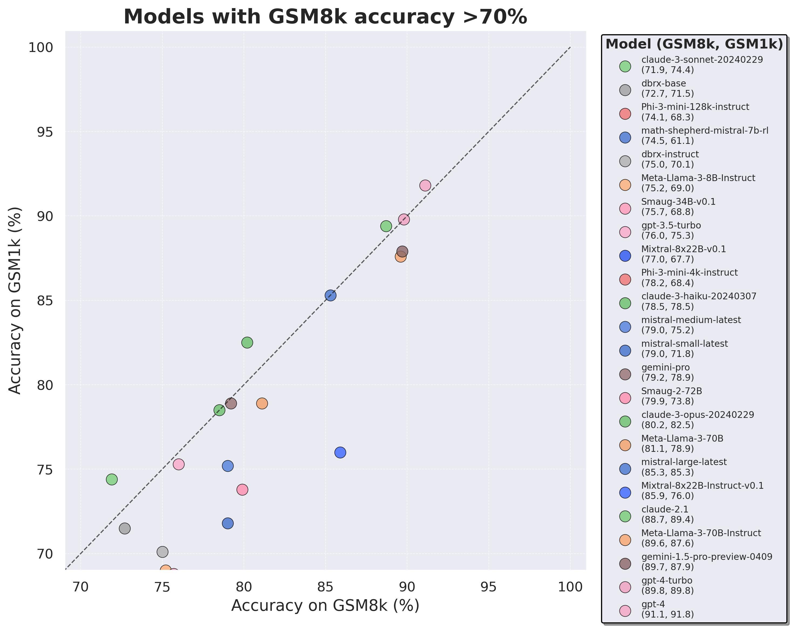

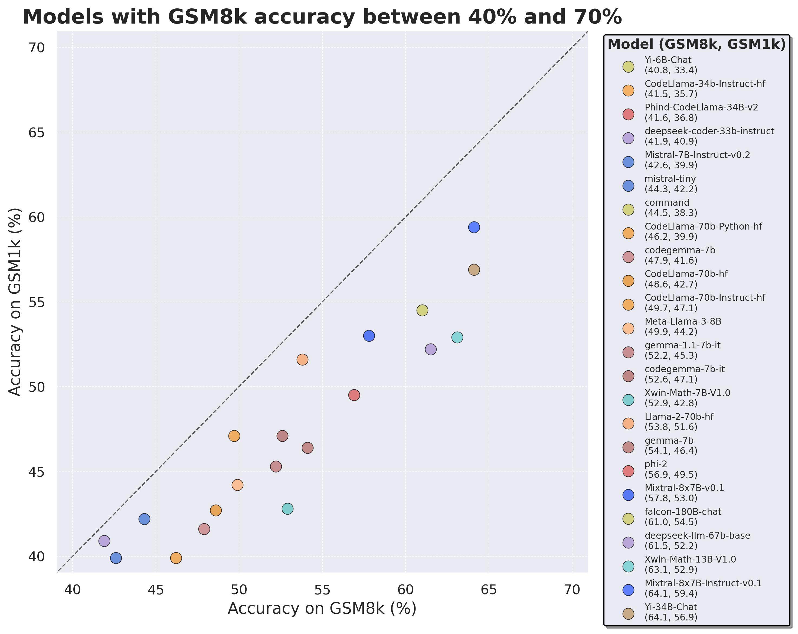

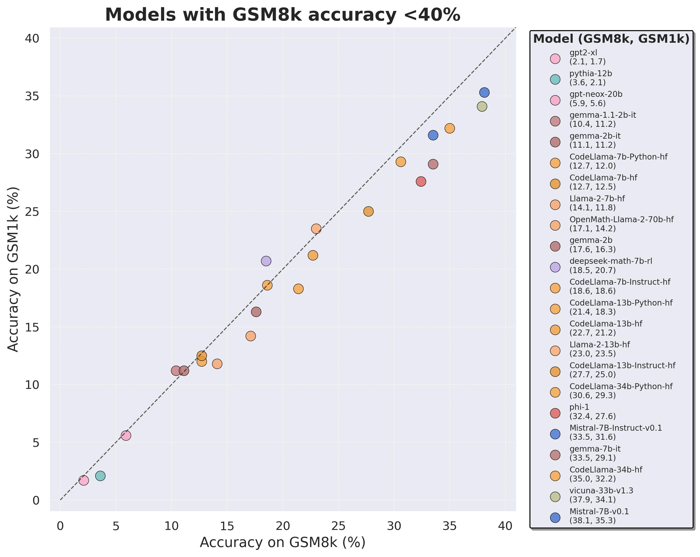

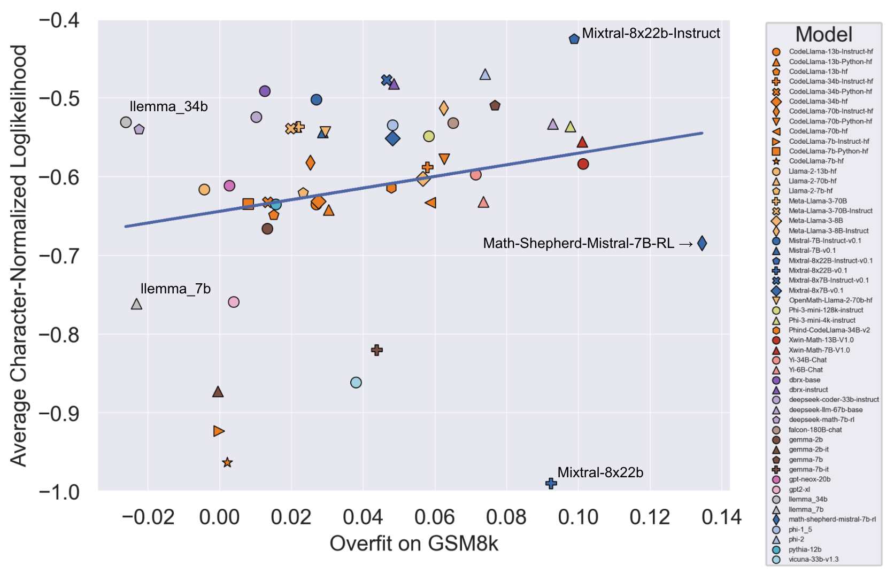

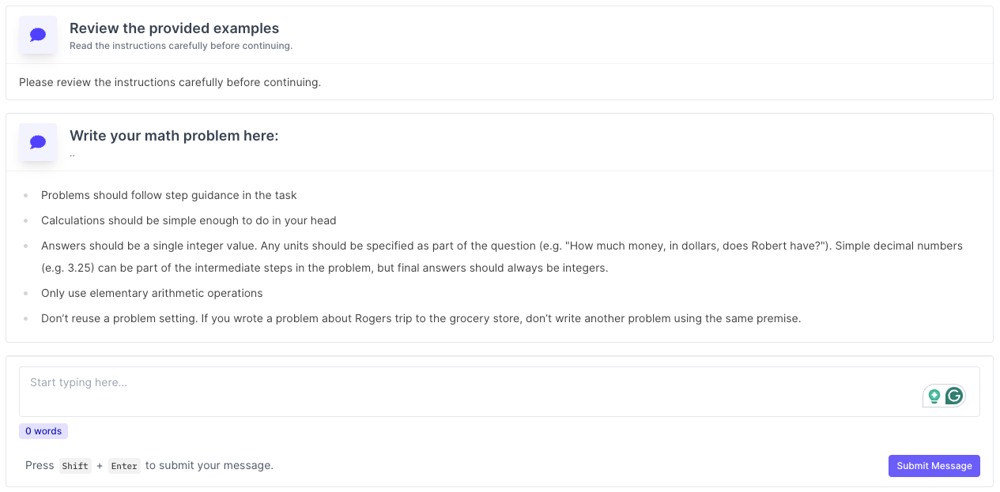

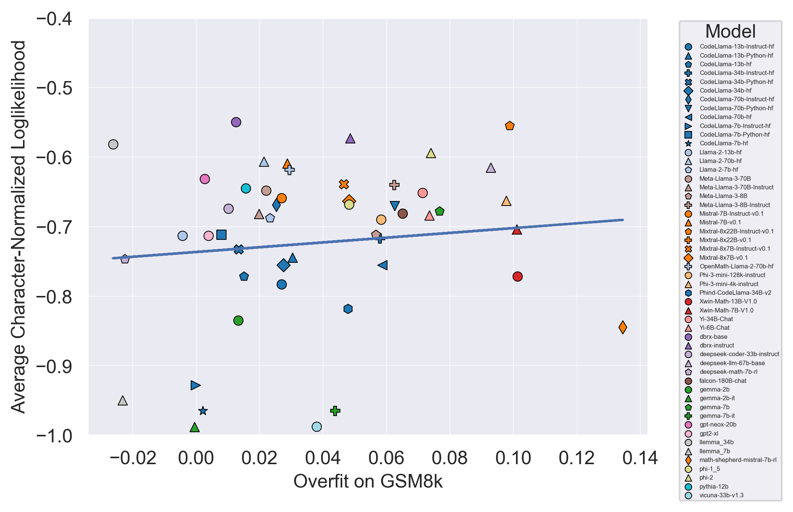

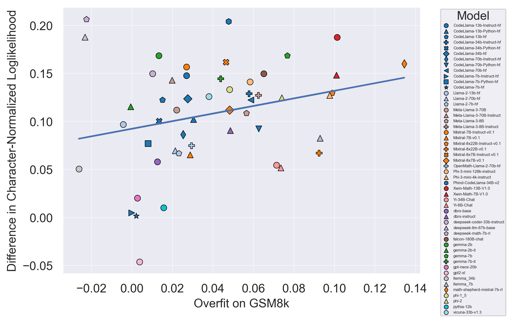

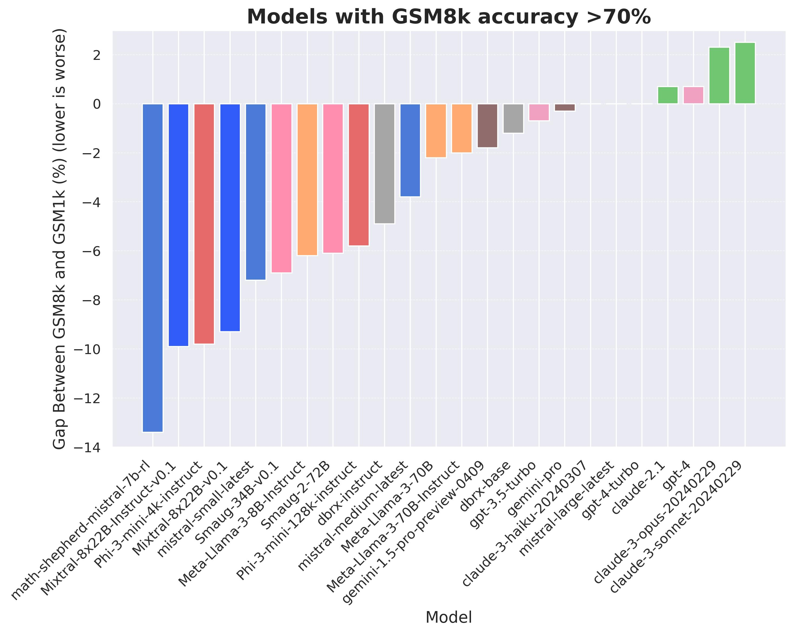

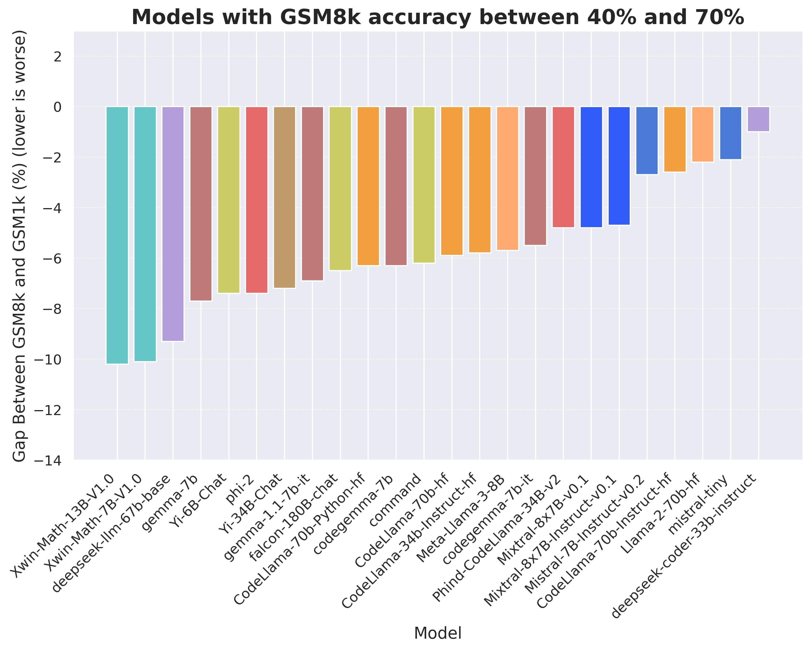

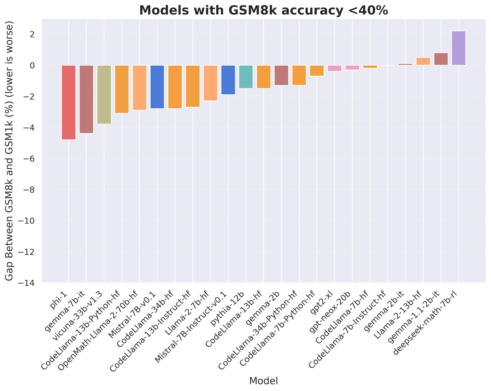

[Arxiv](https://arxiv.org/abs/2405.00332)