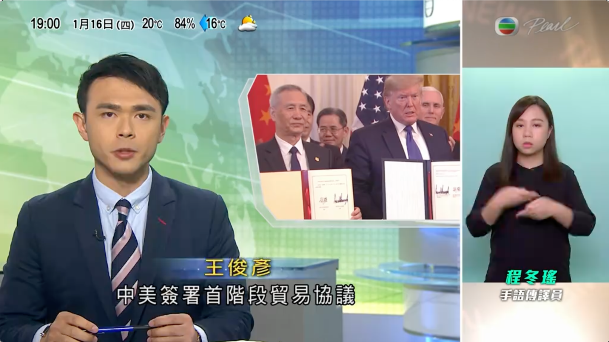
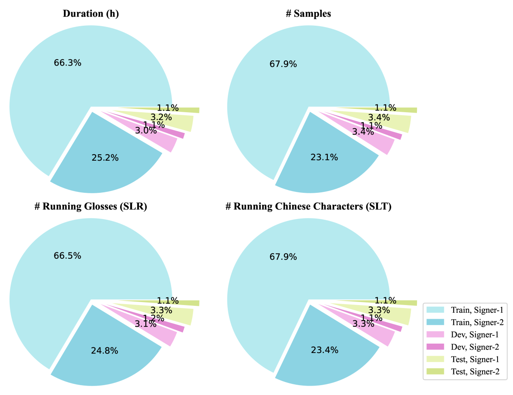
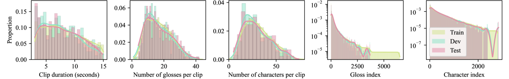
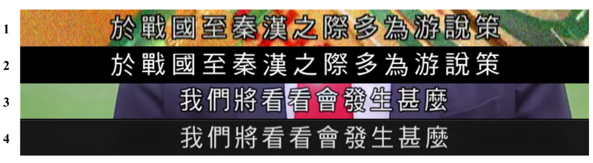
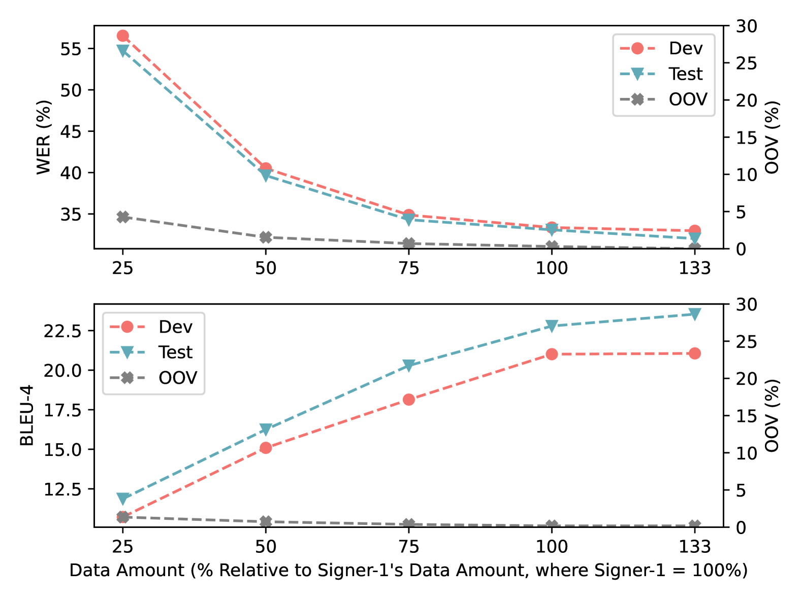

# 香港手语语料库：源自电视手语新闻的采集

发布时间：2024年05月01日

`Agent` `手语识别` `机器翻译`

> A Hong Kong Sign Language Corpus Collected from Sign-interpreted TV News

# 摘要

> 本研究提出了 TVB-HKSL-News，这是一个全新的香港手语（HKSL）数据集，搜集自为期七个月的电视新闻节目。该数据集旨在扩充 HKSL 的资源库，并推动大词汇量连续手语识别（SLR）及翻译（SLT）研究的发展。数据集包含两位手语者共16.07小时的手语视频，涵盖了6,515个术语（用于 SLR）和2,850个中文字符或18K个中文词汇（用于 SLT）。其中一位手语者的视频时长为11.66小时，另一位为4.41小时。构建此数据集的目的之一是探究在拥有大量训练数据的情况下，单一手语者的大词汇量连续手语识别/翻译的效果如何，这可能促成新建模方法的诞生。此外，数据收集流程的大部分已实现自动化，减少了人为干预。我们认为，这种收集方法未来可以扩展，以便为任何手语的 SLT 轻松收集更多数据，只要有相应的手语翻译视频资源。我们还在此数据集上测试了业界领先的 SLR/SLT 模型，得出了 SLR 词汇错误率34.08%和 SLT BLEU-4 分数23.58的基线结果，为未来在此数据集上的研究方向提供了基准。

> This paper introduces TVB-HKSL-News, a new Hong Kong sign language (HKSL) dataset collected from a TV news program over a period of 7 months. The dataset is collected to enrich resources for HKSL and support research in large-vocabulary continuous sign language recognition (SLR) and translation (SLT). It consists of 16.07 hours of sign videos of two signers with a vocabulary of 6,515 glosses (for SLR) and 2,850 Chinese characters or 18K Chinese words (for SLT). One signer has 11.66 hours of sign videos and the other has 4.41 hours. One objective in building the dataset is to support the investigation of how well large-vocabulary continuous sign language recognition/translation can be done for a single signer given a (relatively) large amount of his/her training data, which could potentially lead to the development of new modeling methods. Besides, most parts of the data collection pipeline are automated with little human intervention; we believe that our collection method can be scaled up to collect more sign language data easily for SLT in the future for any sign languages if such sign-interpreted videos are available. We also run a SOTA SLR/SLT model on the dataset and get a baseline SLR word error rate of 34.08% and a baseline SLT BLEU-4 score of 23.58 for benchmarking future research on the dataset.

[Arxiv](https://arxiv.org/abs/2405.00980)