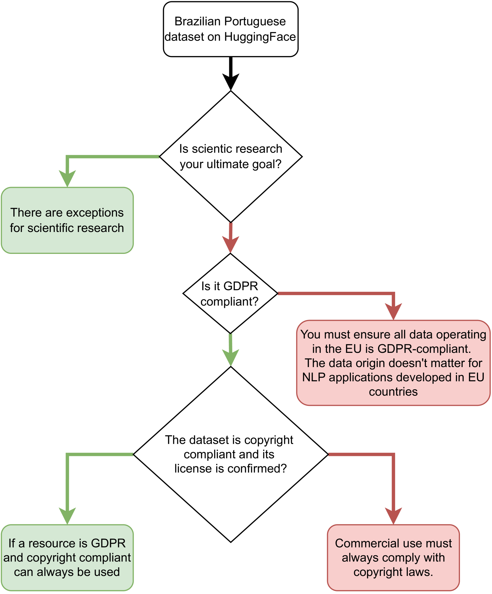
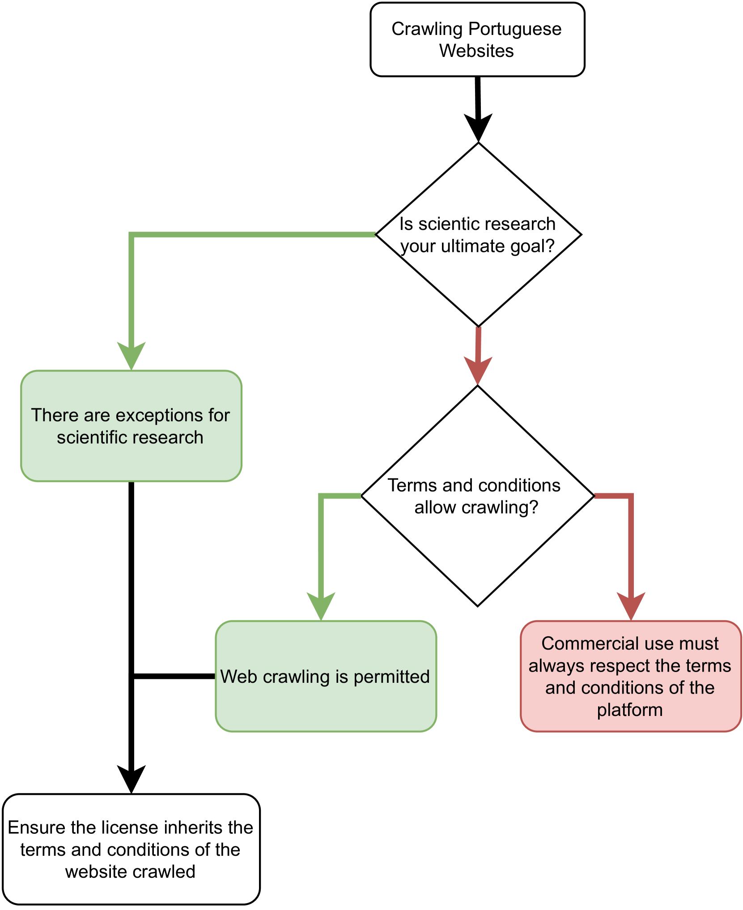
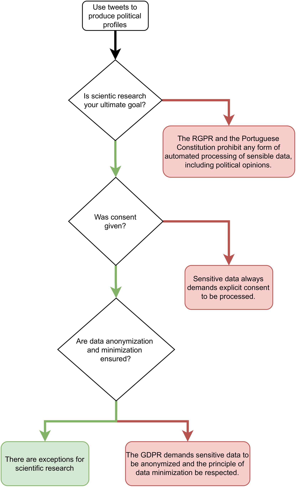

# 葡萄牙建立了一个针对自然语言处理（NLP）模型训练的法律框架。

发布时间：2024年05月01日

`分类：LLM应用`

> A Legal Framework for Natural Language Processing Model Training in Portugal

# 摘要

> 深度学习的最新突破催生了众多计算系统，它们能够执行以往只有人类智慧才能完成的智能任务。在人类语言领域，这一进步使得像ChatGPT这样的应用成为可能，它们无需明确编程即可生成连贯文本。这些模型依托海量文本数据，学习对人类语言的深刻理解。然而，这些技术进步也引发了关于版权和数据隐私侵犯的担忧。尽管如此，自然语言处理（NLP）应用的快速发展往往超越了法规更新的步伐。目前，法律专家与计算机科学家之间的沟通壁垒，常常在NLP应用开发过程中导致无意的法律违规。本文旨在通过展示一系列日常NLP应用案例，并指出开发中可能触及的葡萄牙法律，来弥合这一沟通鸿沟，推动葡萄牙NLP研究的合规性。

> Recent advances in deep learning have promoted the advent of many computational systems capable of performing intelligent actions that, until then, were restricted to the human intellect. In the particular case of human languages, these advances allowed the introduction of applications like ChatGPT that are capable of generating coherent text without being explicitly programmed to do so. Instead, these models use large volumes of textual data to learn meaningful representations of human languages. Associated with these advances, concerns about copyright and data privacy infringements caused by these applications have emerged. Despite these concerns, the pace at which new natural language processing applications continued to be developed largely outperformed the introduction of new regulations. Today, communication barriers between legal experts and computer scientists motivate many unintentional legal infringements during the development of such applications. In this paper, a multidisciplinary team intends to bridge this communication gap and promote more compliant Portuguese NLP research by presenting a series of everyday NLP use cases, while highlighting the Portuguese legislation that may arise during its development.

[Arxiv](https://arxiv.org/abs/2405.00536)