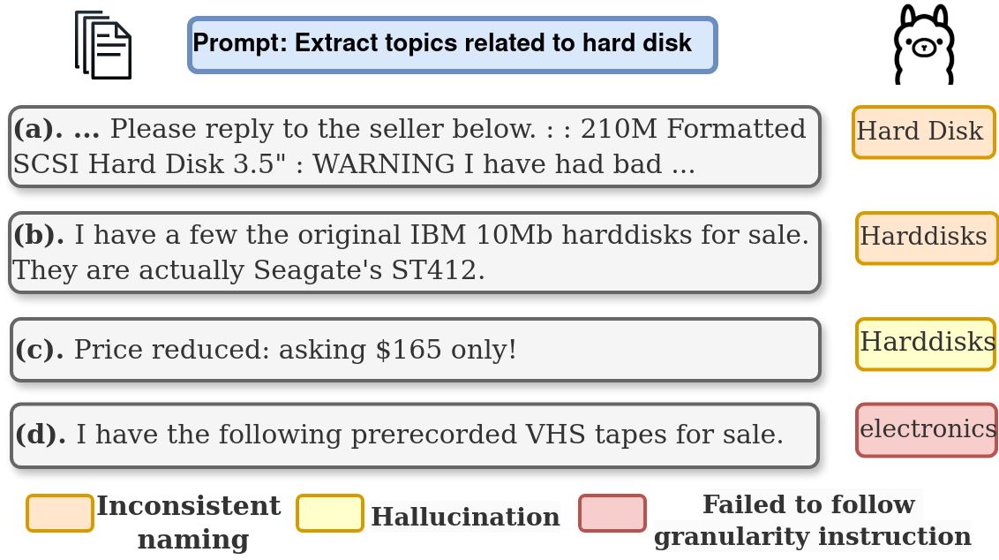
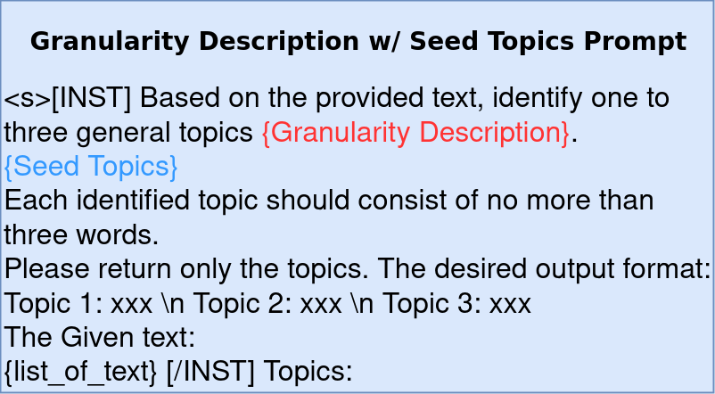
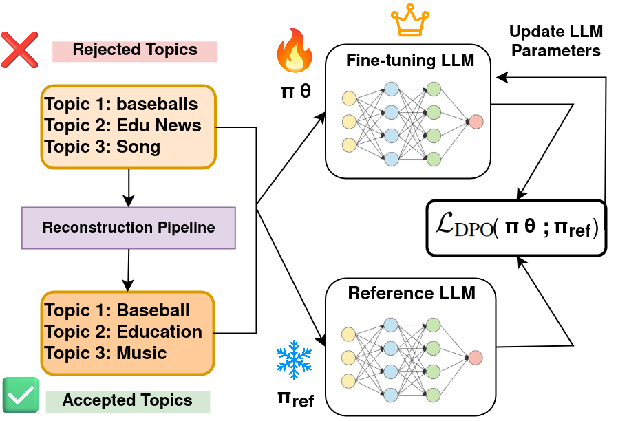
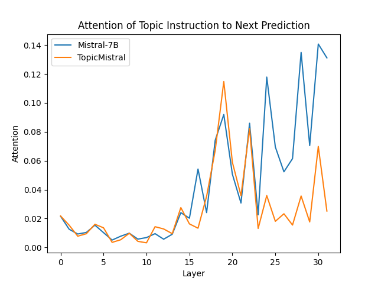

# 探讨大型语言模型在主题建模中的主题粒度细化与幻觉现象

发布时间：2024年05月01日

`LLM应用` `主题建模`

> Addressing Topic Granularity and Hallucination in Large Language Models for Topic Modelling

# 摘要

> 大规模语言模型（LLMs）以其出色的零样本主题抽取功能，为传统的主题建模和封闭集分类方法提供了新选择。这些模型能够根据文档内容，理解指令并生成相关且真实的主题。但当前基于 LLM 的主题建模技术在精确控制主题粒度上存在挑战，常产生大量相似主题。同时，对于 LLM 产生的虚构主题，尚缺乏有效的处理方法。本文聚焦于改善主题粒度控制和减少幻觉现象，以优化基于 LLM 的主题建模。我们提出了一种创新方法，通过直接偏好优化（DPO）技术对开源 LLMs 如 Mistral-7B 进行微调。此方法摒弃了传统的人工标注排名，转而使用重构流程来优化 LLMs 产出的原始主题，实现了一个迅捷高效的训练与推理系统。对比实验结果证明，我们的微调策略显著提升了 LLMs 在生成更一致、贴切、精确主题方面的能力，并有效减少了虚构主题的产生。

> Large language models (LLMs) with their strong zero-shot topic extraction capabilities offer an alternative to probabilistic topic modelling and closed-set topic classification approaches. As zero-shot topic extractors, LLMs are expected to understand human instructions to generate relevant and non-hallucinated topics based on the given documents. However, LLM-based topic modelling approaches often face difficulties in generating topics with adherence to granularity as specified in human instructions, often resulting in many near-duplicate topics. Furthermore, methods for addressing hallucinated topics generated by LLMs have not yet been investigated. In this paper, we focus on addressing the issues of topic granularity and hallucinations for better LLM-based topic modelling. To this end, we introduce a novel approach that leverages Direct Preference Optimisation (DPO) to fine-tune open-source LLMs, such as Mistral-7B. Our approach does not rely on traditional human annotation to rank preferred answers but employs a reconstruction pipeline to modify raw topics generated by LLMs, thus enabling a fast and efficient training and inference framework. Comparative experiments show that our fine-tuning approach not only significantly improves the LLM's capability to produce more coherent, relevant, and precise topics, but also reduces the number of hallucinated topics.

[Arxiv](https://arxiv.org/abs/2405.00611)