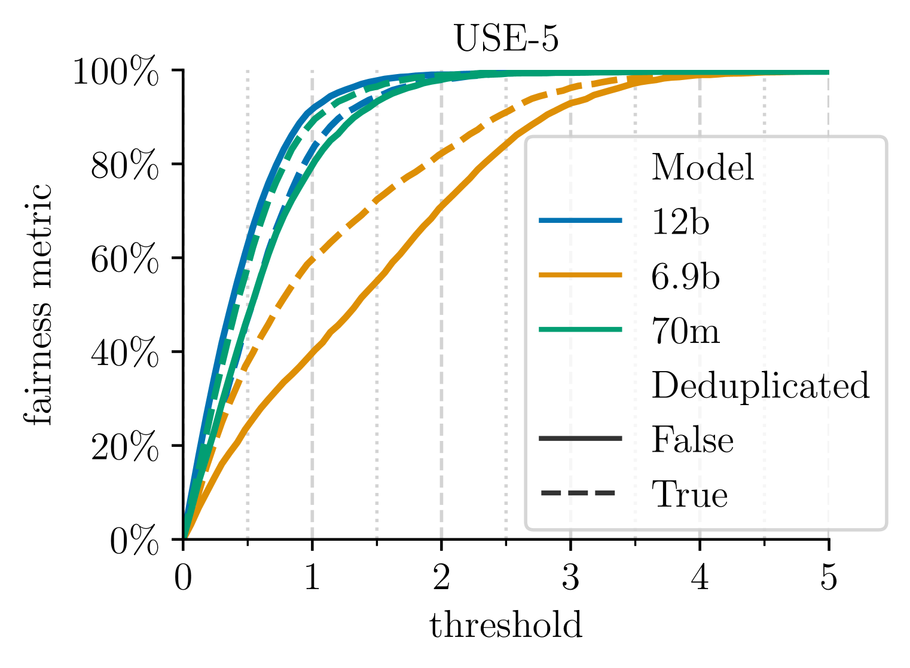

# 文本中若未涉及性别相关词汇，模型是否会表现出偏见？

发布时间：2024年05月01日

`LLM应用` `性别偏见`

> Are Models Biased on Text without Gender-related Language?

# 摘要

> 性别偏见研究揭示了大型语言模型中的不良行为，尤其是与职业和情感相关的性别刻板印象。研究发现，模型往往会因为训练数据中的性别相关性而加深这些刻板印象。本文聚焦于训练数据影响不明显的偏见问题，探讨语言模型在非刻板印象环境下是否仍存在性别偏见。我们提出了UnStereoEval（USE），一个新颖的框架，专为无性别刻板印象场景下探究性别偏见而设计。USE通过预训练数据的统计信息，为句子设定了一个级别分数，以判断其是否含有最少的词-性别关联。利用USE，我们自动生成了不含性别相关语言的基准，以系统地评估流行语言模型在无刻板印象场景下的公平性。此外，我们还利用USE的分数重新评估了先前的性别偏见基准（Winobias和Winogender），以进行非刻板印象的评估。研究发现，在所有测试的28个模型中，公平性普遍较低，模型在9%-41%的无刻板印象句子中才表现出公平行为，这表明偏见并非仅源自性别相关词汇。这一发现引发了关于模型潜在偏见来源的重要讨论，并突显了进行更系统和全面偏见评估的迫切需求。我们已经在 https://ucinlp.github.io/unstereo-eval 上公开了完整的数据集和代码。

> Gender bias research has been pivotal in revealing undesirable behaviors in large language models, exposing serious gender stereotypes associated with occupations, and emotions. A key observation in prior work is that models reinforce stereotypes as a consequence of the gendered correlations that are present in the training data. In this paper, we focus on bias where the effect from training data is unclear, and instead address the question: Do language models still exhibit gender bias in non-stereotypical settings? To do so, we introduce UnStereoEval (USE), a novel framework tailored for investigating gender bias in stereotype-free scenarios. USE defines a sentence-level score based on pretraining data statistics to determine if the sentence contain minimal word-gender associations. To systematically benchmark the fairness of popular language models in stereotype-free scenarios, we utilize USE to automatically generate benchmarks without any gender-related language. By leveraging USE's sentence-level score, we also repurpose prior gender bias benchmarks (Winobias and Winogender) for non-stereotypical evaluation. Surprisingly, we find low fairness across all 28 tested models. Concretely, models demonstrate fair behavior in only 9%-41% of stereotype-free sentences, suggesting that bias does not solely stem from the presence of gender-related words. These results raise important questions about where underlying model biases come from and highlight the need for more systematic and comprehensive bias evaluation. We release the full dataset and code at https://ucinlp.github.io/unstereo-eval.

[Arxiv](https://arxiv.org/abs/2405.00588)