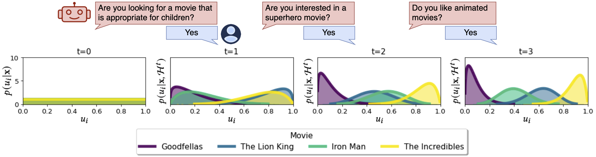
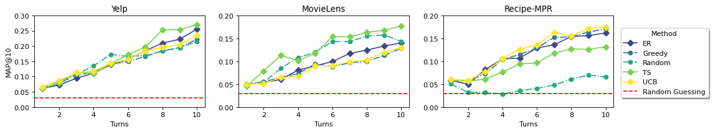

# 利用基于大型语言模型的贝叶斯优化及获取函数，进行自然语言偏好的探索与激发。

发布时间：2024年05月01日

`LLM应用` `对话系统` `推荐系统`

> Bayesian Optimization with LLM-Based Acquisition Functions for Natural Language Preference Elicitation

# 摘要

> 为了构建高效且个性化的对话式推荐系统，快速识别用户在冷启动情境下的首要偏好是一项重大挑战。大型语言模型（LLMs）开启了全自然语言（NL）偏好激发（PE）对话的新篇章，但我们推测，这种单一的LLM NL-PE方法在进行多轮决策理论推理时存在不足，难以有效平衡对用户偏好的探索与利用。而传统的贝叶斯优化PE方法虽然理论上最优，却未能利用自然语言描述或生成查询，且不切实际地假定用户能够直接通过评分和比较来表达偏好。为了克服这些方法的不足，我们提出了一个基于贝叶斯优化（BO）框架的NL-PE方法，旨在生成能够激发自然语言反馈的查询，以降低对项目效用不确定性的评估，从而精准推荐最佳选项。我们的新算法PEBOL，采用了自然语言推理（NLI）技术，以维持用户偏好信念，并结合Thompson Sampling（TS）和上置信界限（UCB）等BO策略，指导LLM生成查询。在受控实验中，我们的方法在10轮冷启动NL-PE对话后，相较于单一的GPT-3.5，MAP@10的性能提升了131%，尽管我们使用的是基于400M参数的小型NLI模型来进行偏好推断。

> Designing preference elicitation (PE) methodologies that can quickly ascertain a user's top item preferences in a cold-start setting is a key challenge for building effective and personalized conversational recommendation (ConvRec) systems. While large language models (LLMs) constitute a novel technology that enables fully natural language (NL) PE dialogues, we hypothesize that monolithic LLM NL-PE approaches lack the multi-turn, decision-theoretic reasoning required to effectively balance the NL exploration and exploitation of user preferences towards an arbitrary item set. In contrast, traditional Bayesian optimization PE methods define theoretically optimal PE strategies, but fail to use NL item descriptions or generate NL queries, unrealistically assuming users can express preferences with direct item ratings and comparisons. To overcome the limitations of both approaches, we formulate NL-PE in a Bayesian Optimization (BO) framework that seeks to generate NL queries which actively elicit natural language feedback to reduce uncertainty over item utilities to identify the best recommendation. We demonstrate our framework in a novel NL-PE algorithm, PEBOL, which uses Natural Language Inference (NLI) between user preference utterances and NL item descriptions to maintain preference beliefs and BO strategies such as Thompson Sampling (TS) and Upper Confidence Bound (UCB) to guide LLM query generation. We numerically evaluate our methods in controlled experiments, finding that PEBOL achieves up to 131% improvement in MAP@10 after 10 turns of cold start NL-PE dialogue compared to monolithic GPT-3.5, despite relying on a much smaller 400M parameter NLI model for preference inference.

[Arxiv](https://arxiv.org/abs/2405.00981)