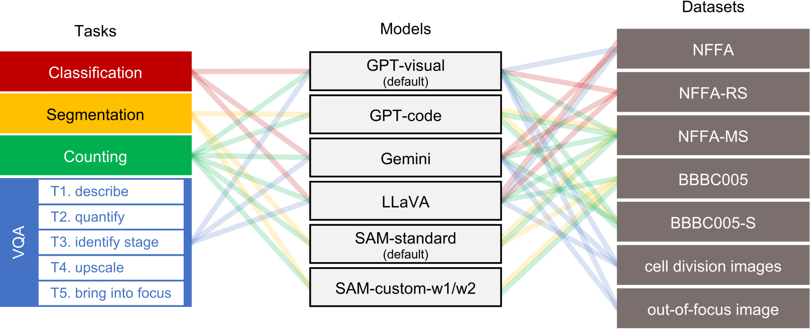

# 超越人眼所见：大型视觉语言模型在显微图像分析领域的应用

发布时间：2024年05月01日

`分类：LLM应用

这篇论文探讨了视觉语言模型（VLMs）和通用分割模型在医学、生物和材料科学领域的显微镜图像分析上的应用。它测试了多个模型在显微镜图像上执行分类、分割、计数和视觉问答（VQA）任务的性能，并比较了它们的表现。这篇论文主要关注这些模型在特定应用场景下的表现，因此归类为LLM应用。` `生物科学`

> Beyond Human Vision: The Role of Large Vision Language Models in Microscope Image Analysis

# 摘要

> 视觉语言模型（VLMs）因其在图像和文本数据理解上的双重能力而成为新宠。VLMs 如 LLaVA、ChatGPT-4 和 Gemini 在自然图像描述、视觉问答（VQA）和空间推理任务上的表现令人瞩目。Meta AI 推出的通用分割模型 Segment Anything Model（SAM）在从未知图像中分离物体方面更是表现卓越。鉴于医学、生物和材料科学领域的专家经常需要结合文本信息来分析显微镜或医学图像，以得出关键结论，因此，对 VLMs 及基础模型如 SAM 在这些图像上的性能进行测试显得尤为重要。本研究中，我们让 ChatGPT、LLaVA、Gemini 和 SAM 在多种显微镜图像上执行分类、分割、计数和 VQA 任务。结果显示，ChatGPT 和 Gemini 在理解显微镜图像的视觉特征方面表现出色，而 SAM 在一般性地分离图像中的物体方面也颇具能力。但这些模型的表现仍未达到领域专家的水平，它们在面对图像中的杂质、缺陷、重叠和多样性时容易受到影响。

> Vision language models (VLMs) have recently emerged and gained the spotlight for their ability to comprehend the dual modality of image and textual data. VLMs such as LLaVA, ChatGPT-4, and Gemini have recently shown impressive performance on tasks such as natural image captioning, visual question answering (VQA), and spatial reasoning. Additionally, a universal segmentation model by Meta AI, Segment Anything Model (SAM) shows unprecedented performance at isolating objects from unforeseen images. Since medical experts, biologists, and materials scientists routinely examine microscopy or medical images in conjunction with textual information in the form of captions, literature, or reports, and draw conclusions of great importance and merit, it is indubitably essential to test the performance of VLMs and foundation models such as SAM, on these images. In this study, we charge ChatGPT, LLaVA, Gemini, and SAM with classification, segmentation, counting, and VQA tasks on a variety of microscopy images. We observe that ChatGPT and Gemini are impressively able to comprehend the visual features in microscopy images, while SAM is quite capable at isolating artefacts in a general sense. However, the performance is not close to that of a domain expert - the models are readily encumbered by the introduction of impurities, defects, artefact overlaps and diversity present in the images.

[Arxiv](https://arxiv.org/abs/2405.00876)