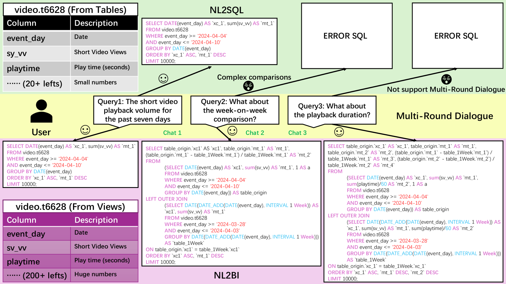
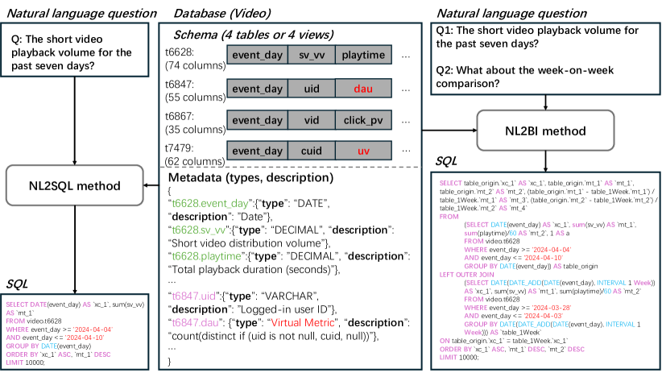
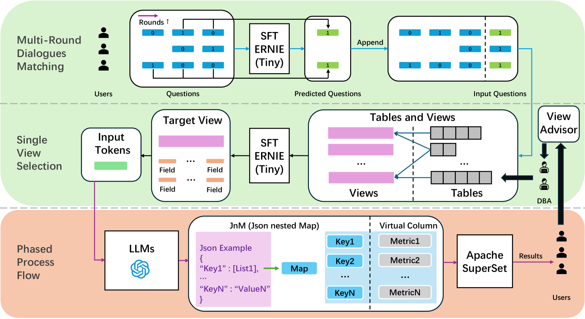
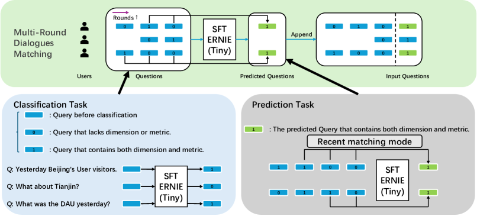
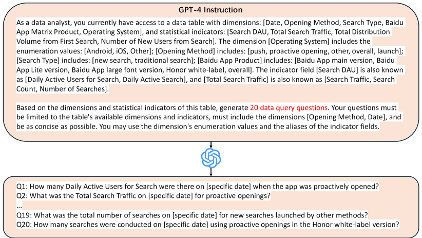
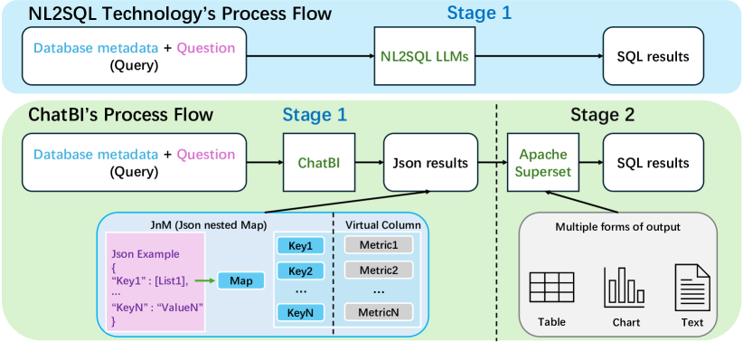
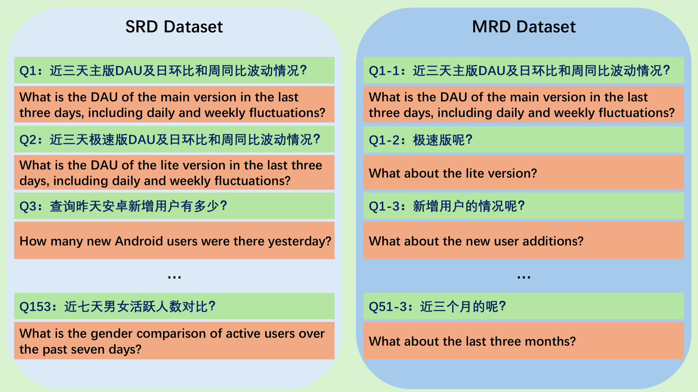

# ChatBI：探索将自然语言转换为复杂的商业智能SQL语句的路径

发布时间：2024年05月01日

`LLM应用` `商业智能` `数据库`

> ChatBI: Towards Natural Language to Complex Business Intelligence SQL

# 摘要

> 自然语言到SQL（NL2SQL）技术让不熟悉数据库的用户也能轻松运用SQL进行数据分析。而将自然语言转化为商业智能（NL2BI）则是NL2SQL技术在实际应用中的一个热门场景，它相较于NL2SQL面临更多挑战。本文提出了ChatBI，一项创新的高效技术，专为解决NL2BI问题而设计。我们首先深入分析了交互模式——这是NL2SQL与NL2BI在应用上的关键差异所在，并为此设计了一款体积更小、成本更低廉的模型。在商业智能（BI）场景中，数据表通常包含大量列，这对于依赖大型语言模型（LLMs）进行架构链接的传统NL2SQL方法来说，由于令牌限制而难以实现。此外，BI场景中模糊列的高比例也增加了架构链接的难度。ChatBI巧妙地结合了数据库领域现有的视图技术，先将架构链接问题简化为单一视图选择问题，再利用一款成本效益更高的机器学习模型来选取列数大幅减少的单一视图。随后，这个视图的列被用作LLM进行架构链接所需的列。ChatBI还提出了一种新颖的分阶段处理流程，与传统流程不同，它能够更精确地生成包含复杂语义和比较关系的SQL语句。我们在百度的数据平台上部署了ChatBI，并将其融入多条产品线，进行了大规模生产任务的评估。结果显示，ChatBI在实用性、通用性和效率方面均表现出色。与当前主流的NL2SQL技术相比，ChatBI在我们实际的BI场景数据表和查询中也取得了最优的成绩。

> The Natural Language to SQL (NL2SQL) technology provides non-expert users who are unfamiliar with databases the opportunity to use SQL for data analysis.Converting Natural Language to Business Intelligence (NL2BI) is a popular practical scenario for NL2SQL in actual production systems. Compared to NL2SQL, NL2BI introduces more challenges.
  In this paper, we propose ChatBI, a comprehensive and efficient technology for solving the NL2BI task. First, we analyze the interaction mode, an important module where NL2SQL and NL2BI differ in use, and design a smaller and cheaper model to match this interaction mode. In BI scenarios, tables contain a huge number of columns, making it impossible for existing NL2SQL methods that rely on Large Language Models (LLMs) for schema linking to proceed due to token limitations. The higher proportion of ambiguous columns in BI scenarios also makes schema linking difficult. ChatBI combines existing view technology in the database community to first decompose the schema linking problem into a Single View Selection problem and then uses a smaller and cheaper machine learning model to select the single view with a significantly reduced number of columns. The columns of this single view are then passed as the required columns for schema linking into the LLM. Finally, ChatBI proposes a phased process flow different from existing process flows, which allows ChatBI to generate SQL containing complex semantics and comparison relations more accurately.
  We have deployed ChatBI on Baidu's data platform and integrated it into multiple product lines for large-scale production task evaluation. The obtained results highlight its superiority in practicality, versatility, and efficiency. At the same time, compared with the current mainstream NL2SQL technology under our real BI scenario data tables and queries, it also achieved the best results.

[Arxiv](https://arxiv.org/abs/2405.00527)