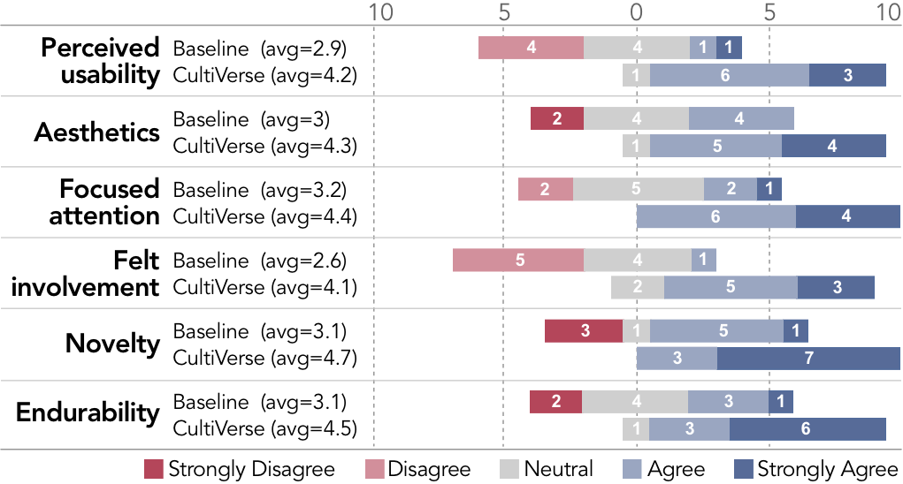

# CultiVerse：迈向利用大型语言模型深化对绘画艺术的跨文化洞察。

发布时间：2024年05月01日

`分类：LLM应用

这篇论文探讨了大型语言模型（LLMs）在跨文化艺术欣赏中的应用，特别是如何利用LLMs来增进对中国传统绘画（TCPs）的理解。通过引入CultiVerse这一视觉分析系统，该系统采用了混合主动性框架内的LLMs，来解决艺术作品中文化象征意义的翻译难题。这表明了LLMs在跨文化交流和艺术欣赏领域的应用潜力，因此将其归类为LLM应用。` `文化研究` `艺术欣赏`

> CultiVerse: Towards Cross-Cultural Understanding for Paintings with Large Language Model

# 摘要

> 将尖端科技与文化研究相结合，可以深化我们对文化传承的认识，但要吸引多元受众却非易事。在不同文化背景下，将个人的解读与作品的本意相匹配尤为困难。本研究致力于探究跨文化视角下艺术欣赏的关键要素。我们研究了大型语言模型（LLMs）在跨越文化和语言障碍、增进对中国传统绘画（TCPs）理解方面的潜力。我们介绍了CultiVerse，这是一款视觉分析系统，它采用了混合主动性框架内的LLMs，提升了跨文化交流中对TCP的深入理解。CultiVerse致力于解决艺术作品中细腻象征意义的翻译难题，这包括解读复杂的文化背景、对齐不同文化中的象征元素，并确认文化认同。CultiVerse结合了互动界面与LLMs的分析功能，对精选的TCP数据集进行探索，助力多维度象征意义的分析和跨文化意外发现的探索。实证评估表明，CultiVerse显著提升了跨文化理解能力，为艺术欣赏提供了更深层次的洞察和更具吸引力的体验。

> The integration of new technology with cultural studies enhances our understanding of cultural heritage but often struggles to connect with diverse audiences. It is challenging to align personal interpretations with the intended meanings across different cultures. Our study investigates the important factors in appreciating art from a cross-cultural perspective. We explore the application of Large Language Models (LLMs) to bridge the cultural and language barriers in understanding Traditional Chinese Paintings (TCPs). We present CultiVerse, a visual analytics system that utilizes LLMs within a mixed-initiative framework, enhancing interpretative appreciation of TCP in a cross-cultural dialogue. CultiVerse addresses the challenge of translating the nuanced symbolism in art, which involves interpreting complex cultural contexts, aligning cross-cultural symbols, and validating cultural acceptance. CultiVerse integrates an interactive interface with the analytical capability of LLMs to explore a curated TCP dataset, facilitating the analysis of multifaceted symbolic meanings and the exploration of cross-cultural serendipitous discoveries. Empirical evaluations affirm that CultiVerse significantly improves cross-cultural understanding, offering deeper insights and engaging art appreciation.

[Arxiv](https://arxiv.org/abs/2405.00435)