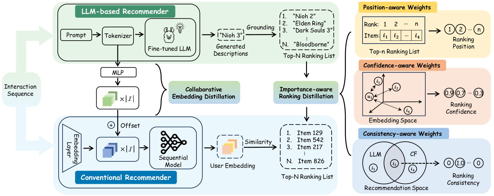
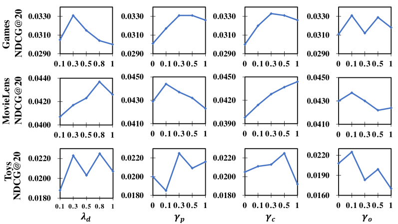

# 蒸馏技术至关重要：它能够提升序列推荐系统的性能，使其达到大型语言模型的水平。

发布时间：2024年05月01日

`分类：LLM应用` `推荐系统` `知识蒸馏`

> Distillation Matters: Empowering Sequential Recommenders to Match the Performance of Large Language Model

# 摘要

> 大型语言模型（LLMs）凭借其卓越的语义推理能力，在推荐系统中发挥着重要作用，表现出色。但它们的高推理延迟成为了实际应用的瓶颈。为克服这一难题，本研究提出了一种从复杂的LLM推荐模型向传统顺序模型进行知识蒸馏的新方法。这一过程面临三大挑战：教师知识的不稳定性、师生容量差异导致的学习难题，以及语义空间发散性对嵌入知识蒸馏的影响。为此，我们设计了一种创新的蒸馏策略DLLM2Rec，专门用于实现这一转换。DLLM2Rec包含两个核心组件：一是重要性感知排名蒸馏，它通过权衡教师信心和师生一致性来筛选可靠的、适合学生的知识；二是协作嵌入蒸馏，它将教师嵌入的知识与数据中挖掘的协作信号相结合。通过大量实验，我们验证了DLLM2Rec的有效性，它平均提升了三种典型顺序模型性能的47.97%，在某些情况下甚至超过了基于LLM的推荐系统。

> Owing to their powerful semantic reasoning capabilities, Large Language Models (LLMs) have been effectively utilized as recommenders, achieving impressive performance. However, the high inference latency of LLMs significantly restricts their practical deployment. To address this issue, this work investigates knowledge distillation from cumbersome LLM-based recommendation models to lightweight conventional sequential models. It encounters three challenges: 1) the teacher's knowledge may not always be reliable; 2) the capacity gap between the teacher and student makes it difficult for the student to assimilate the teacher's knowledge; 3) divergence in semantic space poses a challenge to distill the knowledge from embeddings. To tackle these challenges, this work proposes a novel distillation strategy, DLLM2Rec, specifically tailored for knowledge distillation from LLM-based recommendation models to conventional sequential models. DLLM2Rec comprises: 1) Importance-aware ranking distillation, which filters reliable and student-friendly knowledge by weighting instances according to teacher confidence and student-teacher consistency; 2) Collaborative embedding distillation integrates knowledge from teacher embeddings with collaborative signals mined from the data. Extensive experiments demonstrate the effectiveness of the proposed DLLM2Rec, boosting three typical sequential models with an average improvement of 47.97%, even enabling them to surpass LLM-based recommenders in some cases.

[Arxiv](https://arxiv.org/abs/2405.00338)