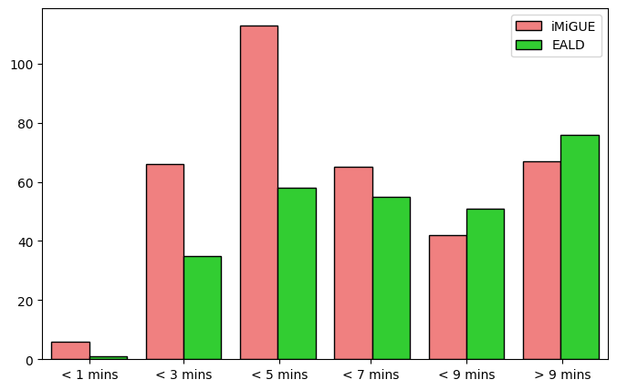
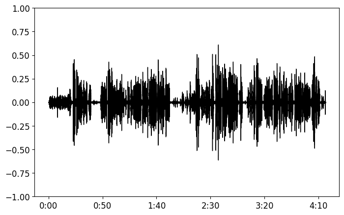
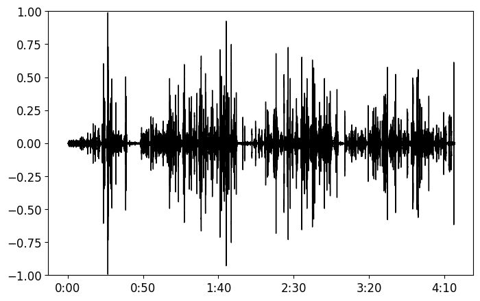
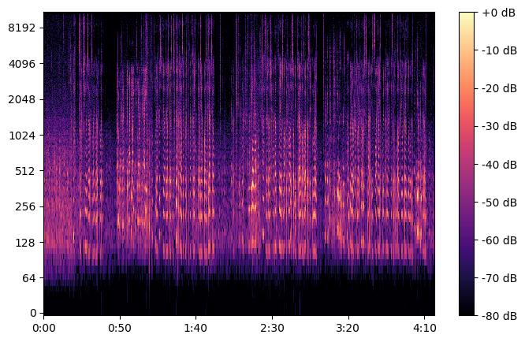
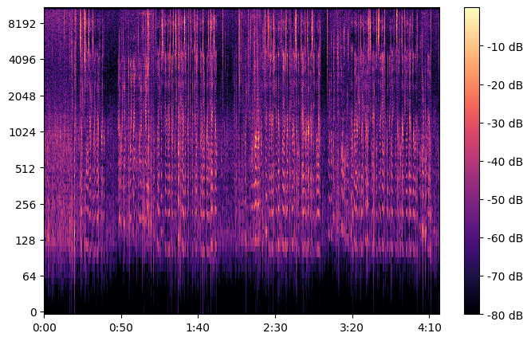
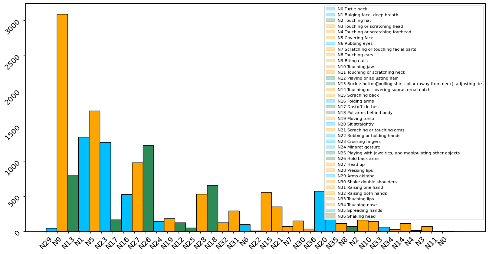
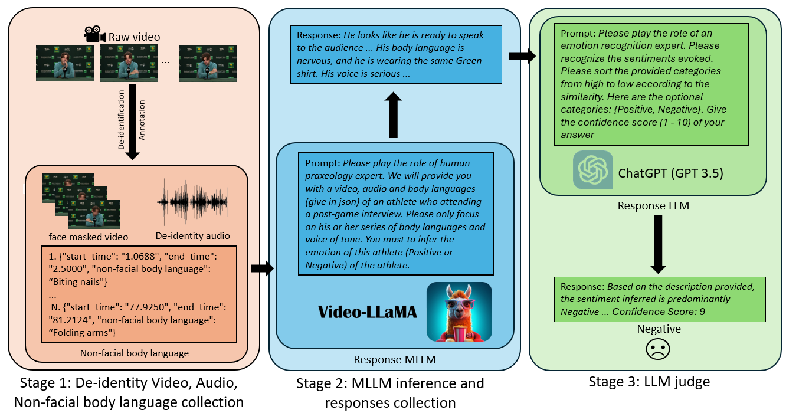
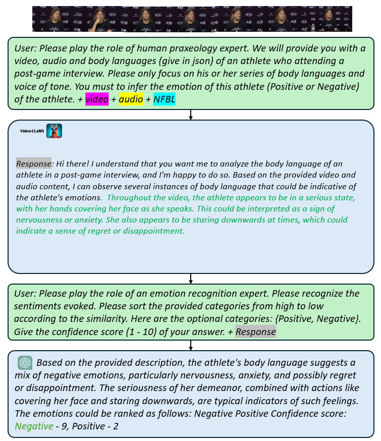
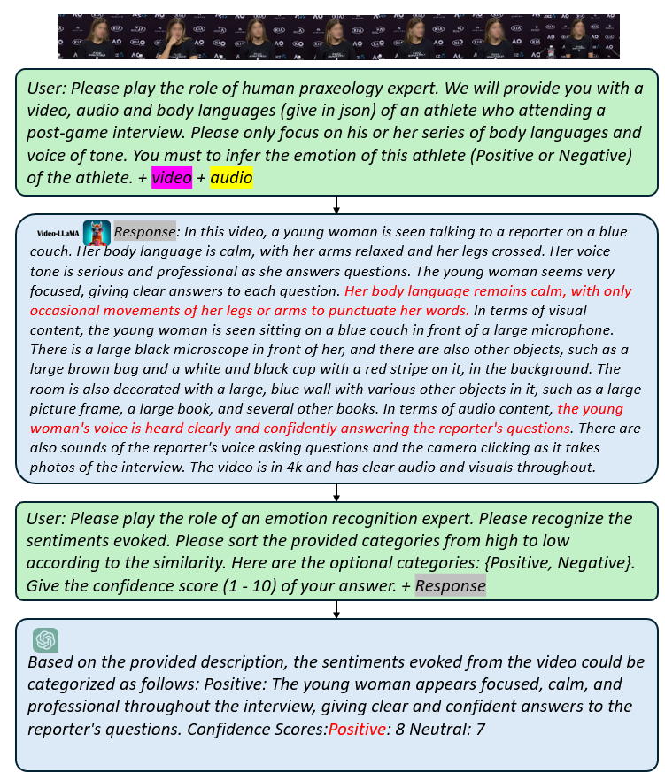
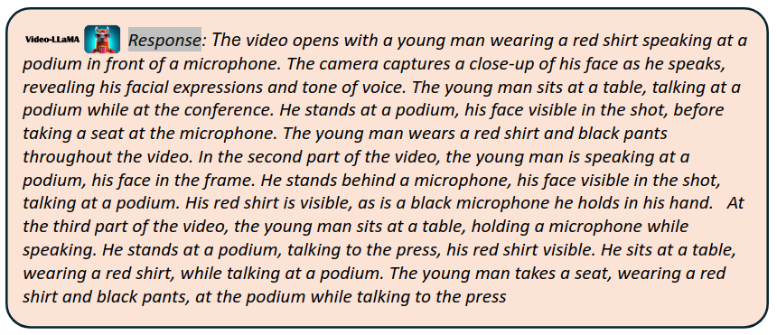

# EALD-MLLM：利用多模态大型语言模型对长序列及去身份视频进行情感分析。

发布时间：2024年05月01日

`分类：Agent` `情感分析` `人工智能`

> EALD-MLLM: Emotion Analysis in Long-sequential and De-identity videos with Multi-modal Large Language Model

# 摘要

> 情感人工智能，即机器对人类情感的洞察力，已在研究中取得显著成果，但仍有两大挑战亟待克服：首先，过往研究多聚焦于短视频情感分析，而忽略了长视频序列的重要性。短视频仅能捕捉瞬间情感，可能受人为操控或隐藏，而长视频则能展现更真实的情感表达；其次，尽管现有研究广泛采用面部、语音乃至敏感的生物信号（如心电图），但随着隐私保护意识的增强，开发不依赖敏感信息的情感AI技术变得尤为关键。为应对这些挑战，本文提出了一个新的数据集EALD，专注于长序列、去身份运动员赛后访谈的情感分析。我们不仅标注了每段视频的整体情感状态，还对每位运动员的非面部肢体语言（NFBL）进行了详细注释，NFBL作为一种内在的情感表达，为我们提供了一个不受身份影响的情感识别线索。此外，我们还建立了一个简洁而有效的基线模型，用于后续研究。通过评估多模态大型语言模型（MLLM）在去除身份信息信号（如视觉、语音和NFBL）后的情感分析性能，我们的实验证实了MLLM即使在零样本情况下也能与单模态监督模型相媲美，甚至更优，同时NFBL在长序列情感分析中扮演了关键角色。EALD数据集将面向公众开放。

> Emotion AI is the ability of computers to understand human emotional states. Existing works have achieved promising progress, but two limitations remain to be solved: 1) Previous studies have been more focused on short sequential video emotion analysis while overlooking long sequential video. However, the emotions in short sequential videos only reflect instantaneous emotions, which may be deliberately guided or hidden. In contrast, long sequential videos can reveal authentic emotions; 2) Previous studies commonly utilize various signals such as facial, speech, and even sensitive biological signals (e.g., electrocardiogram). However, due to the increasing demand for privacy, developing Emotion AI without relying on sensitive signals is becoming important. To address the aforementioned limitations, in this paper, we construct a dataset for Emotion Analysis in Long-sequential and De-identity videos called EALD by collecting and processing the sequences of athletes' post-match interviews. In addition to providing annotations of the overall emotional state of each video, we also provide the Non-Facial Body Language (NFBL) annotations for each player. NFBL is an inner-driven emotional expression and can serve as an identity-free clue to understanding the emotional state. Moreover, we provide a simple but effective baseline for further research. More precisely, we evaluate the Multimodal Large Language Models (MLLMs) with de-identification signals (e.g., visual, speech, and NFBLs) to perform emotion analysis. Our experimental results demonstrate that: 1) MLLMs can achieve comparable, even better performance than the supervised single-modal models, even in a zero-shot scenario; 2) NFBL is an important cue in long sequential emotion analysis. EALD will be available on the open-source platform.

[Arxiv](https://arxiv.org/abs/2405.00574)