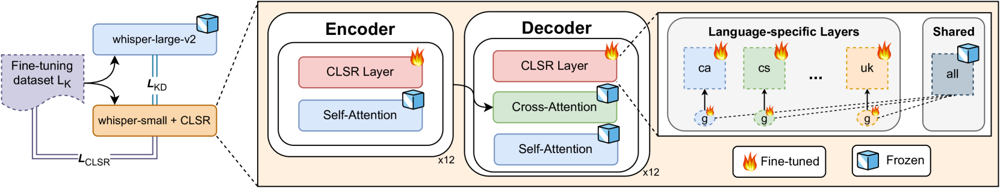

# 本文介绍了一种高效的多任务多语言语音模型压缩技术，旨在优化模型的存储和计算效率。

发布时间：2024年05月01日

`分类：LLM应用` `语音识别` `自动语音识别`

> Efficient Compression of Multitask Multilingual Speech Models

# 摘要

> Whisper，一个涵盖99种语言的多任务多语言语音识别模型，在某些语言上展现了卓越的自动语音识别（ASR）成果。然而，它在一些少数语言上的表现仍有提升空间，尤其是在模型的小型化版本中。本研究深入探讨了其局限性，揭示了与说话者（如性别、年龄）和模型（如资源配置和尺寸）相关的偏见。尽管存在这些偏见，我们发现仅有模型相关的偏见会在量化过程中被放大，对资源匮乏的语言和小型模型影响更大。为了寻求更佳的压缩技术，我们提出了DistilWhisper方法，旨在提升这些语言的ASR性能，同时保持多任务多语言的优势。该方法包括两个核心策略：一是针对特定语言的专家对小型化的Whisper模型进行轻量级模块化微调；二是从大型Whisper模型中提取知识进行蒸馏。这种双管齐下的方法不仅有效提升了ASR性能，还保持了多任务多语言预训练的鲁棒性。实验结果证明，相较于传统的微调或LoRA适配器，我们的方法在目标语言的测试集上，无论是在领域内还是领域外，都显著提升了性能，同时在推理时几乎不增加参数负担。

> Whisper is a multitask and multilingual speech model covering 99 languages. It yields commendable automatic speech recognition (ASR) results in a subset of its covered languages, but the model still underperforms on a non-negligible number of under-represented languages, a problem exacerbated in smaller model versions. In this work, we examine its limitations, demonstrating the presence of speaker-related (gender, age) and model-related (resourcefulness and model size) bias. Despite that, we show that only model-related bias are amplified by quantization, impacting more low-resource languages and smaller models. Searching for a better compression approach, we propose DistilWhisper, an approach that is able to bridge the performance gap in ASR for these languages while retaining the advantages of multitask and multilingual capabilities. Our approach involves two key strategies: lightweight modular ASR fine-tuning of whisper-small using language-specific experts, and knowledge distillation from whisper-large-v2. This dual approach allows us to effectively boost ASR performance while keeping the robustness inherited from the multitask and multilingual pre-training. Results demonstrate that our approach is more effective than standard fine-tuning or LoRA adapters, boosting performance in the targeted languages for both in- and out-of-domain test sets, while introducing only a negligible parameter overhead at inference.

[Arxiv](https://arxiv.org/abs/2405.00966)