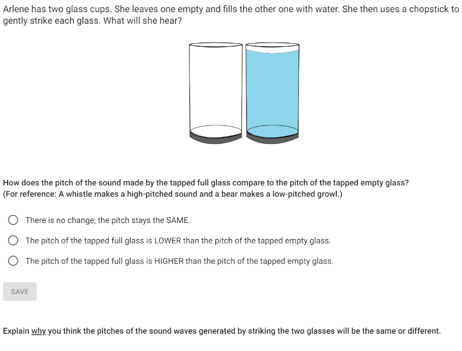
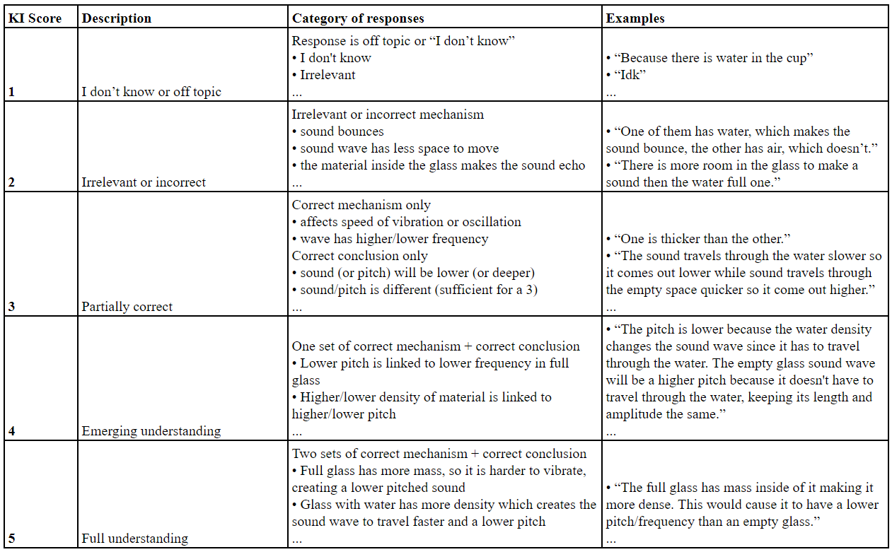
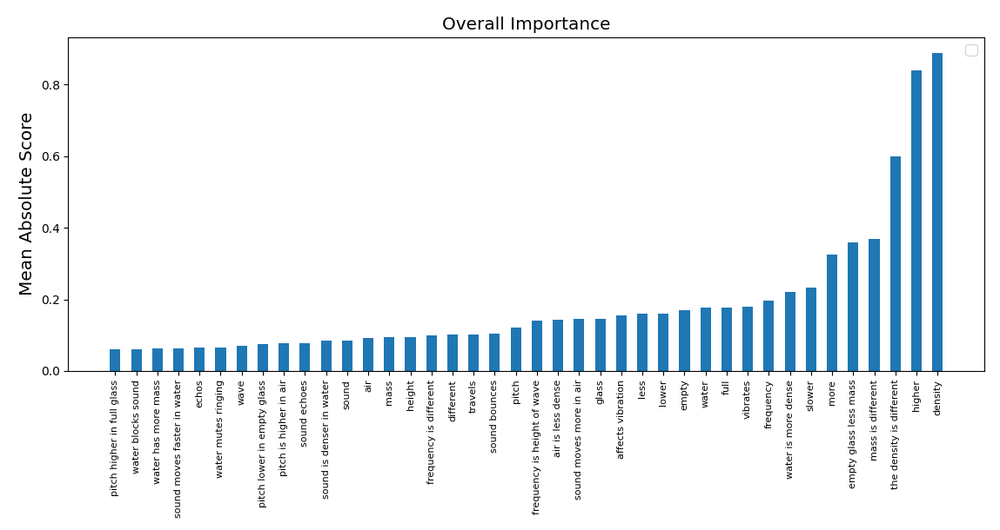
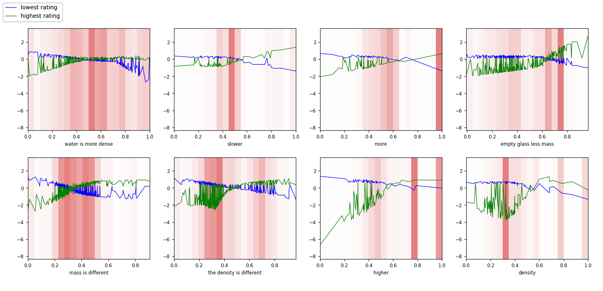
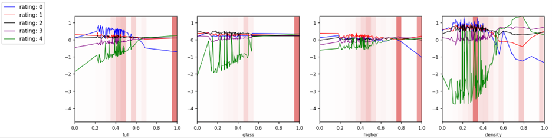

# 神经加性模型在自动评分中的应用，实现了评分过程的可解释性。

发布时间：2024年05月01日

`分类：LLM应用` `自动评分系统`

> Explainable Automatic Grading with Neural Additive Models

# 摘要

> 采用自动短答题评分（ASAG）系统不仅能减轻教师的评分压力，还能促进开放式问题的广泛应用。尽管如此，现有的ASAG系统往往庞大且不透明，缺乏对评分依据的明确解释，这使得教师和学生难以理解评分结果。为了解决这一问题，我们探索了一种名为神经加性模型（NAM）的模型，它将神经网络的强大性能与加性模型的清晰解释力相结合。我们利用学习科学中的知识整合（KI）框架来指导特性工程，确保评分系统能够捕捉到学生回答中的关键思想。我们推测，将预定义思想的包含或遗漏作为评分特征，不仅能提高模型的预测准确性，还能增强其可解释性，从而辅助人工评分者使用KI标准进行评分。我们还对NAM的性能进行了评估，将其与逻辑回归这一可解释模型以及DeBERTa这一无需特性工程的不可解释神经模型进行了比较。

> The use of automatic short answer grading (ASAG) models may help alleviate the time burden of grading while encouraging educators to frequently incorporate open-ended items in their curriculum. However, current state-of-the-art ASAG models are large neural networks (NN) often described as "black box", providing no explanation for which characteristics of an input are important for the produced output. This inexplicable nature can be frustrating to teachers and students when trying to interpret, or learn from an automatically-generated grade. To create a powerful yet intelligible ASAG model, we experiment with a type of model called a Neural Additive Model that combines the performance of a NN with the explainability of an additive model. We use a Knowledge Integration (KI) framework from the learning sciences to guide feature engineering to create inputs that reflect whether a student includes certain ideas in their response. We hypothesize that indicating the inclusion (or exclusion) of predefined ideas as features will be sufficient for the NAM to have good predictive power and interpretability, as this may guide a human scorer using a KI rubric. We compare the performance of the NAM with another explainable model, logistic regression, using the same features, and to a non-explainable neural model, DeBERTa, that does not require feature engineering.

[Arxiv](https://arxiv.org/abs/2405.00489)