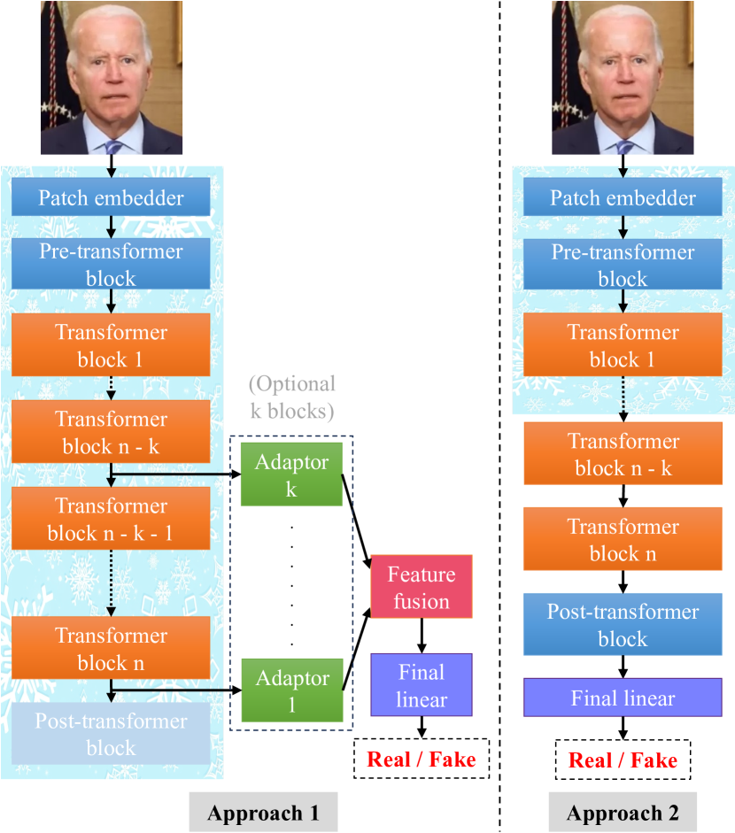
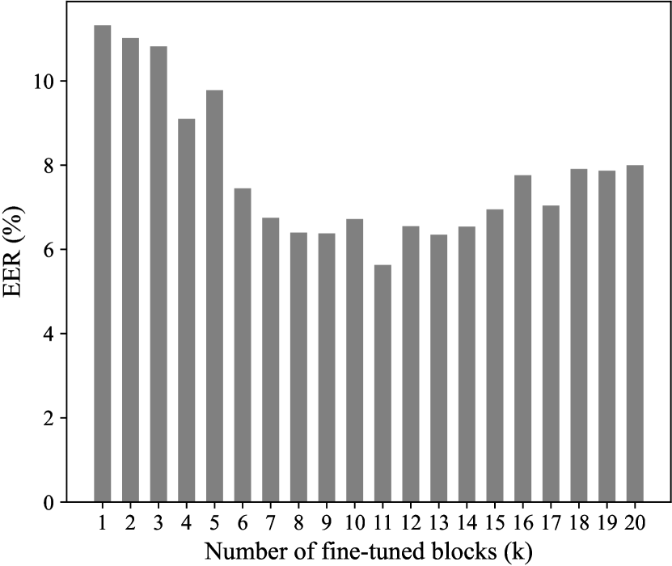

# 本研究深入探讨了自监督视觉变换器在深度伪造检测中的应用，并进行了一项全面的比较分析。

发布时间：2024年05月01日

`分类：LLM应用` `深度伪造检测` `自监督学习`

> Exploring Self-Supervised Vision Transformers for Deepfake Detection: A Comparative Analysis

# 摘要

> 本研究探讨了自监督预训练变换器在识别各类深度伪造对象时，相较于传统监督预训练变换器和常规神经网络的优势，尤其是在数据训练受限的情况下对泛化能力的提升。尽管变换器架构在视觉-语言模型中的应用已在多项任务中取得了显著成果，包括零样本和少样本学习，但深度伪造检测领域对于采纳预训练视觉变换器，尤其是大型模型，作为特征提取器仍持谨慎态度。主要顾虑在于这些模型的高容量特性，它们通常需要大量数据支持，这在训练数据稀缺或多样性不足时可能导致泛化性能不佳，这与已经证明其鲁棒性的ConvNets形成对比。而且，从头开始训练和优化变换器需要巨大的计算资源，这通常只有大型公司能够承担，限制了学术界的深入研究。然而，自监督学习（SSL）在变换器中的应用，如DINO及其衍生模型，已在多种视觉任务中显示出强大的适应性和语义分割能力。通过采用DINO进行深度伪造检测，并结合适度的训练数据和部分微调策略，我们发现模型能够很好地适应检测任务，并通过注意力机制自然地解释检测结果。此外，对变换器进行部分微调的方法，为深度伪造检测提供了一种更为高效的资源利用方式，显著降低了计算资源的需求。

> This paper investigates the effectiveness of self-supervised pre-trained transformers compared to supervised pre-trained transformers and conventional neural networks (ConvNets) for detecting various types of deepfakes. We focus on their potential for improved generalization, particularly when training data is limited. Despite the notable success of large vision-language models utilizing transformer architectures in various tasks, including zero-shot and few-shot learning, the deepfake detection community has still shown some reluctance to adopt pre-trained vision transformers (ViTs), especially large ones, as feature extractors. One concern is their perceived excessive capacity, which often demands extensive data, and the resulting suboptimal generalization when training or fine-tuning data is small or less diverse. This contrasts poorly with ConvNets, which have already established themselves as robust feature extractors. Additionally, training and optimizing transformers from scratch requires significant computational resources, making this accessible primarily to large companies and hindering broader investigation within the academic community. Recent advancements in using self-supervised learning (SSL) in transformers, such as DINO and its derivatives, have showcased significant adaptability across diverse vision tasks and possess explicit semantic segmentation capabilities. By leveraging DINO for deepfake detection with modest training data and implementing partial fine-tuning, we observe comparable adaptability to the task and the natural explainability of the detection result via the attention mechanism. Moreover, partial fine-tuning of transformers for deepfake detection offers a more resource-efficient alternative, requiring significantly fewer computational resources.

[Arxiv](https://arxiv.org/abs/2405.00355)