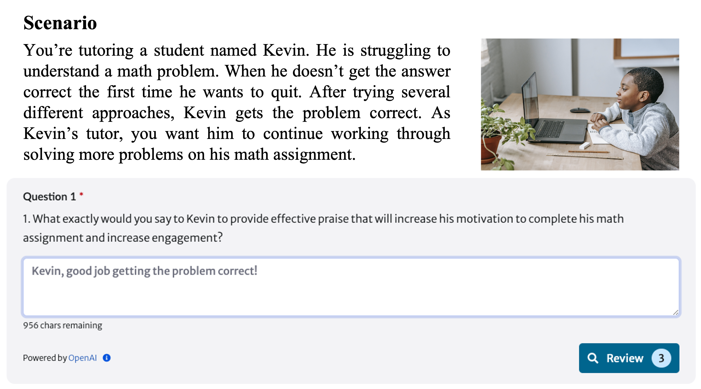
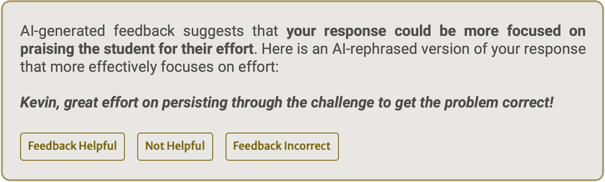
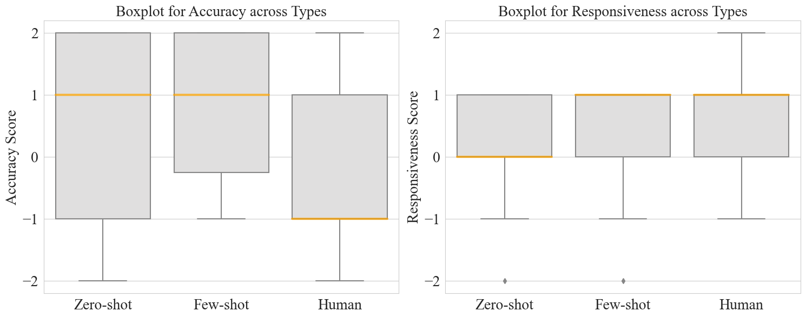
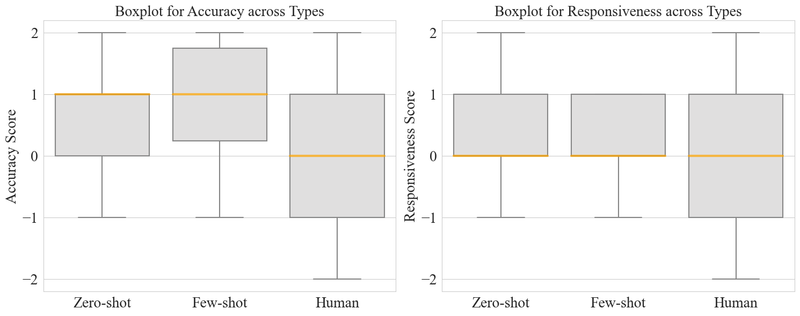
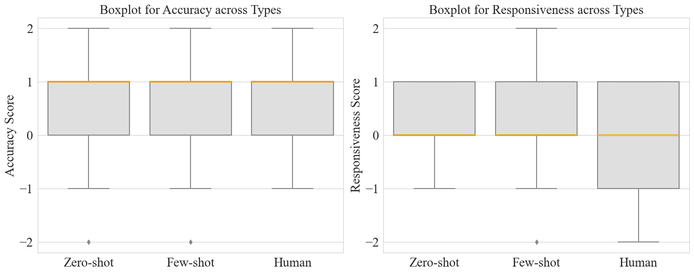
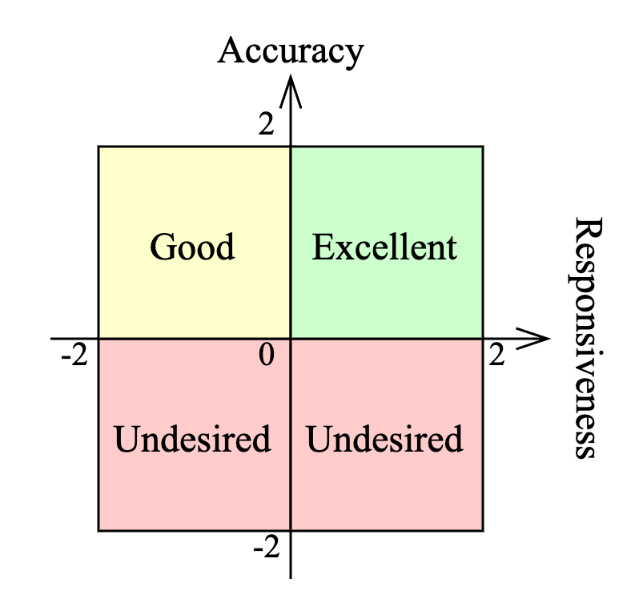

# 如何正确表达？利用 GPT 对实习生的不准确回答进行改写。

发布时间：2024年05月01日

`LLM应用` `自动化反馈系统`

> How Can I Get It Right? Using GPT to Rephrase Incorrect Trainee Responses

# 摘要

> 一对一辅导因其高效而备受推崇，但合格导师的紧缺成了一大难题，这就需要培训新手导师以保障教学质量。研究指出，及时的解释性反馈有助于加速学员的成长，但专家评估的繁琐过程却是个不小的挑战。本研究借鉴了大型语言模型（LLMs）的最新进展，利用GPT-4模型开发了一个自动化的解释性反馈系统。该系统能够识别学员的二元回答（正确或错误），并自动提供基于模板的反馈，同时由GPT-4模型对回答进行恰当的改写。我们对三个培训环节——有效表扬、错误反应、了解学生知识——中的410个学员回答进行了分析。研究结果显示：1）采用少量样本方法，GPT-4模型在识别三个培训环节中学员回答的正确与否上表现出色，平均F1得分达到0.84，AUC得分为0.85；2）同样使用少量样本方法，GPT-4模型能够巧妙地将错误的学员回答改写为期望的回答，其表现与人类专家不相上下。

> One-on-one tutoring is widely acknowledged as an effective instructional method, conditioned on qualified tutors. However, the high demand for qualified tutors remains a challenge, often necessitating the training of novice tutors (i.e., trainees) to ensure effective tutoring. Research suggests that providing timely explanatory feedback can facilitate the training process for trainees. However, it presents challenges due to the time-consuming nature of assessing trainee performance by human experts. Inspired by the recent advancements of large language models (LLMs), our study employed the GPT-4 model to build an explanatory feedback system. This system identifies trainees' responses in binary form (i.e., correct/incorrect) and automatically provides template-based feedback with responses appropriately rephrased by the GPT-4 model. We conducted our study on 410 responses from trainees across three training lessons: Giving Effective Praise, Reacting to Errors, and Determining What Students Know. Our findings indicate that: 1) using a few-shot approach, the GPT-4 model effectively identifies correct/incorrect trainees' responses from three training lessons with an average F1 score of 0.84 and an AUC score of 0.85; and 2) using the few-shot approach, the GPT-4 model adeptly rephrases incorrect trainees' responses into desired responses, achieving performance comparable to that of human experts.

[Arxiv](https://arxiv.org/abs/2405.00970)