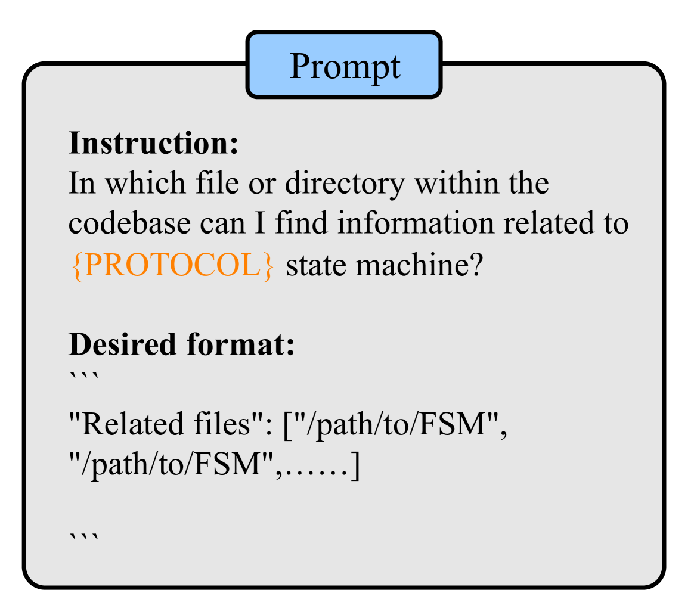

# 利用大型语言模型，从协议实现中推导出状态机。

发布时间：2024年05月01日

`LLM应用` `网络安全` `协议分析`

> Inferring State Machine from the Protocol Implementation via Large Langeuage Model

# 摘要

> 状态机对于深入挖掘协议中的潜在漏洞至关重要。但要从网络协议的实现中推导出状态机，却是一个充满挑战的任务。传统动态分析方法因覆盖面不足而常常漏掉关键状态转换，静态分析则在复杂的代码结构面前显得力不从心。为克服这些难题，我们引入了一种新颖的状态机推断技术，该技术借助大型语言模型（LLMs）的威力。通过文本嵌入技术，LLMs能够深入剖析协议实现代码的细节。我们通过精心设计的提示策略，系统地识别并推断出隐含的状态机。在六种协议实现上的测试结果表明，该方法极为有效，准确度超过90%，并能成功区分相同协议不同实现之间的状态机差异。更值得一提的是，将此方法与协议模糊测试相结合，使得AFLNet的代码覆盖率比RFCNLP提升了10%，充分证明了LLMs在网络协议安全分析领域的巨大潜力。我们提出的这一方法不仅在精确推断状态机方面取得了显著进展，也为提升协议实现的安全性和可靠性开辟了新的路径。

> State machines play a pivotal role in augmenting the efficacy of protocol analyzing to unveil more vulnerabilities. However, the task of inferring state machines from network protocol implementations presents significant challenges. Traditional methods based on dynamic analysis often overlook crucial state transitions due to limited coverage, while static analysis faces difficulties with complex code structures and behaviors. To address these limitations, we propose an innovative state machine inference approach powered by Large Language Models (LLMs). Utilizing text-embedding technology, this method allows LLMs to dissect and analyze the intricacies of protocol implementation code. Through targeted prompt engineering, we systematically identify and infer the underlying state machines. Our evaluation across six protocol implementations demonstrates the method's high efficacy, achieving an accuracy rate exceeding 90% and successfully delineating differences on state machines among various implementations of the same protocol. Importantly, integrating this approach with protocol fuzzing has notably enhanced AFLNet's code coverage by 10% over RFCNLP, showcasing the considerable potential of LLMs in advancing network protocol security analysis. Our proposed method not only marks a significant step forward in accurate state machine inference but also opens new avenues for improving the security and reliability of protocol implementations.

[Arxiv](https://arxiv.org/abs/2405.00393)