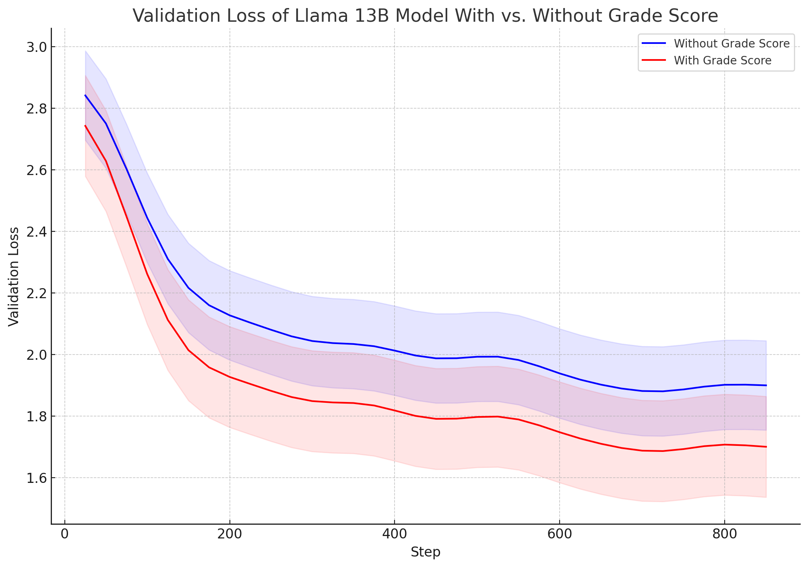

# 探究基于大型语言模型的自动评分与反馈机制

发布时间：2024年05月01日

`LLM应用` `自动化评分`

> Investigating Automatic Scoring and Feedback using Large Language Models

# 摘要

> 自动评分与反馈的探索一直依赖于传统和深度学习技术，以及语言模型的应用。随着高性能的大型语言模型（LLMs）如 LLaMA-2 的问世，我们得以进一步研究其在自动评分和反馈生成上的潜力。尽管性能显著提升，但LLMs在微调过程中仍需大量计算资源，并需特定调整以优化任务性能。为克服这些挑战，参数高效微调（PEFT）方法，包括LoRA和QLoRA，被引入以降低模型微调的内存和计算需求。本研究评估了基于PEFT的量化模型，通过分类或回归机制，对LLMs进行微调，以实现对短答案和论文的连续数值评分及反馈生成。我们在专有和开源数据集上进行了实验，结果显示，经微调的LLMs在评分精度上表现卓越，平均误差率低于3%。此外，微调后的4位量化LLaMA-2 13B模型在提供分级反馈方面超越了基准模型，并在BLEU和ROUGE评分以及反馈质量上与领域专家的反馈达到了高度一致性。本研究的发现为我们提供了宝贵的洞见，尤其是在使用量化技术微调LLMs以执行各种下游任务，如自动评分和反馈生成，且成本和延迟更低的情况下。

> Automatic grading and feedback have been long studied using traditional machine learning and deep learning techniques using language models. With the recent accessibility to high performing large language models (LLMs) like LLaMA-2, there is an opportunity to investigate the use of these LLMs for automatic grading and feedback generation. Despite the increase in performance, LLMs require significant computational resources for fine-tuning and additional specific adjustments to enhance their performance for such tasks. To address these issues, Parameter Efficient Fine-tuning (PEFT) methods, such as LoRA and QLoRA, have been adopted to decrease memory and computational requirements in model fine-tuning. This paper explores the efficacy of PEFT-based quantized models, employing classification or regression head, to fine-tune LLMs for automatically assigning continuous numerical grades to short answers and essays, as well as generating corresponding feedback. We conducted experiments on both proprietary and open-source datasets for our tasks. The results show that prediction of grade scores via finetuned LLMs are highly accurate, achieving less than 3% error in grade percentage on average. For providing graded feedback fine-tuned 4-bit quantized LLaMA-2 13B models outperform competitive base models and achieve high similarity with subject matter expert feedback in terms of high BLEU and ROUGE scores and qualitatively in terms of feedback. The findings from this study provide important insights into the impacts of the emerging capabilities of using quantization approaches to fine-tune LLMs for various downstream tasks, such as automatic short answer scoring and feedback generation at comparatively lower costs and latency.

[Arxiv](https://arxiv.org/abs/2405.00602)