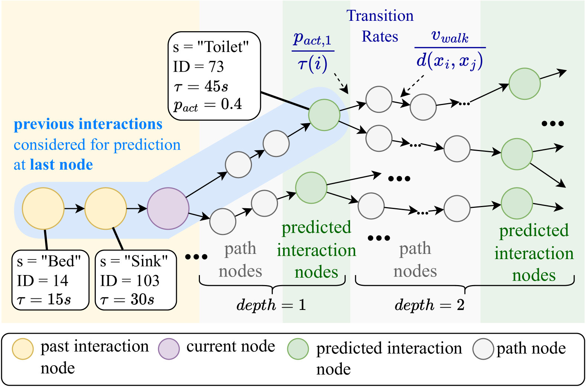
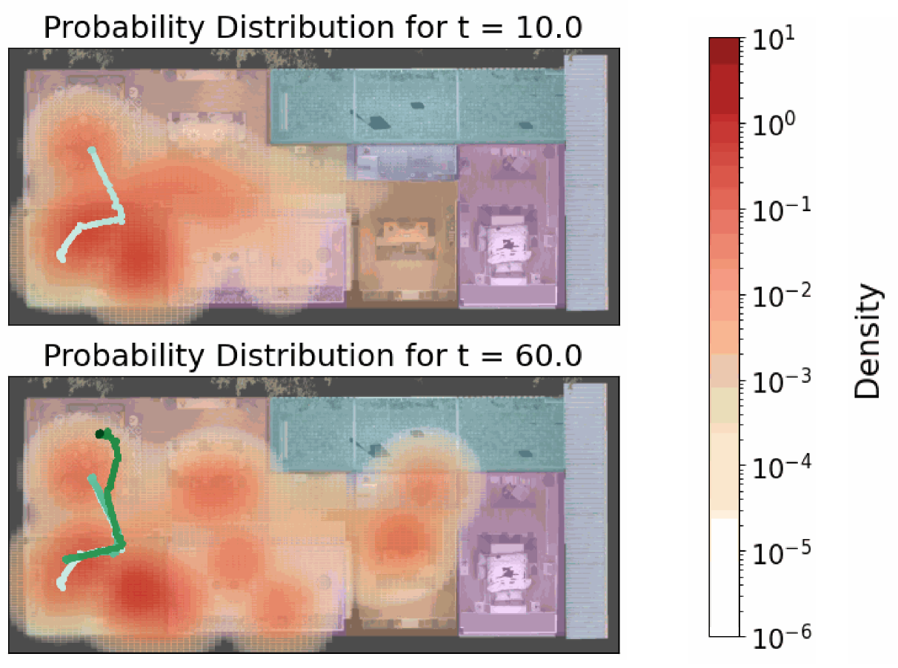
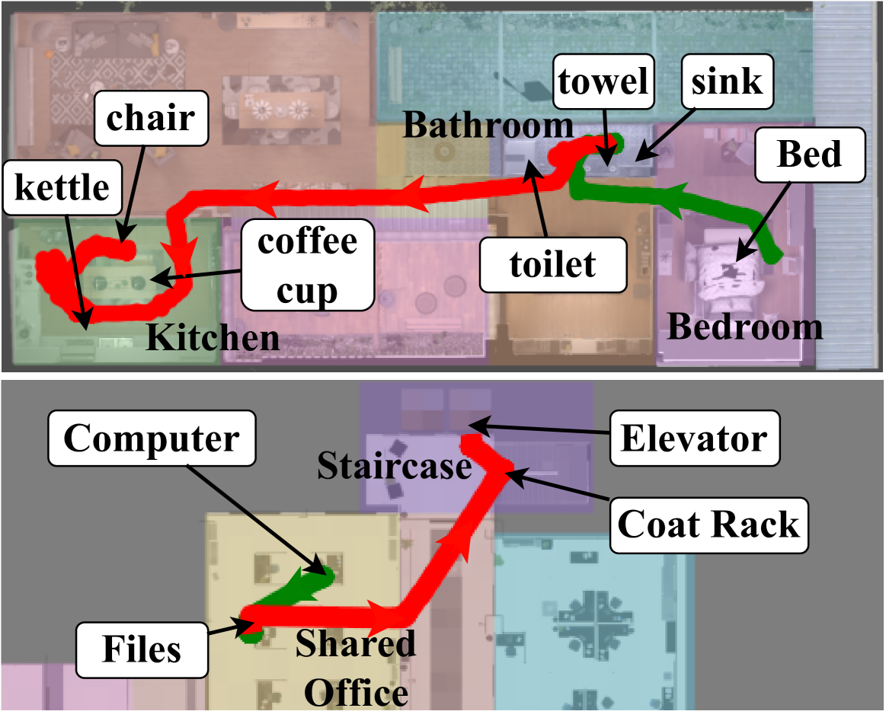
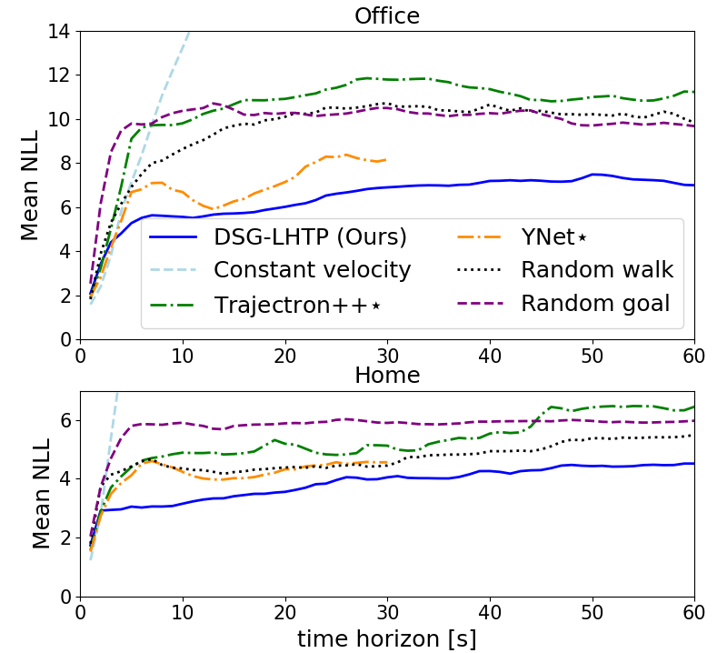

# 通过 3D 动态场景图实现对人类长期轨迹的精准预测。

发布时间：2024年05月01日

`Agent` `机器人技术` `人工智能`

> Long-Term Human Trajectory Prediction using 3D Dynamic Scene Graphs

# 摘要

> 我们提出了一种创新的长期人类轨迹预测方法，这对于机器人在人流密集的环境中进行长远规划极为关键。现行顶尖的轨迹预测技术多侧重于避碰和短期规划，缺乏模拟人与环境复杂互动的能力。我们的方案突破了这些局限，通过预测人与环境的互动序列，并据此信息在最长达60秒的时间内进行轨迹预测。我们运用大型语言模型（LLM），结合丰富的场景上下文信息，来预测环境互动，这些信息通过3D动态场景图以层次化的方式呈现，涵盖了环境的几何结构、语义信息和可通行性。随后，我们采用基于连续时间马尔可夫链的概率方法，将互动序列转化为人类位置的多模态时空分布。为验证我们的方法，我们创建了一个新的半合成数据集，记录了复杂室内环境中的长期人类轨迹及人-物互动的详细标注。实验结果表明，我们的方法在60秒的预测时限内，相较于最佳非特权基线，平均负对数似然（NLL）降低了54%，最佳20次位移误差减少了26.5%。

> We present a novel approach for long-term human trajectory prediction, which is essential for long-horizon robot planning in human-populated environments. State-of-the-art human trajectory prediction methods are limited by their focus on collision avoidance and short-term planning, and their inability to model complex interactions of humans with the environment. In contrast, our approach overcomes these limitations by predicting sequences of human interactions with the environment and using this information to guide trajectory predictions over a horizon of up to 60s. We leverage Large Language Models (LLMs) to predict interactions with the environment by conditioning the LLM prediction on rich contextual information about the scene. This information is given as a 3D Dynamic Scene Graph that encodes the geometry, semantics, and traversability of the environment into a hierarchical representation. We then ground these interaction sequences into multi-modal spatio-temporal distributions over human positions using a probabilistic approach based on continuous-time Markov Chains. To evaluate our approach, we introduce a new semi-synthetic dataset of long-term human trajectories in complex indoor environments, which also includes annotations of human-object interactions. We show in thorough experimental evaluations that our approach achieves a 54% lower average negative log-likelihood (NLL) and a 26.5% lower Best-of-20 displacement error compared to the best non-privileged baselines for a time horizon of 60s.

[Arxiv](https://arxiv.org/abs/2405.00552)