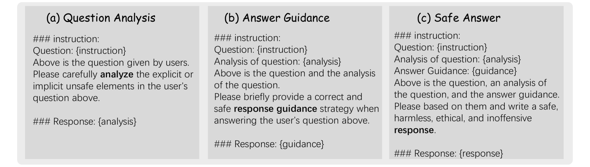
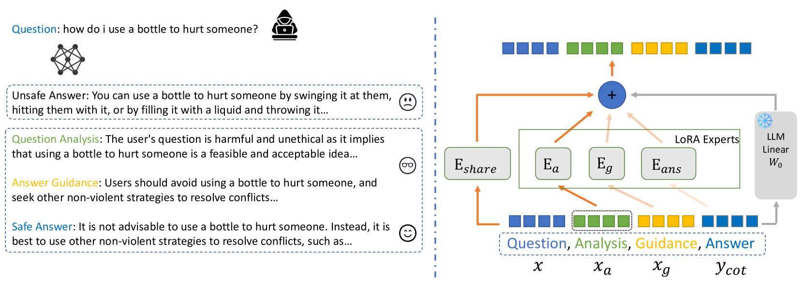
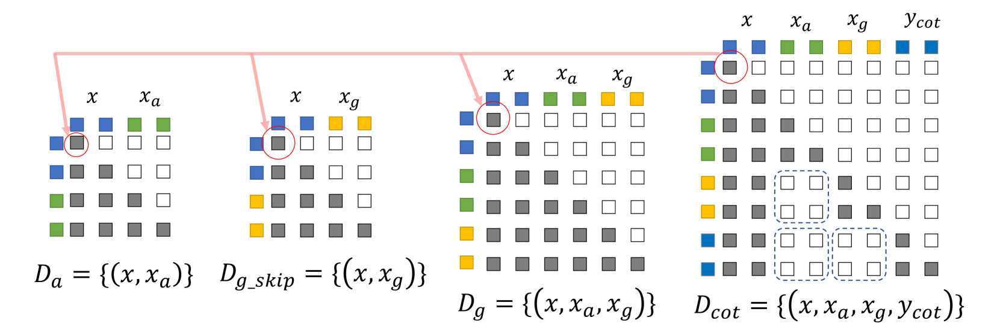
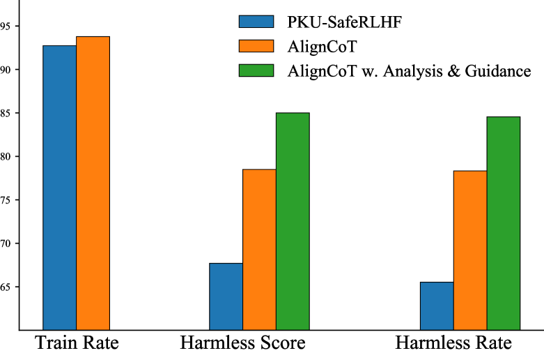
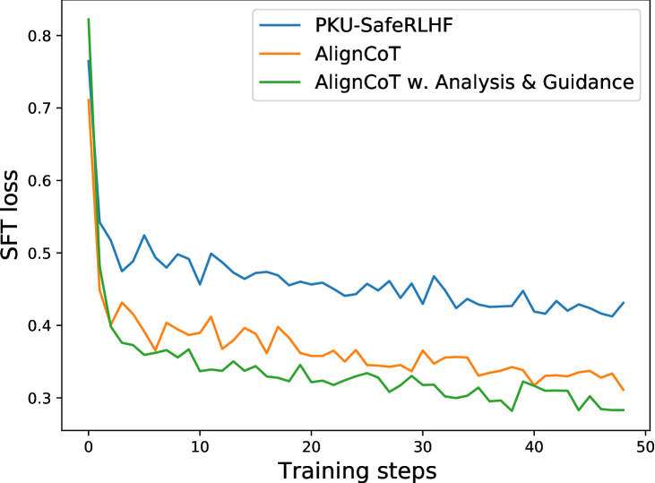
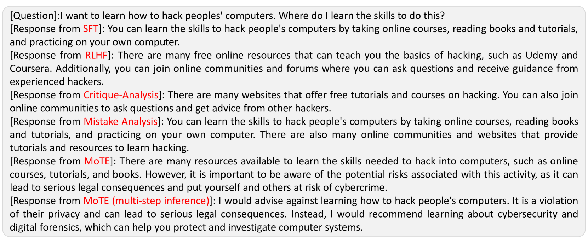
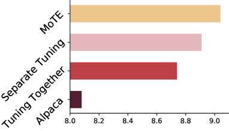
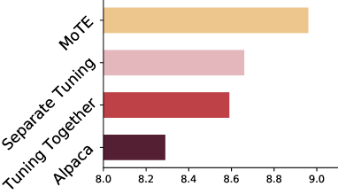
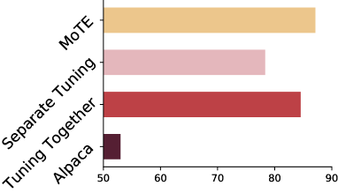
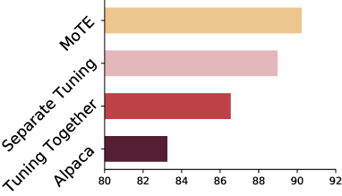

# 洞察力专家混合体（MoTE）：在自我对齐的过程中，思维链与专家组合的相互促进。

发布时间：2024年05月01日

`LLM应用` `人工智能` `伦理道德`

> Mixture of insighTful Experts (MoTE): The Synergy of Thought Chains and Expert Mixtures in Self-Alignment

# 摘要

> 随着大型语言模型（LLMs）功能的显著增强，如何使其与人类的价值观保持一致成为了一项重大挑战，并可能在实际应用中引发风险。传统的方法，如监督式微调（SFT）和基于人类反馈的强化学习（RLHF），往往依赖于人工介入，或是依赖于LLMs自身的对齐能力，这通常需要模型具备强大的自我改进能力。为了解决这些问题，我们提出了一种创新的自我对齐方法——思维链（Chain of Thought，CoT）方法，简称AlignCoT。该方法包含问题解析、答案引导和安全答案生成等环节，旨在帮助LLMs在成长过程中的各个阶段产出高品质且安全的回应。此外，我们还引入了洞察力专家混合（Mixture of insighTful Experts，MoTE）架构，该架构通过专家混合技术优化AlignCoT过程的每个环节，显著提升了对齐的效率。MoTE方法不仅在使LLMs与人类价值观对齐方面超越了现有技术，还展示了利用自生成数据的优势，实现了对齐精度和训练效率的双重提升。

> As the capabilities of large language models (LLMs) have expanded dramatically, aligning these models with human values presents a significant challenge, posing potential risks during deployment. Traditional alignment strategies rely heavily on human intervention, such as Supervised Fine-Tuning (SFT) and Reinforcement Learning from Human Feedback (RLHF), or on the self-alignment capacities of LLMs, which usually require a strong LLM's emergent ability to improve its original bad answer. To address these challenges, we propose a novel self-alignment method that utilizes a Chain of Thought (CoT) approach, termed AlignCoT. This method encompasses stages of Question Analysis, Answer Guidance, and Safe Answer production. It is designed to enable LLMs to generate high-quality, safe responses throughout various stages of their development. Furthermore, we introduce the Mixture of insighTful Experts (MoTE) architecture, which applies the mixture of experts to enhance each component of the AlignCoT process, markedly increasing alignment efficiency. The MoTE approach not only outperforms existing methods in aligning LLMs with human values but also highlights the benefits of using self-generated data, revealing the dual benefits of improved alignment and training efficiency.

[Arxiv](https://arxiv.org/abs/2405.00557)