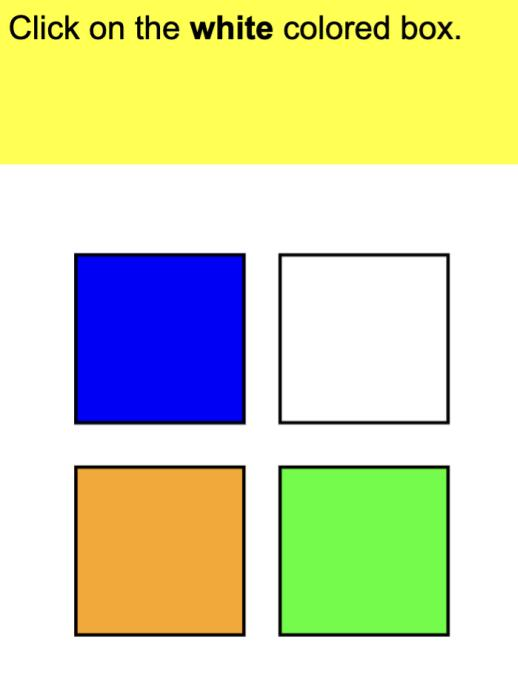
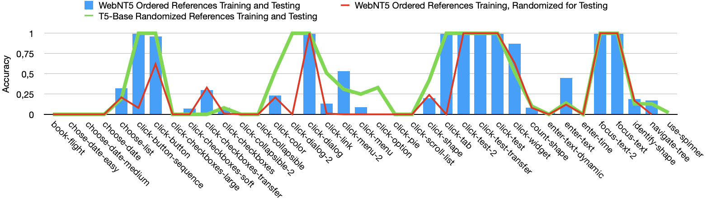

# 探索 WebAI：通过大型语言模型和强化学习训练代理来完成网络任务。

发布时间：2024年05月01日

`LLM应用` `网页导航`

> Navigating WebAI: Training Agents to Complete Web Tasks with Large Language Models and Reinforcement Learning

# 摘要

> 近期语言模型的突破在自然语言处理（NLP）领域，如网页导航等任务中取得了显著进步。相较于传统方法，监督学习（SL）策略在大幅减少训练数据的同时，依旧取得了卓越的成效。尽管如此，SL模型相较于强化学习（RL）策略仍有提升空间，后者在性能上更胜一筹。本文提出了一种创新的方法，将SL与RL技术相结合，针对MiniWoB基准测试，旨在发挥两种方法的长处。同时，我们针对先前模型在解析HTML内容上的一个主要缺陷进行了改进，即它们更倾向于记忆目标元素而非理解其结构。为此，我们提出了增强深层理解的方法，并设立了新的基准结果。实验结果证明，我们的方法在减少数据使用的同时，在某些任务上超越了传统SL方法，并与RL模型的性能差距显著缩小，SL方法的平均准确率达到了43.58%，而结合多模态RL策略时为36.69%。本研究不仅为未来网页导航的发展指明了新方向，还深入探讨了计算机任务中语言模型的局限性与潜力。

> Recent advancements in language models have demonstrated remarkable improvements in various natural language processing (NLP) tasks such as web navigation. Supervised learning (SL) approaches have achieved impressive performance while utilizing significantly less training data compared to previous methods. However, these SL-based models fall short when compared to reinforcement learning (RL) approaches, which have shown superior results. In this paper, we propose a novel approach that combines SL and RL techniques over the MiniWoB benchmark to leverage the strengths of both methods. We also address a critical limitation in previous models' understanding of HTML content, revealing a tendency to memorize target elements rather than comprehend the underlying structure. To rectify this, we propose methods to enhance true understanding and present a new baseline of results. Our experiments demonstrate that our approach outperforms previous SL methods on certain tasks using less data and narrows the performance gap with RL models, achieving 43.58\% average accuracy in SL and 36.69\% when combined with a multimodal RL approach. This study sets a new direction for future web navigation and offers insights into the limitations and potential of language modeling for computer tasks.

[Arxiv](https://arxiv.org/abs/2405.00516)