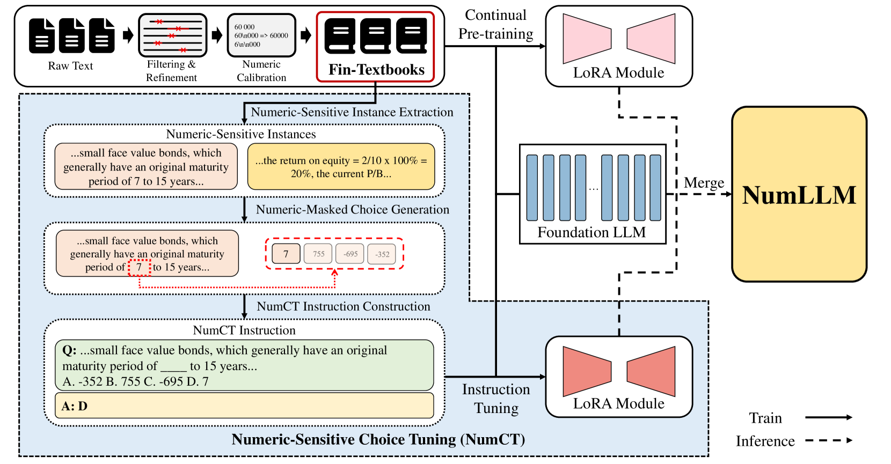
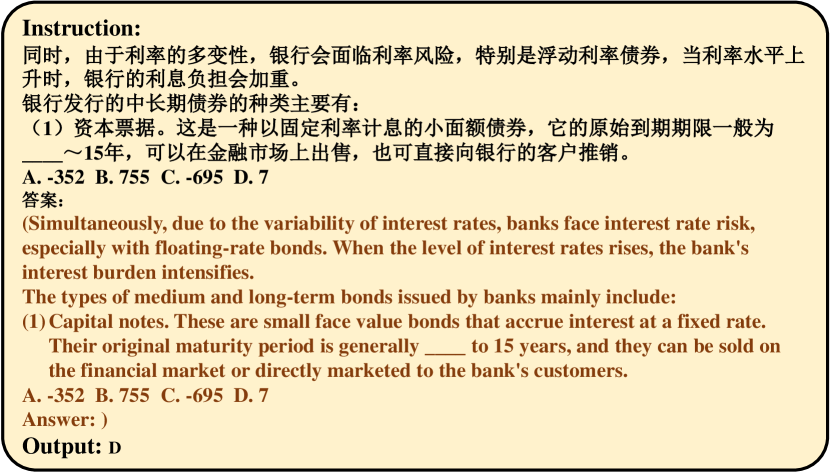
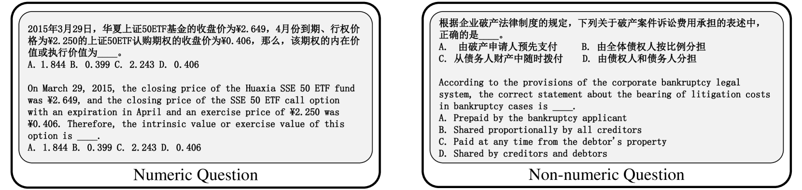
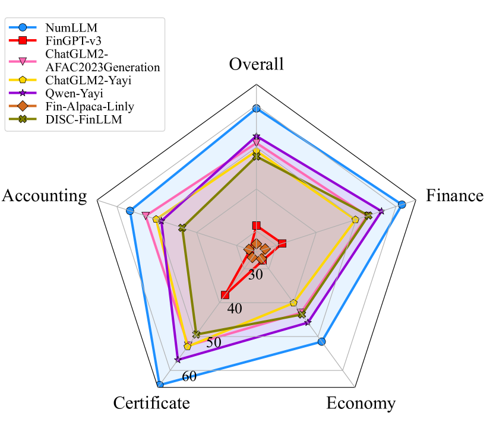

# NumLLM：一款专为中文金融领域设计的、对数值高度敏感的大型语言模型。

发布时间：2024年05月01日

`LLM应用`

> NumLLM: Numeric-Sensitive Large Language Model for Chinese Finance

# 摘要

> 近期，众多研究提出了多种金融领域的大型语言模型（FinLLMs），这些模型通过从零开始预训练或对开源的大型语言模型（LLMs）进行金融语料库的微调来构建。但是，这些现有的金融LLMs在处理包含数值变量的金融文本理解任务时，表现不尽如人意。本文提出了一种创新的大型语言模型——数值敏感型大型语言模型（NumLLM），专门针对中文金融领域。我们首先从金融教科书中构建关键的金融语料库，这对于提升LLMs在微调阶段的数值处理能力极为重要。接着，我们在自建的金融语料库上对两个独立的低秩适应（LoRA）模块进行微调训练。其中一个模块旨在将通用型LLMs适配到金融领域，另一个则致力于提升NumLLM对含有数值变量的金融文本的理解力。最终，我们将这两个LoRA模块整合到基础模型中，形成用于推理的NumLLM。在金融问答领域的基准测试中，NumLLM不仅提升了基础模型的性能，而且在处理数值型和非数值型问题时均展现出超越所有对照基准的最优整体表现。

> Recently, many works have proposed various financial large language models (FinLLMs) by pre-training from scratch or fine-tuning open-sourced LLMs on financial corpora. However, existing FinLLMs exhibit unsatisfactory performance in understanding financial text when numeric variables are involved in questions. In this paper, we propose a novel LLM, called numeric-sensitive large language model (NumLLM), for Chinese finance. We first construct a financial corpus from financial textbooks which is essential for improving numeric capability of LLMs during fine-tuning. After that, we train two individual low-rank adaptation (LoRA) modules by fine-tuning on our constructed financial corpus. One module is for adapting general-purpose LLMs to financial domain, and the other module is for enhancing the ability of NumLLM to understand financial text with numeric variables. Lastly, we merge the two LoRA modules into the foundation model to obtain NumLLM for inference. Experiments on financial question-answering benchmark show that NumLLM can boost the performance of the foundation model and can achieve the best overall performance compared to all baselines, on both numeric and non-numeric questions.

[Arxiv](https://arxiv.org/abs/2405.00566)