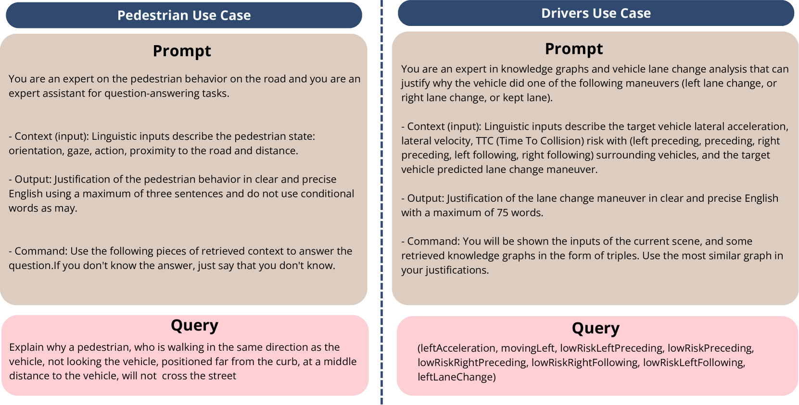
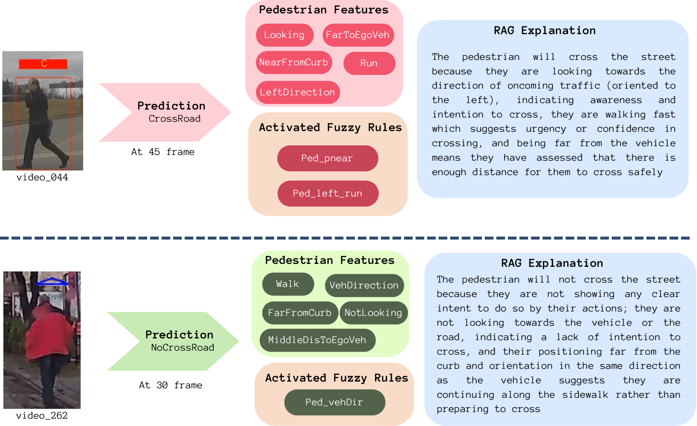

# 利用知识图谱和大型语言模型，基于 RAG（Retrieval-Augmented Generation）框架，对自动驾驶中道路使用者的行为进行可解释预测。

发布时间：2024年05月01日

`Agent` `自动驾驶` `知识图谱`

> RAG-based Explainable Prediction of Road Users Behaviors for Automated Driving using Knowledge Graphs and Large Language Models

# 摘要

> 近年来，科学界对自动驾驶环境下道路使用者行为预测的研究兴趣日益浓厚。现有研究多侧重于利用运动学信息进行行为预测，忽略了作为人类的道路使用者受周围环境影响的复杂性。同时，众多研究依赖于深度学习技术，虽然在预测任务上表现优异，但在理解并利用道路场景中的上下文语义信息方面存在不足，且难以提供人类可理解的解释性预测。本研究提出了一种结合知识图谱推理能力和大型语言模型表达能力的可解释道路使用者行为预测系统，采用检索增强生成技术，通过知识图谱嵌入和贝叶斯推断，构建了一个完全归纳的推理系统。该系统能够基于图谱中的既有信息和车载传感器实时收集的当前证据发布预测。研究中实现了两个应用案例：预测行人过街行为和车道变换操作，均在预测准确性和F1分数上超越了当前技术，为该领域未来研究开辟了新的可能性。

> Prediction of road users' behaviors in the context of autonomous driving has gained considerable attention by the scientific community in the last years. Most works focus on predicting behaviors based on kinematic information alone, a simplification of the reality since road users are humans, and as such they are highly influenced by their surrounding context. In addition, a large plethora of research works rely on powerful Deep Learning techniques, which exhibit high performance metrics in prediction tasks but may lack the ability to fully understand and exploit the contextual semantic information contained in the road scene, not to mention their inability to provide explainable predictions that can be understood by humans. In this work, we propose an explainable road users' behavior prediction system that integrates the reasoning abilities of Knowledge Graphs (KG) and the expressiveness capabilities of Large Language Models (LLM) by using Retrieval Augmented Generation (RAG) techniques. For that purpose, Knowledge Graph Embeddings (KGE) and Bayesian inference are combined to allow the deployment of a fully inductive reasoning system that enables the issuing of predictions that rely on legacy information contained in the graph as well as on current evidence gathered in real time by onboard sensors. Two use cases have been implemented following the proposed approach: 1) Prediction of pedestrians' crossing actions; 2) Prediction of lane change maneuvers. In both cases, the performance attained surpasses the current state of the art in terms of anticipation and F1-score, showing a promising avenue for future research in this field.

[Arxiv](https://arxiv.org/abs/2405.00449)