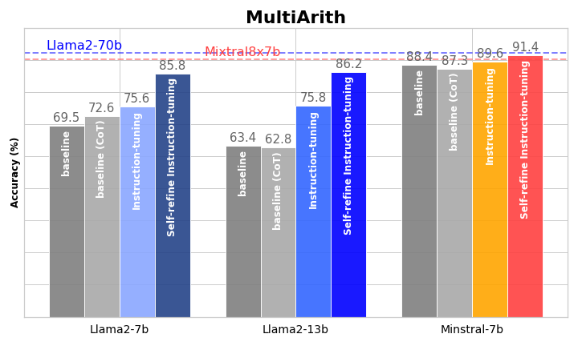

# 自我精炼的指令调优：优化语言模型中的推理对齐。

发布时间：2024年05月01日

`LLM应用` `人工智能`

> Self-Refine Instruction-Tuning for Aligning Reasoning in Language Models

# 摘要

> 本文提出了一种自我精炼指令调整方法，旨在激发小型语言模型（SLMs）自主提升其推理能力。该方法采用两阶段流程：首先，通过LLMs提供的示例进行指令调整，将推理能力从大型语言模型（LLMs）迁移至SLMs；其次，经过指令调整的模型通过偏好优化策略进行自我能力提升。特别是在第二阶段，SLMs利用直接偏好优化算法，自动采样生成的响应，并通过LLMs的基准真值来提供奖励，从而生成一系列推理路径。在常识推理和数学推理任务上的实验结果表明，这种方法在领域内和跨领域场景中均显著超越了传统的指令调整方法，有效拉近了小型与大型语言模型在推理能力上的差距。

> The alignments of reasoning abilities between smaller and larger Language Models are largely conducted via Supervised Fine-Tuning (SFT) using demonstrations generated from robust Large Language Models (LLMs). Although these approaches deliver more performant models, they do not show sufficiently strong generalization ability as the training only relies on the provided demonstrations.
  In this paper, we propose the Self-refine Instruction-tuning method that elicits Smaller Language Models to self-refine their abilities. Our approach is based on a two-stage process, where reasoning abilities are first transferred between LLMs and Small Language Models (SLMs) via Instruction-tuning on demonstrations provided by LLMs, and then the instructed models Self-refine their abilities through preference optimization strategies. In particular, the second phase operates refinement heuristics based on the Direct Preference Optimization algorithm, where the SLMs are elicited to deliver a series of reasoning paths by automatically sampling the generated responses and providing rewards using ground truths from the LLMs. Results obtained on commonsense and math reasoning tasks show that this approach significantly outperforms Instruction-tuning in both in-domain and out-domain scenarios, aligning the reasoning abilities of Smaller and Larger Language Models.

[Arxiv](https://arxiv.org/abs/2405.00402)