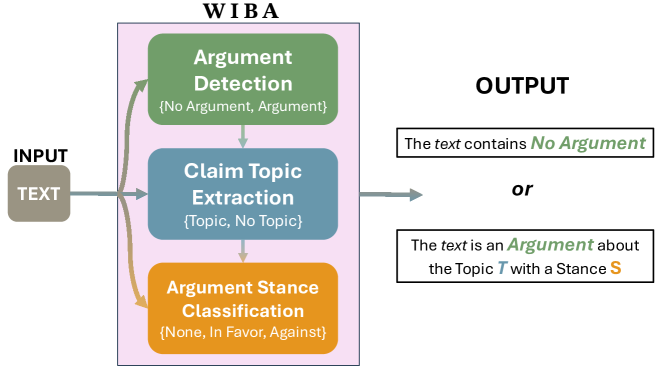
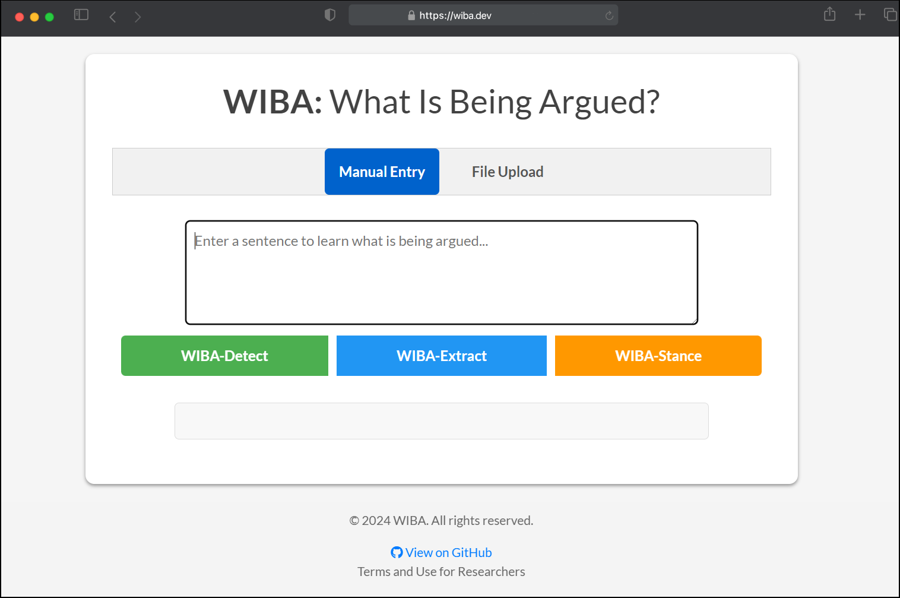

# WIBA：争论的是什么？一种全面深入的论点挖掘方法。

发布时间：2024年05月01日

`LLM应用` `语言学` `通信学`

> WIBA: What Is Being Argued? A Comprehensive Approach to Argument Mining

# 摘要

> 我们引入了WIBA，一个创新的框架及其方法集，旨在深入洞察不同情境下的“争论核心”。该框架能够精准识别争论的存在、主题和立场，同时巧妙处理三者间的逻辑联系。通过深度优化和精心设计的大型语言模型，我们的算法在三大关键性能上均展现出色表现。首先，我们构建并推出了一个争论检测模型，能够在三个不同的基准数据集上，以79%至86%的F1分数准确分类文本段落。其次，我们推出了一个能够识别句子中争论主题的语言模型，无论是隐含还是明确，平均相似度达到71%，性能提升近40%。最后，我们开发了一种争论立场分类方法，并在三个多样化的基准数据集上，实现了71%至78%的分类F1分数。这一评估证实了WIBA在广泛语料库和多样情境中全面解析争论内容的能力，这对于语言学、通信学、社会科学以及计算机科学等领域的应用具有重要意义。为了促进对本研究进展的广泛接触，我们免费开放了WIBA平台（wiba.dev）。

> We propose WIBA, a novel framework and suite of methods that enable the comprehensive understanding of "What Is Being Argued" across contexts. Our approach develops a comprehensive framework that detects: (a) the existence, (b) the topic, and (c) the stance of an argument, correctly accounting for the logical dependence among the three tasks. Our algorithm leverages the fine-tuning and prompt-engineering of Large Language Models. We evaluate our approach and show that it performs well in all the three capabilities. First, we develop and release an Argument Detection model that can classify a piece of text as an argument with an F1 score between 79% and 86% on three different benchmark datasets. Second, we release a language model that can identify the topic being argued in a sentence, be it implicit or explicit, with an average similarity score of 71%, outperforming current naive methods by nearly 40%. Finally, we develop a method for Argument Stance Classification, and evaluate the capability of our approach, showing it achieves a classification F1 score between 71% and 78% across three diverse benchmark datasets. Our evaluation demonstrates that WIBA allows the comprehensive understanding of What Is Being Argued in large corpora across diverse contexts, which is of core interest to many applications in linguistics, communication, and social and computer science. To facilitate accessibility to the advancements outlined in this work, we release WIBA as a free open access platform (wiba.dev).

[Arxiv](https://arxiv.org/abs/2405.00828)