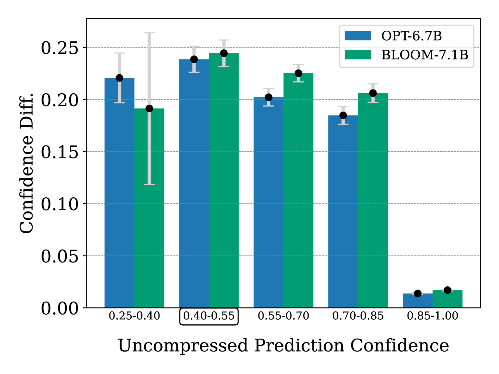
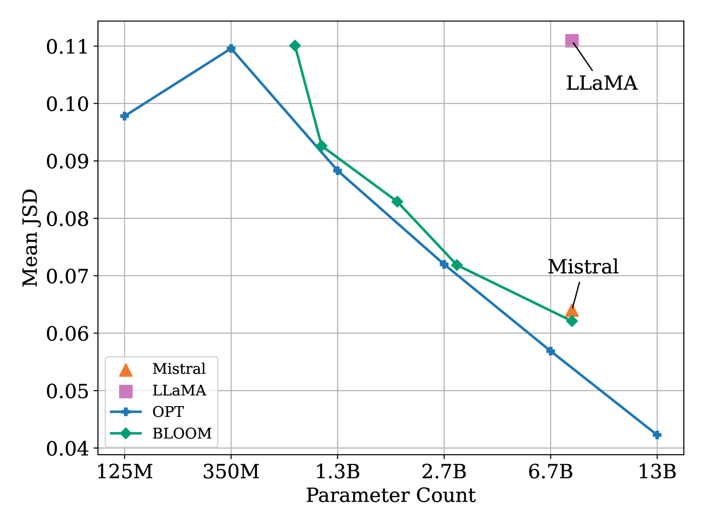
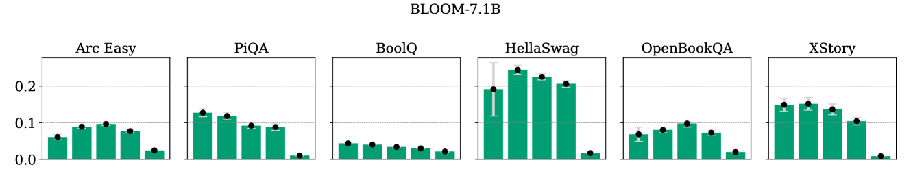
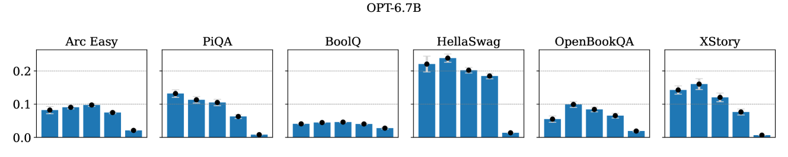
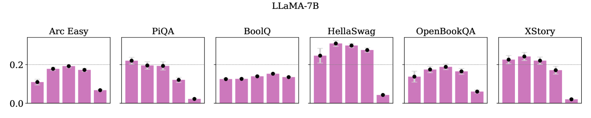
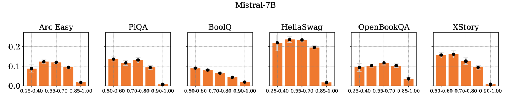

# 量化如何影响大型语言模型的置信度？

发布时间：2024年05月01日

`LLM理论` `机器学习`

> When Quantization Affects Confidence of Large Language Models?

# 摘要

> 近期研究通过训练后的量化或低比特权重量表示，为大型语言模型（LLMs）带来了高效的压缩方法。虽然量化权重有助于节省存储空间并加快推理速度，但现有研究指出，量化可能会影响模型性能并放大LLMs的偏见。本研究深入探讨了量化模型的置信度和校准问题，分析了语言模型类型和规模对量化损失的影响。我们首先发现，采用GPTQ量化至4位会降低对正确标签的置信度，且这种影响在不同语言模型中表现不一。其次，我们注意到置信度在不同规模的语言模型中波动。最终，我们基于置信度水平对量化损失提出了解释，指出量化对于那些模型原本就缺乏信心的样本影响更大。

> Recent studies introduced effective compression techniques for Large Language Models (LLMs) via post-training quantization or low-bit weight representation. Although quantized weights offer storage efficiency and allow for faster inference, existing works have indicated that quantization might compromise performance and exacerbate biases in LLMs. This study investigates the confidence and calibration of quantized models, considering factors such as language model type and scale as contributors to quantization loss. Firstly, we reveal that quantization with GPTQ to 4-bit results in a decrease in confidence regarding true labels, with varying impacts observed among different language models. Secondly, we observe fluctuations in the impact on confidence across different scales. Finally, we propose an explanation for quantization loss based on confidence levels, indicating that quantization disproportionately affects samples where the full model exhibited low confidence levels in the first place.

[Arxiv](https://arxiv.org/abs/2405.00632)