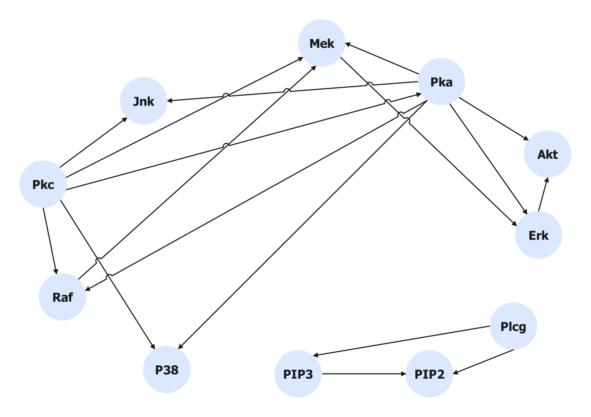
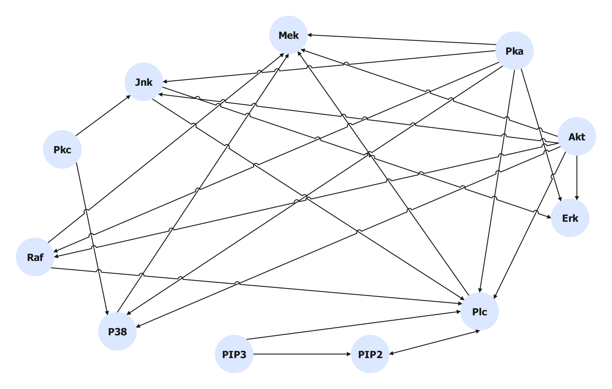

# ALCM：独立增强型大型语言模型因果探索框架

发布时间：2024年05月02日

`LLM应用` `因果推理` `数据科学`

> ALCM: Autonomous LLM-Augmented Causal Discovery Framework

# 摘要

> 在高维数据集上进行高效的因果推断，首先进行因果发现至关重要，即基于观测数据构建因果图。然而，构建一个完整准确的因果图面临巨大挑战，这是一个公认的NP-hard问题。大型语言模型（LLMs）的兴起为因果推理带来了新纪元，它们在医学、金融和科学等多个领域的应用展现了强大的潜力。LLMs的深厚知识基础有望通过增强解释力、推断力、泛化力和发现新因果结构，推动因果推理领域的发展。本文提出了一种新框架——自主LLM增强因果发现框架（ALCM），旨在结合数据驱动的因果发现算法与LLMs，自动化地生成更为稳健、精确和可解释的因果图。ALCM包含因果结构学习、因果包装器和LLM驱动的因果细化器三个核心组件，它们在动态环境中自主协作，以解决因果发现问题并生成合理的因果图。通过在七个著名数据集上的两个演示，我们对ALCM框架进行了评估。实验结果显示，ALCM在性能上超越了现有的LLM方法和传统的数据驱动因果推理机制。本研究不仅证实了ALCM的有效性，也为利用LLMs的因果推理能力开辟了新的研究方向。

> To perform effective causal inference in high-dimensional datasets, initiating the process with causal discovery is imperative, wherein a causal graph is generated based on observational data. However, obtaining a complete and accurate causal graph poses a formidable challenge, recognized as an NP-hard problem. Recently, the advent of Large Language Models (LLMs) has ushered in a new era, indicating their emergent capabilities and widespread applicability in facilitating causal reasoning across diverse domains, such as medicine, finance, and science. The expansive knowledge base of LLMs holds the potential to elevate the field of causal reasoning by offering interpretability, making inferences, generalizability, and uncovering novel causal structures. In this paper, we introduce a new framework, named Autonomous LLM-Augmented Causal Discovery Framework (ALCM), to synergize data-driven causal discovery algorithms and LLMs, automating the generation of a more resilient, accurate, and explicable causal graph. The ALCM consists of three integral components: causal structure learning, causal wrapper, and LLM-driven causal refiner. These components autonomously collaborate within a dynamic environment to address causal discovery questions and deliver plausible causal graphs. We evaluate the ALCM framework by implementing two demonstrations on seven well-known datasets. Experimental results demonstrate that ALCM outperforms existing LLM methods and conventional data-driven causal reasoning mechanisms. This study not only shows the effectiveness of the ALCM but also underscores new research directions in leveraging the causal reasoning capabilities of LLMs.

[Arxiv](https://arxiv.org/abs/2405.01744)