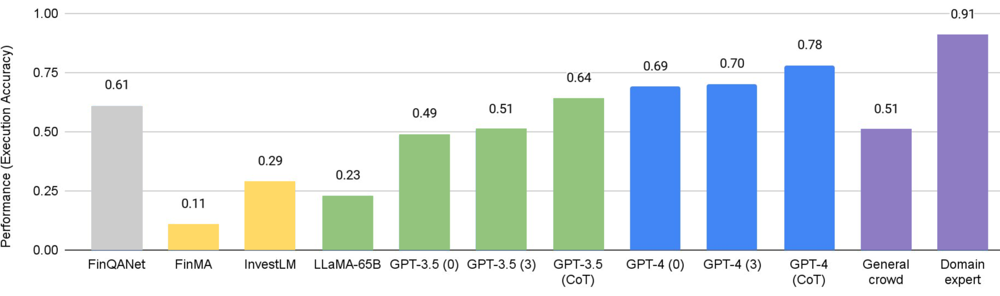
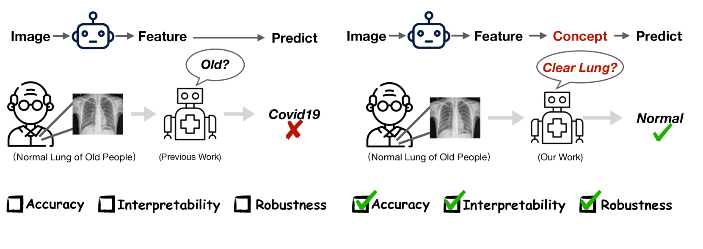
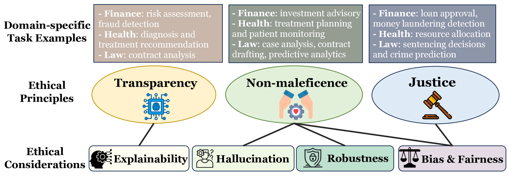

# 一项针对金融、医疗保健和法律等关键社会领域内大型语言模型的综述研究

发布时间：2024年05月02日

`LLM应用`

> A Survey on Large Language Models for Critical Societal Domains: Finance, Healthcare, and Law

# 摘要

> 在人工智能迅猛发展的今天，大型语言模型（LLMs）如 GPT-3 和 GPT-4 正在金融、医疗和法律等专业领域掀起革命。这些领域依赖专业知识、面临数据获取难题、风险高且法规要求严格。本篇综述深入探讨了 LLMs 在这些高风险行业的应用方法、实践案例、所遇挑战及未来机遇。我们突出了 LLMs 在医疗领域改进诊疗手段、金融领域创新分析技术、以及法律领域提升解释和合规策略中的关键作用。同时，我们也对这些领域中 LLM 应用的伦理问题进行了深入分析，指出了现存的伦理顾虑，并强调了开发透明、公正、强大且符合法规的 AI 系统的必要性。通过全面审视现有文献和实际应用案例，我们展示了 LLMs 的深远影响，并强调了跨学科合作、方法论创新和伦理警觉性的重要性。我们希望通过这些视角激发讨论，激发未来研究，旨在最大化 LLMs 的正面影响，同时减少在这些对精度要求极高的领域中的风险。为了推动这些关键社会领域中 LLM 的研究，我们还建立了一个持续更新的阅读清单，以追踪该主题的最新进展：\url{https://github.com/czyssrs/LLM_X_papers}。

> In the fast-evolving domain of artificial intelligence, large language models (LLMs) such as GPT-3 and GPT-4 are revolutionizing the landscapes of finance, healthcare, and law: domains characterized by their reliance on professional expertise, challenging data acquisition, high-stakes, and stringent regulatory compliance. This survey offers a detailed exploration of the methodologies, applications, challenges, and forward-looking opportunities of LLMs within these high-stakes sectors. We highlight the instrumental role of LLMs in enhancing diagnostic and treatment methodologies in healthcare, innovating financial analytics, and refining legal interpretation and compliance strategies. Moreover, we critically examine the ethics for LLM applications in these fields, pointing out the existing ethical concerns and the need for transparent, fair, and robust AI systems that respect regulatory norms. By presenting a thorough review of current literature and practical applications, we showcase the transformative impact of LLMs, and outline the imperative for interdisciplinary cooperation, methodological advancements, and ethical vigilance. Through this lens, we aim to spark dialogue and inspire future research dedicated to maximizing the benefits of LLMs while mitigating their risks in these precision-dependent sectors. To facilitate future research on LLMs in these critical societal domains, we also initiate a reading list that tracks the latest advancements under this topic, which will be continually updated: \url{https://github.com/czyssrs/LLM_X_papers}.

[Arxiv](https://arxiv.org/abs/2405.01769)