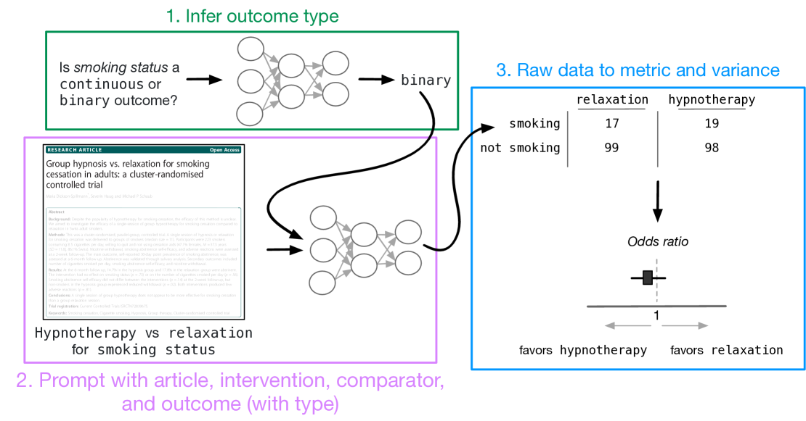
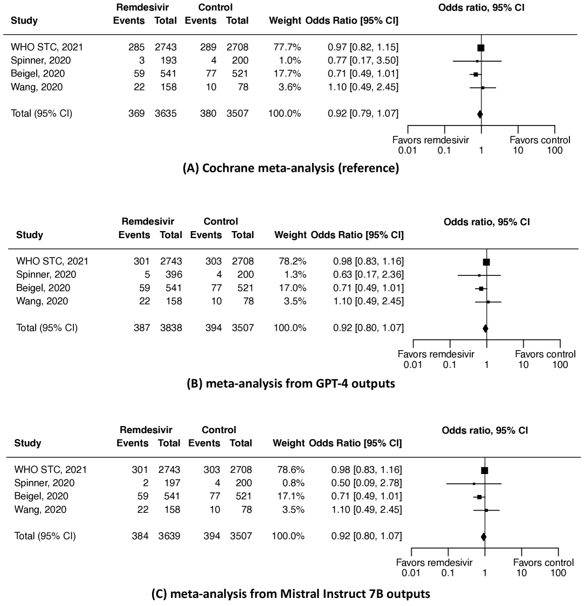
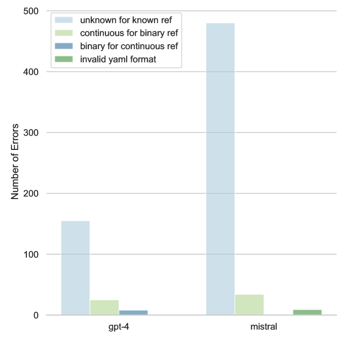
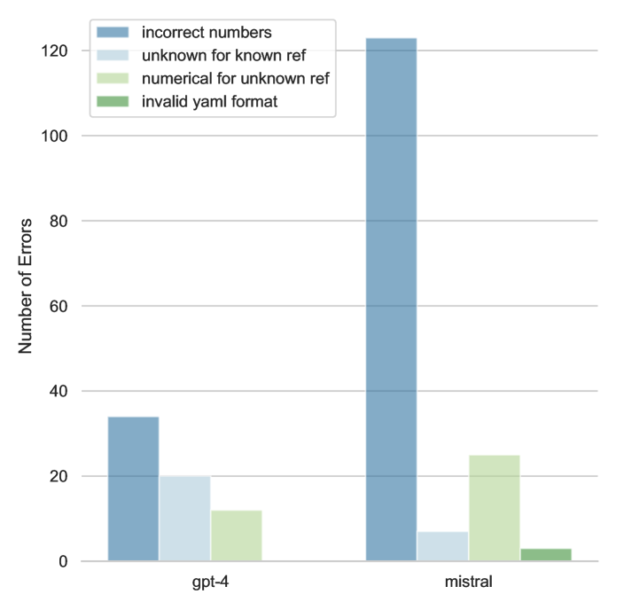
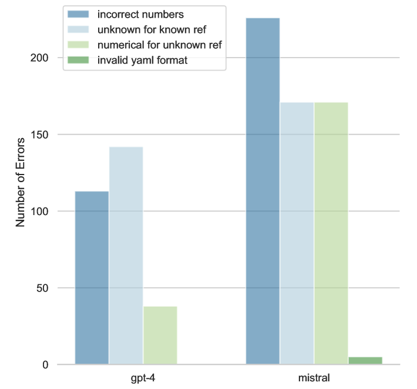
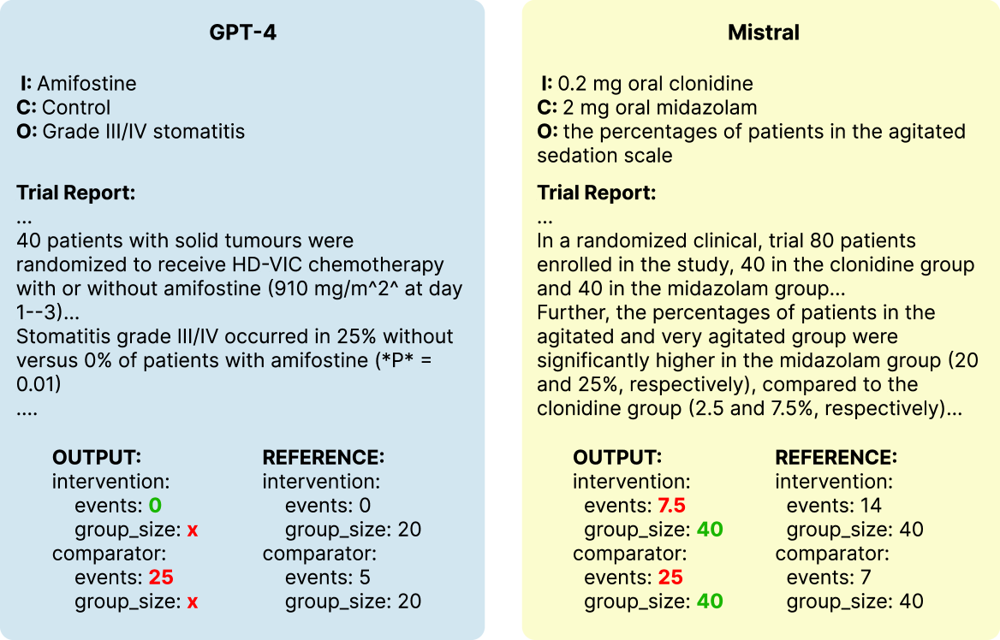
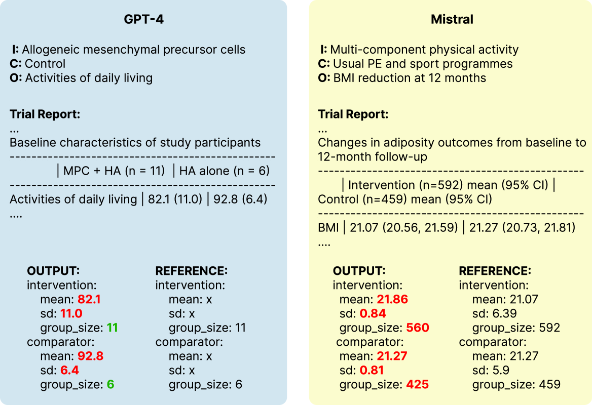

# 利用大型语言模型，我们能够自动地从随机对照试验中抽取出数值数据。

发布时间：2024年05月02日

`LLM应用`

> Automatically Extracting Numerical Results from Randomized Controlled Trials with Large Language Models

# 摘要

> 元分析通过整合多项随机对照试验的研究成果，为评估医疗效果提供了强有力的证据。然而，这一过程既耗时又费力，因为它需要手动搜集各试验的数据。理想状况下，我们希望能够利用语言技术实现自动化的元分析。这涉及到从各个试验中精确抽取数值数据，而这对于自然语言处理技术来说一直是个挑战。在本研究中，我们探讨了现代大型语言模型（LLMs）是否能够胜任这一任务。我们创建并公开了一个包含临床试验报告和相关数值结果的详细评估数据集，这些结果关联到干预措施、对照组和研究结果。利用这个数据集，我们对七个大型语言模型进行了零样本条件下的性能测试，以评估它们从试验报告中提取数值结果的能力。研究发现，能够处理长篇输入的大型语言模型在自动化元分析方面已接近实现，尤其是在处理二元结果（如死亡率）时。但当面对复杂度量和需要推理的统计结果时，即便是经过生物医学文本训练的模型也表现不佳。本研究为利用大型语言模型实现随机对照试验的全自动化元分析提供了可能的路径，并指出了现有模型在实现这一目标上的局限。

> Meta-analyses statistically aggregate the findings of different randomized controlled trials (RCTs) to assess treatment effectiveness. Because this yields robust estimates of treatment effectiveness, results from meta-analyses are considered the strongest form of evidence. However, rigorous evidence syntheses are time-consuming and labor-intensive, requiring manual extraction of data from individual trials to be synthesized. Ideally, language technologies would permit fully automatic meta-analysis, on demand. This requires accurately extracting numerical results from individual trials, which has been beyond the capabilities of natural language processing (NLP) models to date. In this work, we evaluate whether modern large language models (LLMs) can reliably perform this task. We annotate (and release) a modest but granular evaluation dataset of clinical trial reports with numerical findings attached to interventions, comparators, and outcomes. Using this dataset, we evaluate the performance of seven LLMs applied zero-shot for the task of conditionally extracting numerical findings from trial reports. We find that massive LLMs that can accommodate lengthy inputs are tantalizingly close to realizing fully automatic meta-analysis, especially for dichotomous (binary) outcomes (e.g., mortality). However, LLMs -- including ones trained on biomedical texts -- perform poorly when the outcome measures are complex and tallying the results requires inference. This work charts a path toward fully automatic meta-analysis of RCTs via LLMs, while also highlighting the limitations of existing models for this aim.

[Arxiv](https://arxiv.org/abs/2405.01686)