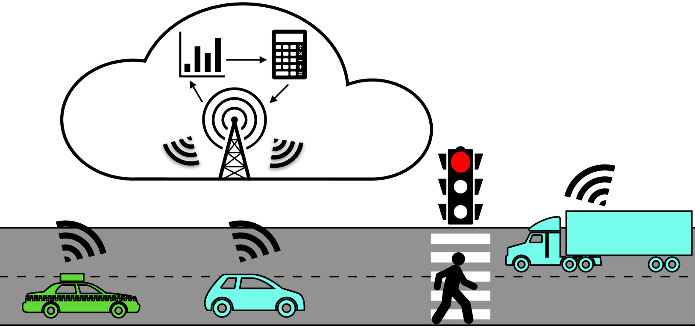
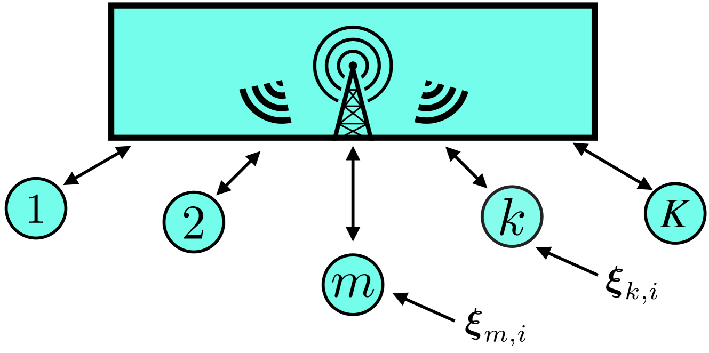
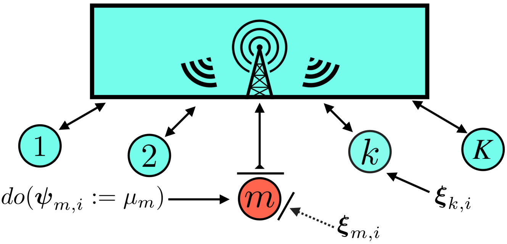
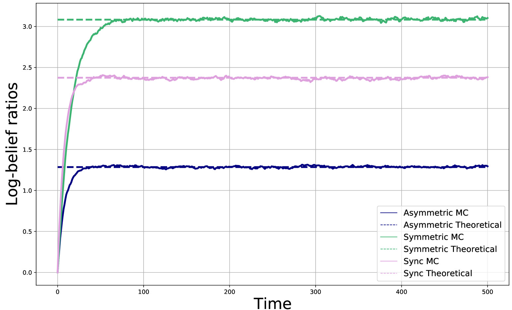
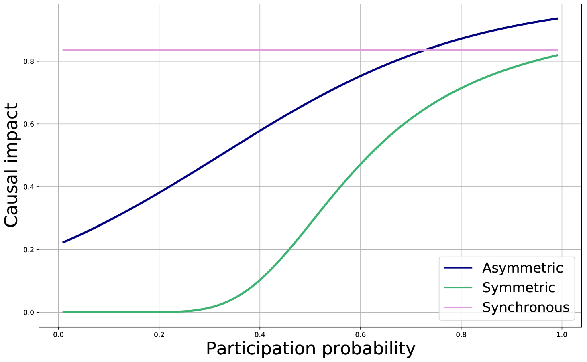
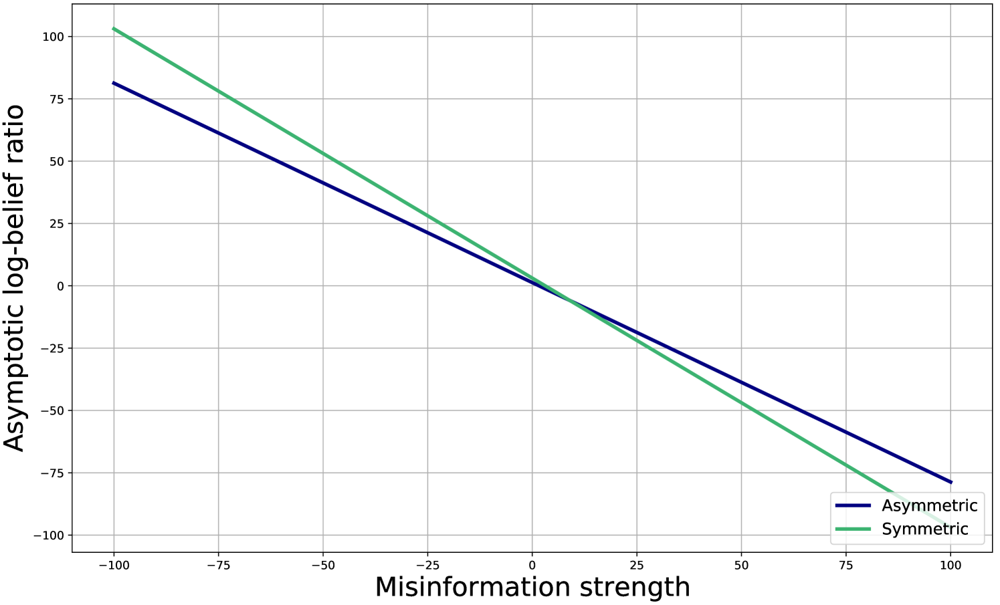
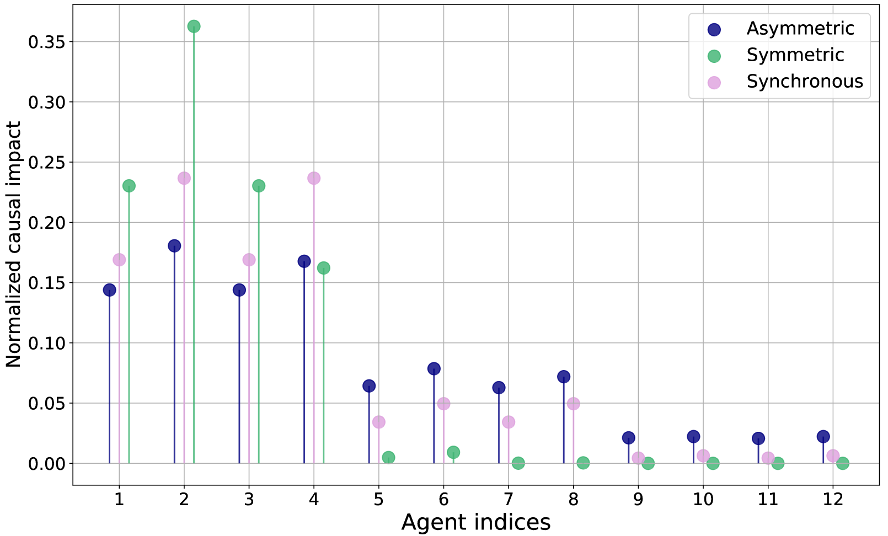
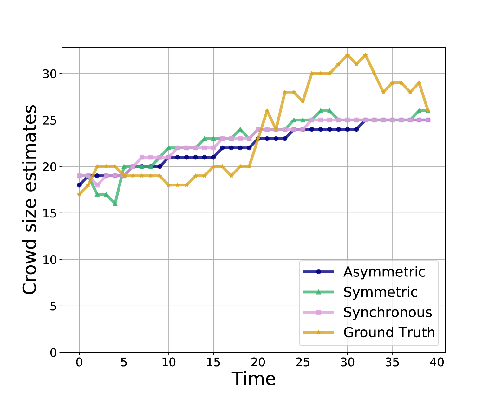
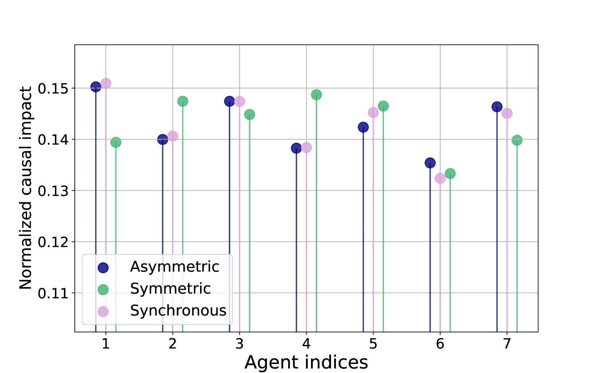

# 在联合边缘推理领域，因果关系的影响是一个关键因素。

发布时间：2024年05月02日

`Agent` `智能体系统` `因果推断`

> Causal Influence in Federated Edge Inference

# 摘要

> 本文探讨了一个场景，异构智能体通过未标记的实时数据进行推理，而这些数据对于目标变量的信息提供有限。为了应对不确定性，智能体们通过融合中心交换各自的局部推断结果，实现协同合作。本研究采用因果框架来评估每个智能体对集体决策的具体影响，区分了智能体的实际影响力与决策过程中的表面相关性。研究涵盖了多种不同智能体参与模式和融合中心策略的情景。我们建立了计算每个智能体对共同决策因果影响的公式，这对于预测和处理如对抗性攻击或系统故障等异常情况具有重要意义。理论分析通过数值模拟和实际的多摄像头人群计数应用得到了验证。

> In this paper, we consider a setting where heterogeneous agents with connectivity are performing inference using unlabeled streaming data. Observed data are only partially informative about the target variable of interest. In order to overcome the uncertainty, agents cooperate with each other by exchanging their local inferences with and through a fusion center. To evaluate how each agent influences the overall decision, we adopt a causal framework in order to distinguish the actual influence of agents from mere correlations within the decision-making process. Various scenarios reflecting different agent participation patterns and fusion center policies are investigated. We derive expressions to quantify the causal impact of each agent on the joint decision, which could be beneficial for anticipating and addressing atypical scenarios, such as adversarial attacks or system malfunctions. We validate our theoretical results with numerical simulations and a real-world application of multi-camera crowd counting.

[Arxiv](https://arxiv.org/abs/2405.01260)