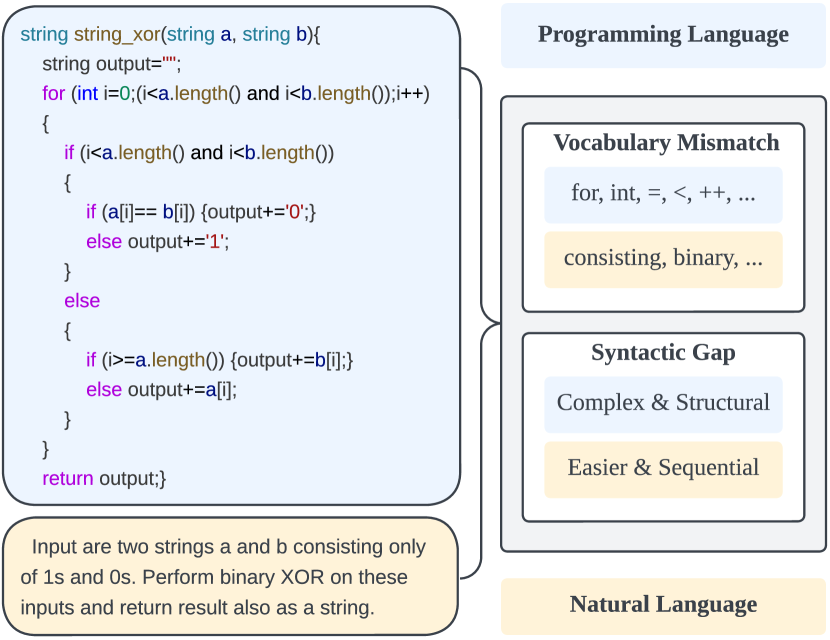
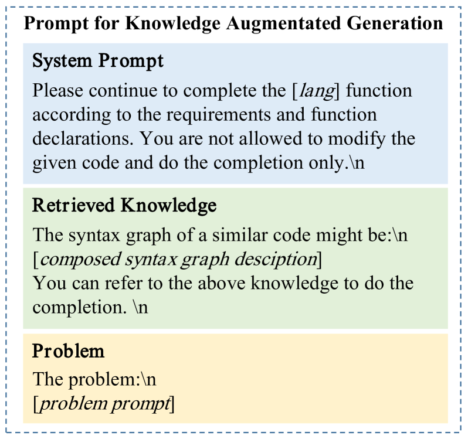

# CodeGRAG：一种用于增强检索功能的跨语言代码生成技术，能够提炼出复合的语法图。

发布时间：2024年05月02日

`LLM应用` `软件开发`

> CodeGRAG: Extracting Composed Syntax Graphs for Retrieval Augmented Cross-Lingual Code Generation

# 摘要

> 大型语言模型在软件开发领域展现出潜力，但其在特定代码生成任务上的专业性仍有提升空间。编程语言的逻辑复杂性与自然语言之间的差异，使得直接生成准确代码颇具挑战。目前，为了获得更佳的解决方案，通常需要对大型语言模型进行多次提示，这不仅成本高昂。本文提出了一种新方法——语法图检索增强的代码生成（CodeGRAG），旨在提升LLMs在单轮代码生成任务中的表现。CodeGRAG通过提炼代码块的控制流和数据流，弥合了编程语言与自然语言之间的鸿沟，并构建了代码块的内在流程模型，这不仅帮助LLMs更深入地理解代码语法，还充当了不同编程语言之间的桥梁。该方法显著增强了LLMs的代码生成能力，甚至在跨语言代码生成方面也展现出了性能提升，如将Python代码转换为C++。

> Utilizing large language models to generate codes has shown promising meaning in software development revolution. Despite the intelligence shown by the general large language models, their specificity in code generation can still be improved due to the syntactic gap and mismatched vocabulary existing among natural language and different programming languages. In addition, programming languages are inherently logical and complex, making them hard to be correctly generated. Existing methods rely on multiple prompts to the large language model to explore better solutions, which is expensive. In this paper, we propose Syntax Graph Retrieval Augmented Code Generation (CodeGRAG) to enhance the performance of LLMs in single-round code generation tasks. CodeGRAG extracts and summarizes the control flow and data flow of code blocks to fill the gap between programming languages and natural language. The extracted external structural knowledge models the inherent flows of code blocks, which can facilitate LLMs for better understanding of code syntax and serve as a bridge among different programming languages. CodeGRAG significantly improves the code generation ability of LLMs and can even offer performance gain for cross-lingual code generation, e.g., C++ for Python.

[Arxiv](https://arxiv.org/abs/2405.02355)