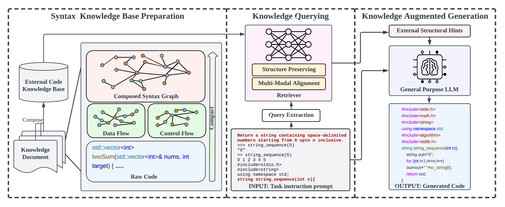

# CodeGRAF：为增强检索的跨语言代码生成提取合成语法图。

发布时间：2024年05月02日

`LLM应用` `软件开发`

> CodeGRAG: Extracting Composed Syntax Graphs for Retrieval Augmented Cross-Lingual Code Generation

# 摘要

> 大型语言模型在代码生成领域的应用，为软件开发带来了革命性的前景。尽管这些模型已经表现出了一定的智能，但在特定于代码生成的任务上，它们的表现还有待提升，这主要是由于自然语言与编程语言之间的语法差异和词汇不匹配。编程语言的内在逻辑性和复杂性也增加了正确生成代码的难度。目前，为了寻找更优的解决方案，研究者们通常需要向语言模型提供多个提示，但这种方法成本较高。本文提出了一种新的模型——语法图检索增强的代码生成（CodeGRAG），旨在提升大型语言模型在单轮代码生成任务中的表现。CodeGRAG 能够提炼并概括代码块的控制流和数据流，弥补了编程语言与自然语言之间的差异。这种提炼出的外部结构知识不仅帮助模型更深入地理解代码的语法结构，还能作为不同编程语言之间的桥梁。CodeGRAG 显著增强了语言模型的代码生成能力，甚至在跨语言生成，如将 Python 代码转换为 C++ 代码时，也能实现性能的提升。

> Utilizing large language models to generate codes has shown promising meaning in software development revolution. Despite the intelligence shown by the general large language models, their specificity in code generation can still be improved due to the syntactic gap and mismatched vocabulary existing among natural language and different programming languages. In addition, programming languages are inherently logical and complex, making them hard to be correctly generated. Existing methods rely on multiple prompts to the large language model to explore better solutions, which is expensive. In this paper, we propose Syntax Graph Retrieval Augmented Code Generation (CodeGRAG) to enhance the performance of LLMs in single-round code generation tasks. CodeGRAG extracts and summarizes the control flow and data flow of code blocks to fill the gap between programming languages and natural language. The extracted external structural knowledge models the inherent flows of code blocks, which can facilitate LLMs for better understanding of code syntax and serve as a bridge among different programming languages. CodeGRAG significantly improves the code generation ability of LLMs and can even offer performance gain for cross-lingual code generation, e.g., C++ for Python.

[Arxiv](https://arxiv.org/abs/2405.02355)