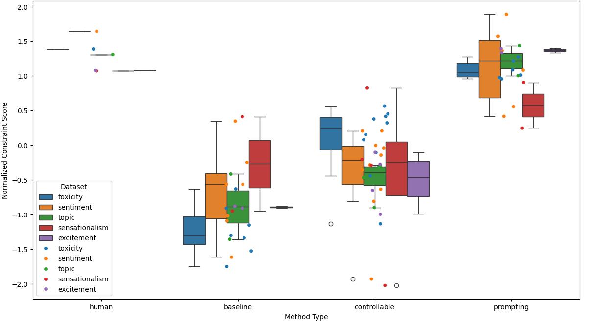
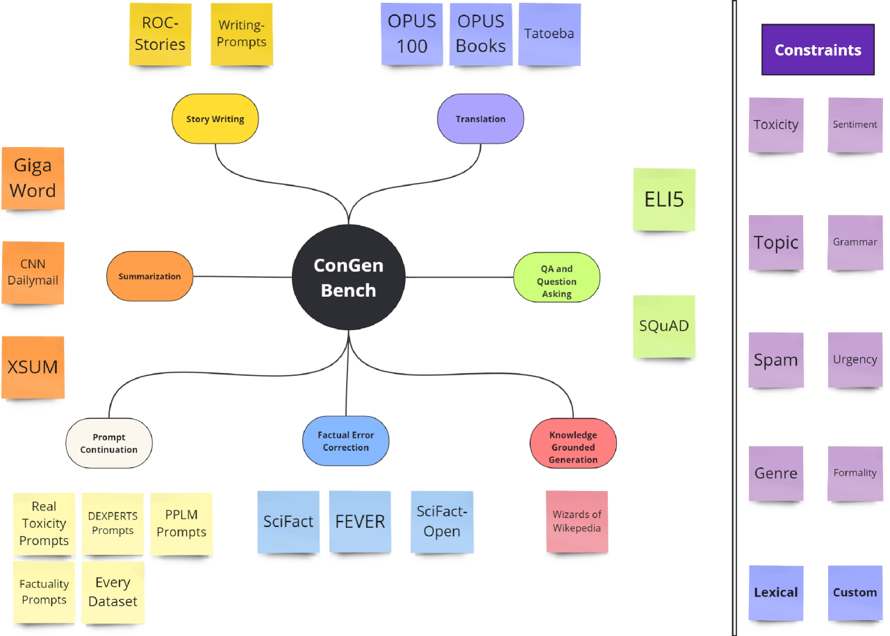
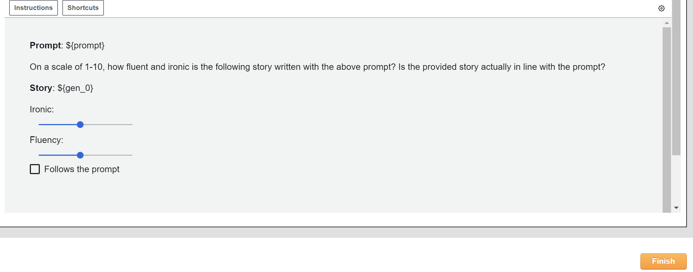
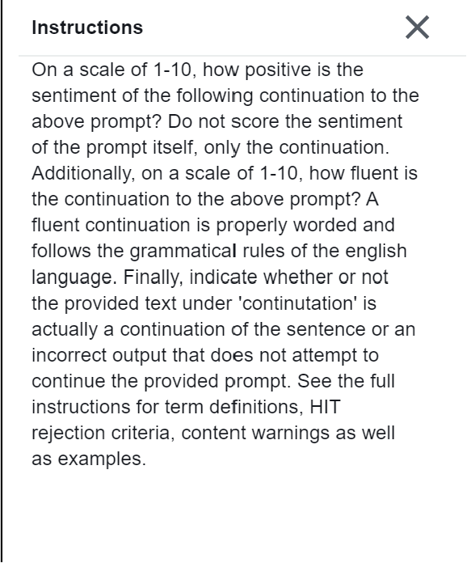
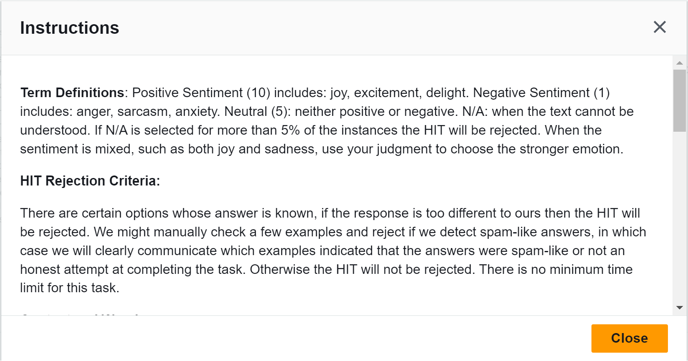
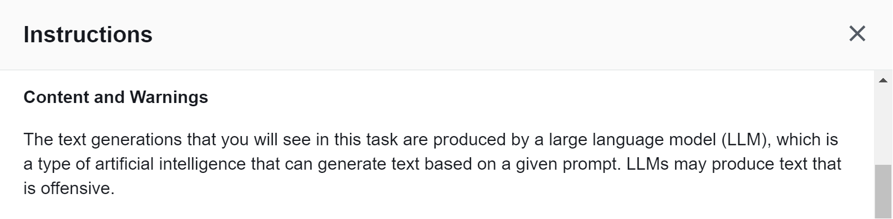
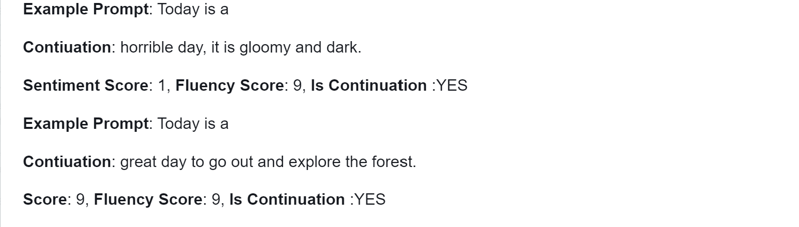
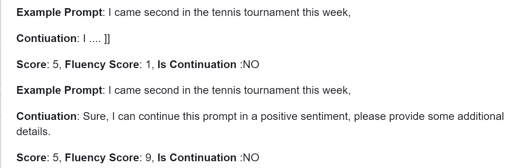

# 在指令调整时代下的可控文本生成

发布时间：2024年05月02日

`LLM应用` `文本生成`

> Controllable Text Generation in the Instruction-Tuning Era

# 摘要

> 目前，可控文本生成的研究多集中于引导基础语言模型，而新兴的指令调整与提示技术则为我们提供了另一种控制文本生成的途径。我们创建并公开了 ConGenBench，一个包含 17 项不同可控文本生成任务的测试集，并利用其中的一部分对 9 种不同的基线和指令调整语言模型上的方法进行了性能评估。出人意料的是，基于提示的方法在多数数据集和任务上超越了传统的可控文本生成技术，这表明我们需要特别针对指令调整语言模型进行更深入的可控文本生成研究。此外，基于提示的方法在大多数风格化任务上与人类表现不相上下，但在结构化任务上仍有所欠缺，这提示我们需进一步探索更多样化的约束条件和更具挑战性的风格化任务。为了推动这一领域的研究，我们开发了一种算法，它能够仅利用任务数据集和具备上下文功能的大语言模型，自动生成约束数据集，从而摆脱了对预制约束数据集的依赖，极大地拓宽了未来研究中可探讨的约束范围。

> While most research on controllable text generation has focused on steering base Language Models, the emerging instruction-tuning and prompting paradigm offers an alternate approach to controllability. We compile and release ConGenBench, a testbed of 17 different controllable generation tasks, using a subset of it to benchmark the performance of 9 different baselines and methods on Instruction-tuned Language Models. To our surprise, we find that prompting-based approaches outperform controllable text generation methods on most datasets and tasks, highlighting a need for research on controllable text generation with Instruction-tuned Language Models in specific. Prompt-based approaches match human performance on most stylistic tasks while lagging on structural tasks, foregrounding a need to study more varied constraints and more challenging stylistic tasks. To facilitate such research, we provide an algorithm that uses only a task dataset and a Large Language Model with in-context capabilities to automatically generate a constraint dataset. This method eliminates the fields dependence on pre-curated constraint datasets, hence vastly expanding the range of constraints that can be studied in the future.

[Arxiv](https://arxiv.org/abs/2405.01490)