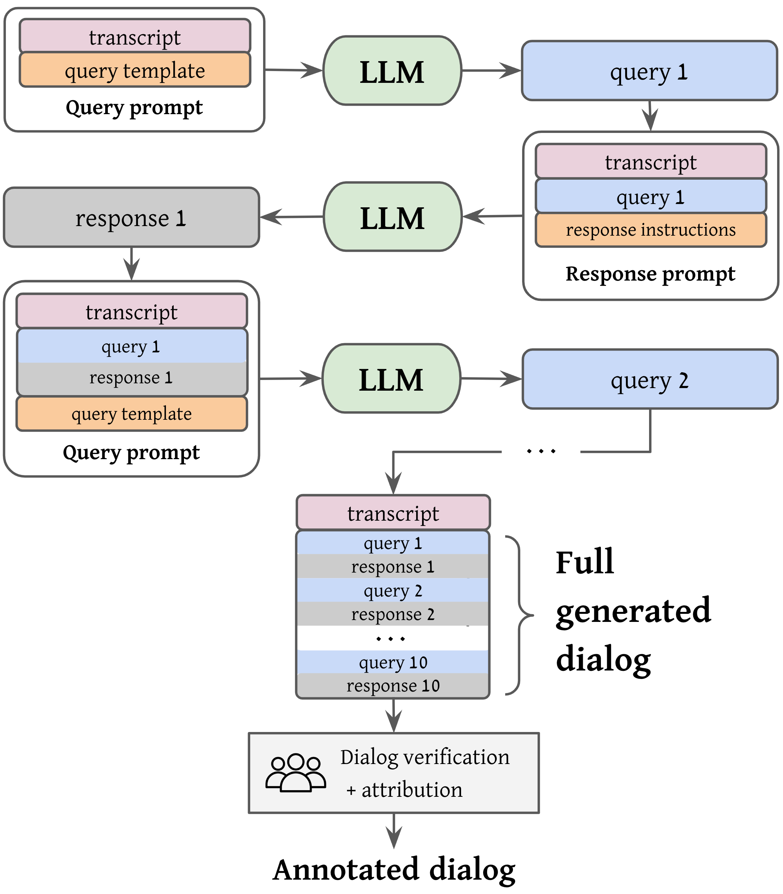
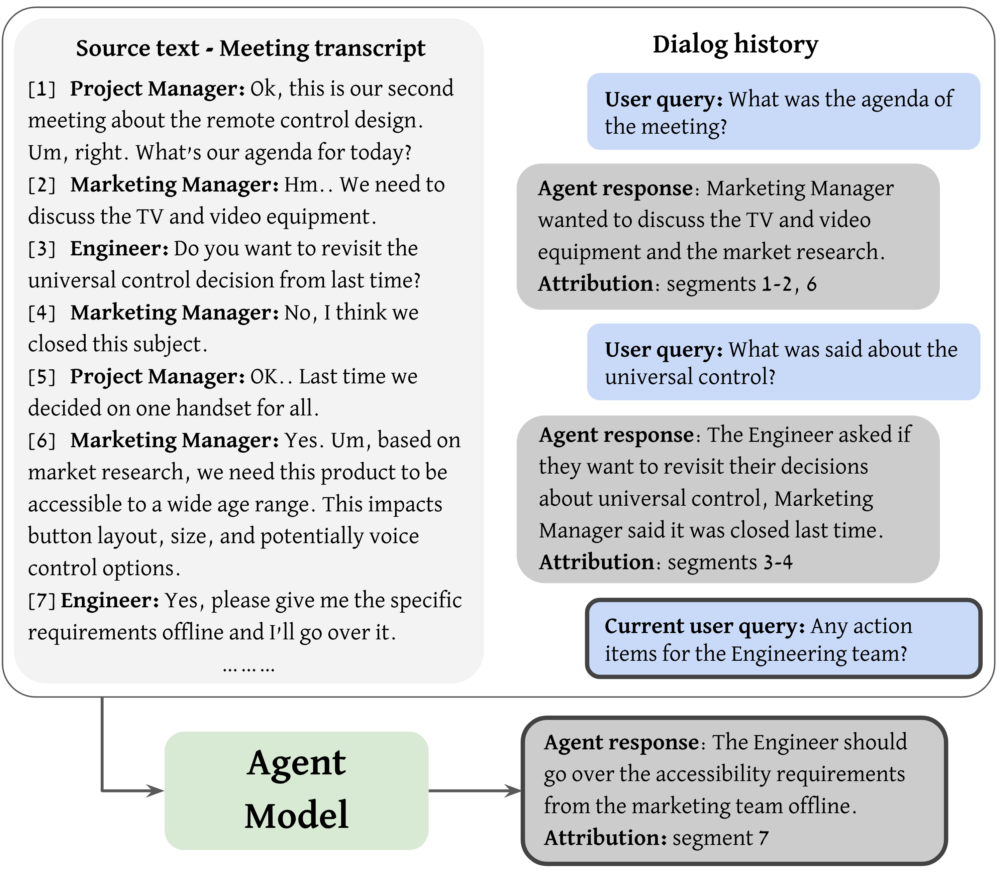
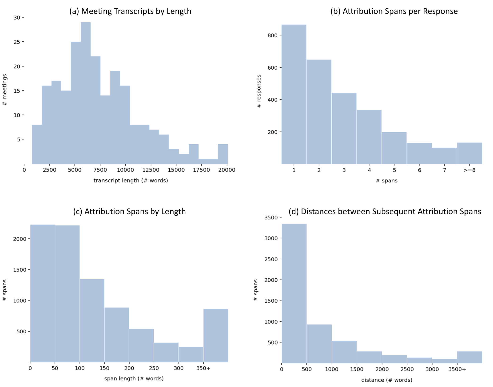

# 高效数据生成：以会议记录为信息寻求型源-地面对话的用例

发布时间：2024年05月02日

`LLM应用` `对话系统`

> Efficient Data Generation for Source-grounded Information-seeking Dialogs: A Use Case for Meeting Transcripts

# 摘要

> 传统方法在构建基于源头的信息搜寻对话数据集时，因完全依赖人工标注而成本高昂且实施困难。我们提出一种新方法，结合大型语言模型（LLMs）的提示和人类专家知识，以提高数据生成的效率和可靠性。与传统的“幕后巫师”（WOZ）方法相比，该方法不再需要两名标注者从头开始构建对话，扮演代理和用户角色，而是利用LLM生成技术来模拟这两个角色。标注者随后对生成的内容进行验证，并添加归因数据。我们通过创建MISeD——首个专注于会议记录的信息搜寻对话数据集——来验证这种方法。使用MISeD数据集进行微调的模型不仅在我们的测试集中表现出色，也在全新的全手动WOZ测试集和现有的基于查询的摘要基准测试中展现了优越性能，这证明了我们方法的有效性。

> Existing methods for creating source-grounded information-seeking dialog datasets are often costly and hard to implement due to their sole reliance on human annotators. We propose combining large language models (LLMs) prompting with human expertise for more efficient and reliable data generation. Instead of the labor-intensive Wizard-of-Oz (WOZ) method, where two annotators generate a dialog from scratch, role-playing agent and user, we use LLM generation to simulate the two roles. Annotators then verify the output and augment it with attribution data. We demonstrate our method by constructing MISeD -- Meeting Information Seeking Dialogs dataset -- the first information-seeking dialog dataset focused on meeting transcripts. Models finetuned with MISeD demonstrate superior performance on our test set, as well as on a novel fully-manual WOZ test set and an existing query-based summarization benchmark, suggesting the utility of our approach.

[Arxiv](https://arxiv.org/abs/2405.01121)