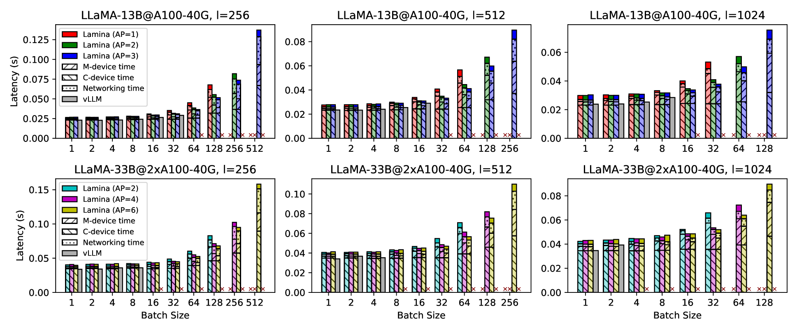

# 通过注意力卸载实现大型语言模型的高效经济推理

发布时间：2024年05月02日

`LLM应用` `计算优化`

> Efficient and Economic Large Language Model Inference with Attention Offloading

# 摘要

> 基于 Transformer 的大型语言模型（LLM）在创造性任务上有着令人瞩目的表现，但在现实应用中，由于对成本高昂、计算优化的加速器使用效率不高，面临不小的挑战。这一问题主要来自于 LLM 的自回归特性，其生成阶段涉及资源需求各异的操作。特别是，注意力机制作为内存消耗大户，其内存访问模式与现代加速器的优势不匹配，尤其是在处理更长上下文时。为了提升 LLM 在服务端的效率和经济性，我们提出了“注意力卸载”的新概念。这种方法通过使用成本较低、内存优化的设备来处理注意力机制，同时保留高端加速器来执行模型的其他部分。这种混合配置确保了每个组件都能针对其工作负载进行优化，从而实现性能和成本效率的最大化。我们通过深入分析和实验验证了跨多个设备分配注意力计算的可行性，并且异构设备间的通信带宽需求也可以通过现有的网络技术得到有效控制。为了实践我们的设想，我们构建了 Lamina，这是一个集成了注意力卸载功能的 LLM 推理系统。实验数据显示，Lamina 在每投资一美元的情况下，能够实现比传统同质解决方案高达 1.48 至 12.1 倍的吞吐量。

> Transformer-based large language models (LLMs) exhibit impressive performance in generative tasks but introduce significant challenges in real-world serving due to inefficient use of the expensive, computation-optimized accelerators. This mismatch arises from the autoregressive nature of LLMs, where the generation phase comprises operators with varying resource demands. Specifically, the attention operator is memory-intensive, exhibiting a memory access pattern that clashes with the strengths of modern accelerators, especially as context length increases. To enhance the efficiency and cost-effectiveness of LLM serving, we introduce the concept of attention offloading. This approach leverages a collection of cheap, memory-optimized devices for the attention operator while still utilizing high-end accelerators for other parts of the model. This heterogeneous setup ensures that each component is tailored to its specific workload, maximizing overall performance and cost efficiency. Our comprehensive analysis and experiments confirm the viability of splitting the attention computation over multiple devices. Also, the communication bandwidth required between heterogeneous devices proves to be manageable with prevalent networking technologies. To further validate our theory, we develop Lamina, an LLM inference system that incorporates attention offloading. Experimental results indicate that Lamina can provide 1.48x-12.1x higher estimated throughput per dollar than homogeneous solutions.

[Arxiv](https://arxiv.org/abs/2405.01814)