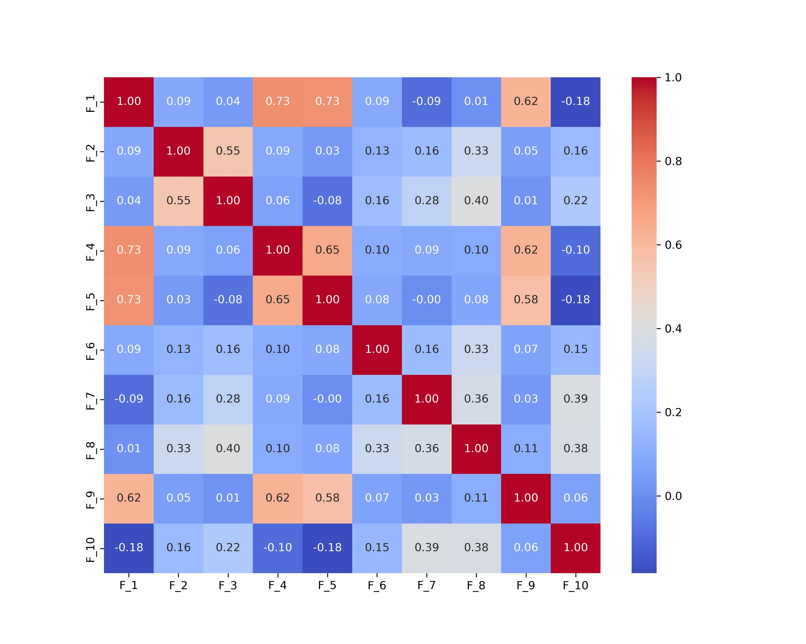
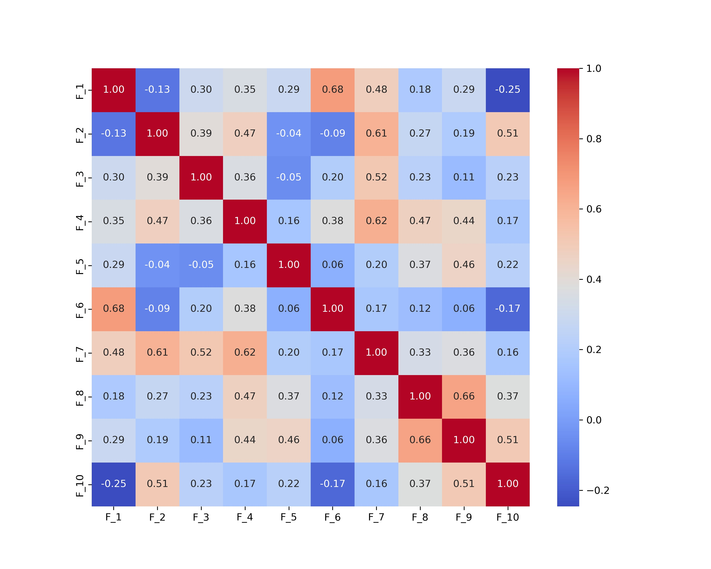
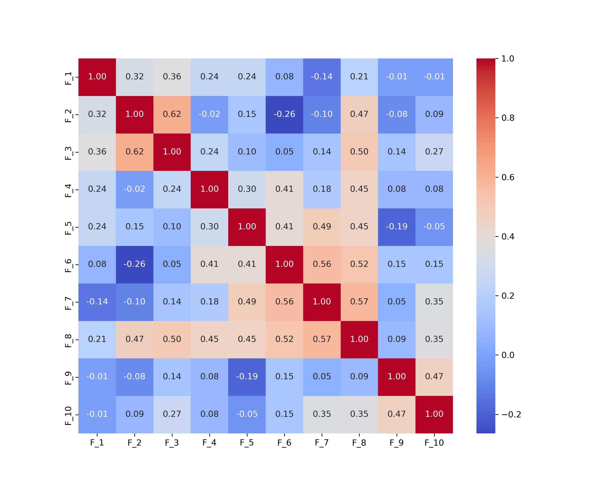
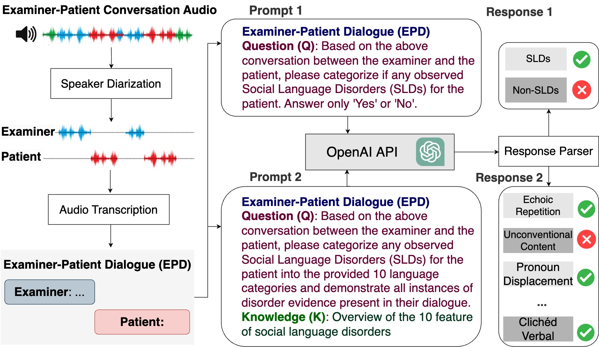

# 通过 ChatGPT 来识别自闭症相关的语言障碍，并挖掘其独特的特征。

发布时间：2024年05月02日

`LLM应用` `神经科学` `医疗诊断`

> Exploiting ChatGPT for Diagnosing Autism-Associated Language Disorders and Identifying Distinct Features

# 摘要

> 自闭症相关语言障碍的诊断充满挑战，常因传统评估手段的主观多变而受阻。本研究尝试利用尖端的大型语言模型 ChatGPT，通过提升诊断精确度和识别自闭症特征性语言特征，来解决这些难题。ChatGPT 的高级自然语言处理技术有助于优化诊断流程。在与包括 BERT 在内的常规监督学习模型对比中，ChatGPT 在零样本学习情境下的表现显著更佳，准确度和 F1 分数均提升了超过 13%，显示出其作为神经学诊断工具的巨大潜力。研究还识别了与自闭症语言障碍相关的十个关键特征，如回声言语、代词颠倒和异常语言使用，这些对于精确诊断 ASD 和制定个性化治疗方案至关重要。研究结果鼓励在临床环境中采用 ChatGPT 等先进 AI 工具，以提高诊断精确度，并推动个性化医疗的发展，为自闭症等神经发育障碍的评估带来革新。

> Diagnosing language disorders associated with autism is a complex and nuanced challenge, often hindered by the subjective nature and variability of traditional assessment methods. Traditional diagnostic methods not only require intensive human effort but also often result in delayed interventions due to their lack of speed and specificity. In this study, we explored the application of ChatGPT, a state of the art large language model, to overcome these obstacles by enhancing diagnostic accuracy and profiling specific linguistic features indicative of autism. Leveraging ChatGPT advanced natural language processing capabilities, this research aims to streamline and refine the diagnostic process. Specifically, we compared ChatGPT's performance with that of conventional supervised learning models, including BERT, a model acclaimed for its effectiveness in various natural language processing tasks. We showed that ChatGPT substantially outperformed these models, achieving over 13% improvement in both accuracy and F1 score in a zero shot learning configuration. This marked enhancement highlights the model potential as a superior tool for neurological diagnostics. Additionally, we identified ten distinct features of autism associated language disorders that vary significantly across different experimental scenarios. These features, which included echolalia, pronoun reversal, and atypical language usage, were crucial for accurately diagnosing ASD and customizing treatment plans. Together, our findings advocate for adopting sophisticated AI tools like ChatGPT in clinical settings to assess and diagnose developmental disorders. Our approach not only promises greater diagnostic precision but also aligns with the goals of personalized medicine, potentially transforming the evaluation landscape for autism and similar neurological conditions.

[Arxiv](https://arxiv.org/abs/2405.01799)