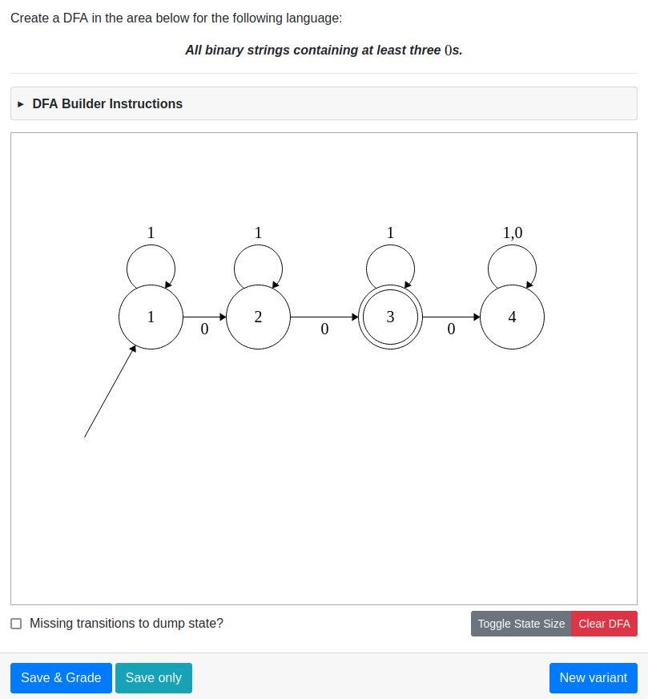
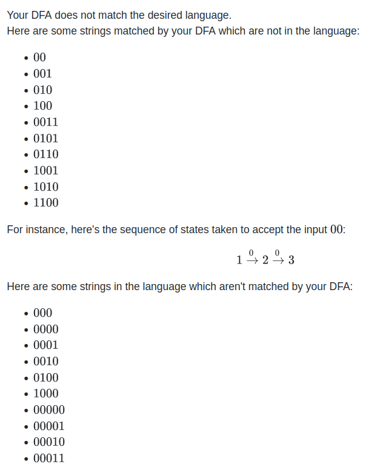
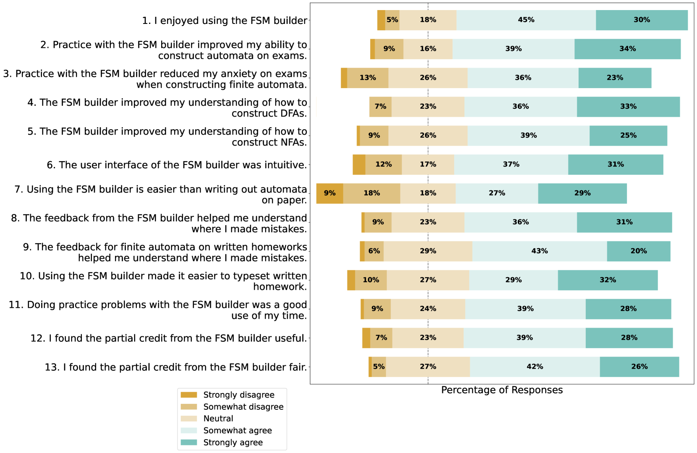

# FSM Builder：一款编写自动评分有限自动机习题的工具

发布时间：2024年05月02日

`Agent` `计算机科学教育` `计算理论`

> FSM Builder: A Tool for Writing Autograded Finite Automata Questions

# 摘要

> 确定性与非确定性有限自动机（DFAs 与 NFAs）作为计算理论的抽象模型，在计算机基础课程中广为讲授。它们不仅在快速正则表达式匹配等领域有着广泛应用，也是形式语言理论的入门知识。然而，初学者往往因抽象程度而难以把握这些概念。为了帮助学生更好地理解和实践，开发了多种教学辅助工具。本文推介了一种名为 FSM Builder 的新型教学工具，它通过图形界面让学生练习构建 DFAs 与 NFAs，同时提供个性化反馈和部分得分评价。该工具背后的算法深受前人研究的启发，相较于其他同类工具，其突出优势在于更高的灵活性和扩展性。这是因为 FSM Builder 采用了开源软件包中的高效算法，便于进行功能扩展和题目设置。文章还探讨了该工具的实现细节，其与旧工具的不同之处，以及在多门大型课程中使用该工具的经验和教训。调查反馈显示，学生普遍认为 FSM Builder 的操作界面和反馈机制非常有帮助。

> Deterministic and nondeterministic finite automata (DFAs and NFAs) are abstract models of computation commonly taught in introductory computing theory courses. These models have important applications (such as fast regular expression matching), and are used to introduce formal language theory. Undergraduate students often struggle with understanding these models at first, due to the level of abstraction. As a result, various pedagogical tools have been developed to allow students to practice with these models. We introduce the FSM Builder, a new pedagogical tool enabling students to practice constructing DFAs and NFAs with a graphical editor, giving personalized feedback and partial credit. The algorithms used for generating these are heavily inspired by previous works. The key advantages to its competitors are greater flexibility and scalability. This is because the FSM Builder is implemented using efficient algorithms from an open source package, allowing for easy extension and question creation. We discuss the implementation of the tool, how it stands out from previous tools, and takeaways from experiences of using the tool in multiple large courses. Survey results indicate the interface and feedback provided by the tool were useful to students.

[Arxiv](https://arxiv.org/abs/2405.01717)